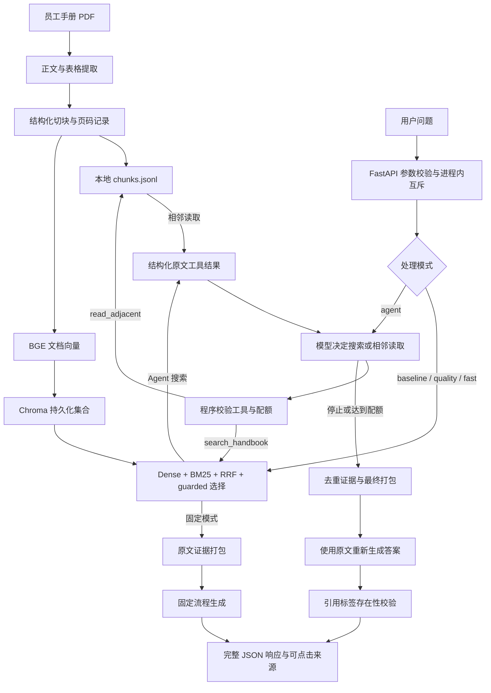
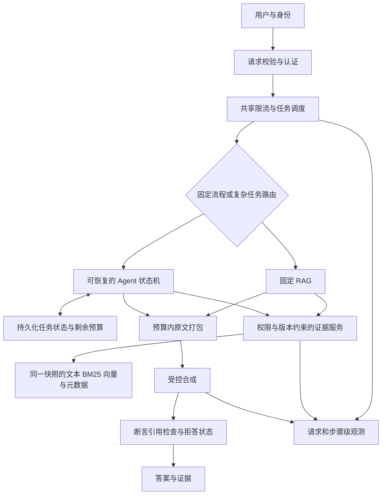

# Agent 系统设计分析：员工手册 RAG 的取舍与演进

分析日期：2026-10-09。源码基线：`cbc0ece`；本阶段只新增分析文档，不修改业务代码、不重建索引、不重新调用付费模型。

当前 `data/chunks.jsonl` 实读为 123 块，SHA-256 为 `6689f74c6d50718e48a76d1857128247f336bca005f8c8b655b06b11d74e9301`。这是本轮检查的语料标识，不等于下文历史实验的语料版本。

**核心判断：当前项目是“固定 RAG 主流程 + 可选的受限检索 Agent”。Agent 的价值假设是针对复合问题自适应补齐证据，但现有实验尚未证明它优于固定流程。接下来的重点应是验证增量价值，并补齐预算、证据一致性和恢复能力，而不是先增加 Agent 数量。**

本文区分四类表述：**源码事实**来自当前实现；**历史测量**来自仓库保存的实验；**设计动机推断**根据问题与实现推导，不能代替作者当时的决策记录；**未实施方案**是后续建议，没有性能收益承诺。

第一阶段的整体模块地图见 `PROJECT_ARCHITECTURE.md`；逐段源码讲解见 `notes/module_agent.md`、`notes/module_retriever.md`、`notes/module_llm.md`、`notes/module_service.md`、`notes/module_evaluation.md`。本阶段重点回答“为什么这样设计、边界在哪里、何时需要升级”。

## 1. 当前实现方案

### 1.1 系统定位与两条在线路径

业务目标是从员工手册中找到适用条款，给出可回看原文的回答。复杂之处通常是资格条件、一般规则、例外、不同事项之间的组合，而不是执行外部业务操作。

当前没有写入业务系统的工具，没有多 Agent 协作，没有持久化任务恢复，也没有基于登录身份的文档权限过滤。它适合本地项目验证和面试演示；这些能力边界要与“企业可部署”的目标分开。

两个分支复用同一检索能力，但编排方式不同。

| 模式 | 检索策略 | 生成策略 | 当前意义 |
|---|---|---|---|
| baseline | 单查询 baseline | baseline 提示、默认 thinking 配置 | 保留基础对照 |
| quality，默认 | guarded | evidence 提示、low thinking | 固定的质量优先路径 |
| fast | guarded | evidence 提示、请求禁用 thinking | 固定的低延迟候选路径 |
| agent | 模型选择搜索和相邻读取；搜索内部仍用 guarded | 收集后独立 evidence 合成 | 自适应检索实验路径 |

依据：`webapp.py:31`、`webapp.py:57`，以及 `ragcore/agent.py:95`。`agent` 只有在非 retrieval-only 且接口已配置时才进入 Agent 分支；只检索时不能把响应理解为执行过 Agent 编排。`api_ready()` 是配置检查，不证明远程服务可用。

### 1.2 谁负责什么：模型有行动建议权，程序有执行控制权

| 层级 | 实际职责 | 不应归给它的能力 |
|---|---|---|
| 编排模型 | 根据问题与工具结果提出查询、选择相邻读取、决定停止调用 | 强制权限、可靠的证据充分性证明、线程取消 |
| 应用程序 | 工具白名单、参数结构、已知来源锚点、次数与时间限制、去重、状态返回 | 自动理解所有条款之间的法律或业务关系 |
| 检索器 | 两路候选、排名融合、规则扩展、事项配额 | 判断答案一定正确、识别全部资格条件 |
| 合成模型 | 基于最终原文组织回答、解释条件与例外 | 自动获得未提供的证据或用户个人信息 |
| LlamaIndex / OpenAI SDK / httpx | 工具 schema、消息与请求适配、传输 | 自动提供完整任务状态机或业务授权 |
| Chroma 与本地文件 | 向量检索、文本与元数据保存、相邻块读取 | 自动保证文件、向量与进程缓存属于同一版本 |
| 前端 | 展示答案、引用、来源、耗时与本地历史 | 给模型提供跨轮记忆、验证语义正确性 |

例如，模型输出 `read_adjacent` 时，程序要求 `chunk_id` 已经出现在本请求收集的证据里。模型不能通过猜一个任意 ID 跳过这个约束。但“已知 ID”只代表当前任务曾检索到它，不代表用户拥有文档访问权限。

### 1.3 实际执行链路

1. 请求进入 API，校验问题长度与模式；进程内互斥锁拒绝同进程同时处理的另一个请求，返回 409。
2. 固定模式直接检索；Agent 模式创建本次请求的消息历史、证据字典、工具计数与 trace。
3. 编排模型看到工具定义，返回工具调用；应用逐一验证名称、参数、锚点与剩余配额。
4. 工具在线程池中运行，搜索返回候选原文，相邻读取返回锚点及前后块。
5. 证据按 ID 去重；经过单次工具证据筛选的原文 JSON 作为 tool 消息送回模型。所有收集到的块同时保留在应用侧。
6. 停止编排后，应用对累计证据重新打包；独立合成请求只包含最终提示、用户问题与原文上下文。中间模型文字不作为答案证据。
7. Agent 对答案中出现的 `〔来源N〕` 检查标签能否对应最终上下文；随后返回状态、答案、来源、trace 与 usage。
8. 前端等待完整 JSON 后展示，没有增量 SSE 输出；浏览器保存的本地历史不随下次问题发送。

依据：`ragcore/agent.py:95`、`ragcore/agent.py:207`、`webapp.py:49`、`web/app.js`。

这是一个具有“行动—观察—再行动”反馈环的受限检索 Agent。它没有显式的持久化计划对象，也没有任务分派器，因此不能讲成完整的 Plan-and-Execute 或多 Agent 系统。

### 1.4 当前边界：哪些限制是程序强制的

| 约束 | 当前默认值与执行方式 | 边界 |
|---|---|---|
| 可执行工具 | search_handbook、read_adjacent 两项白名单 | 工具 schema 之外还有运行时校验 |
| 工具参数 | 恰好一个指定键；非空字符串；长度不超过 500 | 字符限制不检查查询语义是否保留资格条件 |
| 搜索次数 | 最多 3 次，执行前检查；失败尝试也消耗配额 | 一次 guarded 工具搜索可包含最多 3 条内部查询 |
| 相邻读取 | 最多 2 次；锚点必须已知；单次最多 3 块 | 文件顺序相邻不保证属于同一业务条款 |
| 编排模型调用 | 最多 8 次 | 不包含最终合成；不是整个请求的 token 上限 |
| 编排时间 | 120 秒，包含工具等待 | 超时停止等待，不能强制杀死已运行的 Python 线程 |
| 合成时间 | 最多 120 秒，各次合成共用同一截止时间 | 不能把三次重试讲成各有 120 秒 |
| 合成输出 | 最多三次，2048 → 4096 → 8192 | 翻倍是重新请求，不是接着旧答案续写 |
| 证据上下文 | evidence 打包参考上限 6000 字符 | 不是 tokenizer 计算的总输入 token 预算 |
| 至少搜索一次 | SEARCH_PROMPT 中要求 | 没有程序强制首次搜索；未搜索且无证据会返回 no_evidence |

因此单请求默认最多有 8 次编排与 3 次合成，即 11 次应用层模型调用。按默认双路检索、每次工具内部最多 3 条查询计算，3 次搜索最多触发 9 次 dense 与 9 次 BM25 查询；这是代码推导的上界，不是实验平均值。

单次工具回复依据 `prepare_context` 的选择结果构造，但随后附加 JSON、元数据和 omitted IDs；不能保证整个 JSON 严格不超过 6000 字符。多次 tool 消息持续累积，尚无整个编排历史的 token 预算。`context_window=32000` 是传给适配器的配置，不是已验证的供应商窗口或程序截断机制。

### 1.5 离线知识链路同样决定在线质量

`extract.py` 使用 pdfplumber 提取正文和表格；在删除表格区域的正文前，检查检测框与表格数量对应，并验证区域内非空白字符能被单元格字符覆盖。不满足条件时保留正文。这个保护针对“检测到表格但内容没被完整提取”的丢字问题。

`chunker.py` 记录章节路径、条款与页码，再按长度拆分；章节路径进入文本，因此也影响 embedding 和 BM25。块 ID 含起始页与文本散列，解析或切块改变后，旧 ID 可能失效。页码是块级来源信息，不是逐字符精确位置。

`embedder.py` 使用 CPU 上的 `bge-small-zh-v1.5`，对向量归一化，查询加检索前缀；`store.py` 保存到 Chroma 的 cosine 集合。没有本项目训练的 embedding 模型，也没有默认图像 OCR 链路。

`ingest.py` 先计算向量，再删除并创建集合、写入新块。这比先删集合再计算向量少一个失败窗口，但仍不是原子发布。在线语料与 BM25 缓存、Chroma 集合、本地 JSONL 尚未绑定版本。

## 2. 为什么这样实现

以下“为什么”主要是设计动机推断；源码注释能确认的执行约束已在第一节标明。

### 2.1 先分清固定流程和动态决策的必要性

简单问题如“某假期有几天”，主要需要定位明确条款；一次固定检索与生成通常就能形成完整路径。复合问题可能同时涉及资格、一般规则与例外，第一次检索未必覆盖全部事项，这时可以考虑让模型根据已有证据决定下一次查询。

Agent 加入的核心能力是**根据观察选择后续动作**。RAG 是获取外部证据的方法；两者不是互斥概念。当前 Agent 实际上是调用 RAG 工具的控制层。

是否需要 Agent，应比较“在固定检索仍缺证据的题上，它能否有效补查”，而不是比较工具调用次数。更多调用可能只是重复搜索；最终回答更长也可能只是冗余。

### 2.2 关键选择、替代方案和指标

| 当前选择 | 解决的问题与设计理由 | 替代方案及代价 | 应观察的指标 |
|---|---|---|---|
| 固定 quality 默认、Agent 可选 | 让复杂编排的额外开销可隔离，并保留对照 | 全量 Agent 容易让简单问题也增加调用 | 分题型正确率、额外有效证据、总耗时、总 token |
| Agent 复用原检索器 | 新增编排而不同时替换底层召回，便于定位增益来源 | 框架默认检索器需重新校准，可能失去已有消融能力 | 同语料、同底层检索的成对增量 |
| dense + BM25，用 RRF 融合 | 同时保留语义匹配和制度术语匹配；基于排名避免直接相加异尺度分数 | 单路更简单；学习式融合需训练数据；cross-encoder 需额外推理 | Recall@k、完整证据率、MRR、检索时间 |
| guarded 规则扩展与事项配额 | 防止不同事项的证据被单一话题挤出 Top-k | LLM 改写更灵活但加调用；规则维护会增长 | 完整证据率、条件保留率、旧题回退率 |
| 相邻读取独立成工具 | 不必把每个检索块都自动扩成大窗口，由模型按需要请求 | 固定邻域扩展减少决策调用，但更容易增加无关文本 | 有效新增证据、重复率、最终上下文充分性 |
| 编排与最终合成分离 | 让中间推断不能直接成为最终政策依据 | 一次模型连续完成较省输入，但事实与中间判断更易混合 | 未支持断言率、引用支持率、额外输入 token |
| 显式 Python 循环与校验 | 两个只读工具的状态容易看清，预算与错误可直接测试 | 图编排在长任务更清晰，但增加状态和依赖管理 | 故障定位耗时、可测试性、重启恢复率 |
| 本地 embedding 与 Chroma | 不需要每次向云端发送文档来生成向量，便于离线复现 | 云 embedding / 服务化检索增加部署、计费与权限管理 | 召回、CPU 延迟、内存、构建耗时；没有统一收益测量 |
| 不同 thinking 模式 | 把生成质量与延迟、token 的取舍做成可比较配置 | 默认供应商行为可能不明确；不同供应商字段未必兼容 | 人工正确率、首次完整输出率、生成耗时、reported tokens |

RRF 的形式为 `Σ 1 / (60 + rank)`。它解决“不同检索分数难比较”，不解决“候选语义一定正确”。多查询会改变投票结构，重复命中的同一主题可能占优势，所以后面还要考虑事项选择。

同样，guarded 是手册场景的规则启发式，不能称为训练过的 reranker、通用查询理解模型或所有问题的条件保留保证。

### 2.3 为什么不是直接把整本手册塞进模型

长上下文是可比较的替代方案：它减少检索遗漏，却可能增加输入、使无关信息干扰回答，并且不能替代条款版本与权限控制。当前代码选择检索后给少量原文，但没有与“整本输入”做同模型同问题的完整对照。

因此面试中应说：“我采用检索来控制输入并保留来源；是否优于整本输入，需要比较相同题集上的答案正确率、引用支持率、完整输入 token 与耗时。”不能声称已经测出具体节省比例。

### 2.4 为什么现在不优先加多 Agent

当前主要工具是同一个手册上的搜索与相邻读取，没有天然独立的业务角色和数据系统。把它拆成多个角色会引入重复检索、消息成本、状态同步和冲突处理；这些开销未必产生新增证据。

单 Agent、固定工作流、Plan-and-Execute、图编排、多 Agent 是不同控制方式，不是必须依次升级的等级。只有出现可独立并行的子任务，并测出串行瓶颈和协作收益，才有理由引入多 Agent；本项目尚无这样的对照结果。

### 2.5 第三方依赖的行为也属于系统设计

`requirements-agent.txt` 固定了 LlamaIndex core 0.14.25、openai-like 0.8.1、openai 适配包 0.8.2 和 OpenAI SDK 2.54.0；Web 依赖采用版本范围。这是仓库的依赖声明，不代表所有基础依赖都有完整环境锁定。

一个具体例子是合成重试：源码记录了 LlamaIndex 模型默认值会覆盖逐次调用的 `max_tokens`，所以实现既更新模型属性，也传调用参数。已有 transport 测试拦截实际适配器请求，验证 2048、4096、8192 是否到达请求层，而不是只验证外层变量翻倍。

这体现的是依赖边界的契约验证：配置看起来正确，不代表最终请求正确。升级依赖、切换兼容供应商或 thinking 字段时，应验证发出的参数、返回正文、finish_reason、usage 和工具调用格式。该测试仍不证明远程供应商实际遵守所有字段。

## 3. 优势

### 3.1 设计层面的实际优势

**执行控制能从源码验证。** 工具白名单、参数校验和预算在程序里实施，即使模型不遵守提示，超过配额的工具调用也不会继续执行。注入伪模型、搜索函数和相邻读取函数，可以离线验证这些控制行为。

**事实链路保留原文。** 检索结果有块 ID、路径、页码，工具结果回传原文，最终合成重新使用原文上下文。最终证据不依赖编排模型写出的摘要；这降低了中间摘要误差传播的一个渠道，但不证明最终模型不会幻觉。

**质量优化可以分层定位。** baseline、单路召回、融合、规则扩展、提示与 thinking 设置保留了比较入口。出了问题可以检查解析、候选、Top-k、上下文、生成，而不是把所有失败归结为“大模型不聪明”。

**失败可带证据返回。** Agent 超时、工具失败或生成失败时，保留已经找到的来源；limited 状态可能生成基于已有证据的回答并提示遗漏风险。接口 complete 表示流程完成，不能充当答案正确性评分。

**部署与学习路径较直接。** 本地向量、少量工具、显式循环和简单 API，使整个系统可以从一个请求追到原文与模型请求。这个优势是可理解性与调试成本，不是经过测量的吞吐或高可用优势。

### 3.2 已测收益：固定 RAG 的改进有范围明确的证据

| 历史对照 | 数据集与指标 | 基线 → 新结果 | 可以得出的结论 |
|---|---|---|---|
| baseline 检索 → guarded | 36 模拟开发题中的 9 个正样本；Top-8 完整 gold 证据覆盖 | 7/9 → 9/9，增加 22.22 个百分点 | 已知开发题的证据组合更完整；不是答案准确率 |
| 同次检索回归 | 原有 35 个正样本；Top-8 任一及完整证据覆盖 | 两者均 35/35 → 35/35 | 此次保存实验未观察到该指标回退；不代表所有题不退化 |
| 生成方案 A → H | 36 模拟开发/回归题；Codex 模型复核 strict accuracy | 21/36，58.33% → 30/36，83.33%；增加 25 个百分点 | 组合方案在该模型复核口径下提高；不是人审或真实用户成绩 |
| 同批生成开销 | 同上；生成 P50，含应用重试、预先算好检索、排除 API 错误运行 | 8.038 s → 14.071 s；增加 6.033 s，约 75.06% | 质量改善同时伴随生成延迟增加；不是网页端到端延迟 |
| 同批 reported tokens | A/H 最新保存运行的 prompt + completion 合计 | 261181 → 295563；增加 34382，约 13.16% | 这是响应报告的 token，不是实际金额；reasoning 不应再重复相加 |

来源：`evaluation/guarded_experiment_2026-09-26/retrieval_summary.json`、`evaluation/evidence_optimization_summary_2026-09-26/summary.json` 与 `MANIFEST.json`。以上是历史索引/模型/请求配置下的结果，本轮未重跑；不能把它们直接当成当前重建语料上的新成绩。

A → H 同时改变检索、上下文/提示与 thinking 配置，不能把全部增益归功于 Agent、RRF 或某一句提示。E → F 虽然检索结果相同，仍改变了证据包装、系统提示与截断处理，不是纯提示单变量实验。

F、G、H 的保存检索与上下文/系统提示可用于更接近单变量的 thinking 对照：G 为 27/36、生成 P50 2.141 s，H 为 30/36、14.071 s。这支持“需要按场景选质量与延迟”的判断；一次运行和模型复核仍不足以估计稳定的因果收益。

### 3.3 Agent 目前证明了什么

| 6 题成对实验指标 | 固定 quality | Agent | 变化与解释 |
|---|---:|---:|---|
| complete | 6/6 | 6/6 | 相同；仅流程完成 |
| 收集到全部 gold 证据 | 5/6 | 5/6 | 相同；未出现该指标增益 |
| 最终上下文包含全部 gold | 5/6 | 5/6 | 相同；未出现该指标增益 |
| 总运行耗时 P50 | 46.144 s | 49.515 s | 增加 3.371 s，约 7.31% |
| 平均 reported tokens | 14910 | 33471.17 | 增加 18561.17，约 124.49% |
| 答案正确率 | 未评分 | 未评分 | 无法比较 |

来源：`evaluation/agent_experiment_2026-10-04/summary.json`。这是历史语料与配置下的 6 题开发实验，不是泛化结论，也不是当前 Web 并发压测。样本只有 6 题，P95 近似落在最大观测值，不能当稳定的生产尾延迟。

**应得出的结论是：受限编排路径可运行，且有可测试的控制边界；增量答案价值仍未被证明。** 如果面试官问“Agent 提升了多少”，应直接给出这组对照，并说明下一步如何设计评估。

## 4. 缺点

### 4.1 价值层：增加自主性可能只是增加开销

Agent 的 search 工具内部已经使用 guarded。固定流程能够覆盖的问题，Agent 可能重复相同工作；多轮原文进入 history 还增加输入 token。现有 6 题没有额外完整证据覆盖，却有更高 token 使用。

这不是证明 Agent 永远无价值，而是缺少“固定流程漏证据、Agent 能补齐”的独立题集。必须同时加入简单题，检查复杂机制是否造成过度调用和错误适用范围。

### 4.2 检索层：召回、事项覆盖和适用性仍有断点

补充查询的规则不保证保留全部资格与发起方条件；事项配额只能分配名额，不能理解证据之间是否构成完整的业务论证。RRF 排名也没有校准成“相关概率”，不能用高分直接代表足够回答。

相邻读取按 JSONL 顺序取锚点前后块，可能跨章节；源文件与向量索引不一致时还可能读到另一版本。缓存语料与 BM25 的更新机制也不足以支持在线热更新。

对应源码：`ragcore/retriever.py:31`、`ragcore/retriever.py:84`、`ragcore/evidence.py`、`ragcore/agent.py:80`。

### 4.3 输入与输出预算：现有控制不是总资源预算

6000 字符不等于 6000 token，也不包括系统提示、问题、工具 schema 和跨轮历史。evidence 打包会跳过超大的完整块，但不会将它拆成可以安全引用的子块；累计证据按第一次出现的顺序保留，也不一定把最关键条款放到前面。

输出预算翻倍用于应对空正文或 length 截断；它不重新检索、不验证业务正确性。若原始证据就缺失，增加输出预算可能只让错误回答更长。普通生成还同时存在 SDK 重试和应用重试，应用尝试数不能直接当成底层 HTTP 发送数。

未实施的总预算应至少同时约束：完整输入 token、剩余输出 token、总 deadline、模型/工具调用额度、已知费用估计。供应商 usage 缺失时应保留未知，不能把未知当作零。

### 4.4 引用与状态：来源标签正确不等于答案有依据

Agent 当前只检查答案中出现的标签是否存在于最终 source map。答案完全没有标签时，正则匹配为空，也可以通过；标签存在但支撑不了对应断言时，同样可能通过。普通固定生成没有同样的 Agent 标签校验。

还存在一个状态边界：固定流程有检索块，但打包后没有可用上下文时，`generate` 可返回本地“没有参考资料”文本，服务仍可能标为 complete。这应与“已生成有证据的答案”区分。代码对 finish_reason 也主要排除 length，并非仅接受 stop。

需要分别评估：来源可定位率、应引用断言的引用覆盖率、断言被证据支持的比例、答案正确率、无证据时恰当拒答率。一个点击成功的引用只证明第一项的一部分。

### 4.5 超时与恢复：用户等待结束，后台工作未必结束

`wait_for` 可以中止协程等待，独立线程池避免同步入口退出时等待默认 executor 收尾；但已运行的线程无法被强制取消。单 worker 限制同时运行的工作，不保证任务队列不会残留。后续请求还可能排在旧工作后面。

当前证据、计数、history 都只在本次请求内存中。进程崩溃或用户重新提交后，没有 checkpoint 可以恢复已完成步骤；浏览器历史只是展示数据。把 timeout 改为更长也不会带来恢复语义。

只读工具减少重复执行的业务副作用，但未来若加入提交申请或写数据库，就必须区分“请求超时”“动作未执行”“动作执行但响应丢失”，并通过操作 ID、状态查询和幂等机制控制重复动作。

### 4.6 数据链路：版本与解析正确性尚未形成统一契约

| 当前机制 | 可能的触发场景 | 影响 |
|---|---|---|
| Chroma 删除后重建 | 新集合写入失败或构建时在线读取 | 暂时无集合、空集合或不完整新集合 |
| 本地 JSONL 与向量分开发布 | 只更新其中一个产物 | 搜索 ID、相邻读取与原文不一致 |
| 进程缓存没有快照版本 | 重建后服务不重启 | 固定流程仍读取旧语料；Agent 相邻读取读取新文件 |
| 块 ID 依赖文本 | 重新解析、重新切块 | 历史引用或 gold IDs 失效，评测结果不能直接横比 |
| 表格字符覆盖保护 | 字符没丢，但行列或阅读顺序错误 | 仍可能把制度数值对应到错误条件 |
| 字符长度切块与 embedding 长度限制 | tokenizer 下输入超长 | 向量编码可能截断；后部信息影响召回不足 |

最后一项需要用实际模型 tokenizer 检查输入长度与截断比例；字符上限不能证明每个块都被完整编码。表格保护也只能证明它检查的字符覆盖条件，不能证明全部表格语义正确。

### 4.7 服务与安全：本地演示边界明确

进程内 Lock 不提供跨进程或跨机器互斥，也没有排队、优先级或公平调度。直接增加 worker 会改变并发行为，并让客户端、模型资源与缓存状态的问题暴露出来；当前没有吞吐、并发饱和点与排队延迟测量。

没有登录身份、文档 ACL、租户隔离或权限审计。提示中的“忽略资料内指令”是防提示注入的一层提醒，不是权限安全边界；schema 与参数校验只控制可执行动作的形状，不验证资料内容是否恶意。

`/health` 的配置和 busy 状态也不能证明集合完整、embedding 可加载、模型在线。对外服务前需要分别设计存活检查、就绪检查与依赖探测，且避免每次健康检查产生付费调用。

### 4.8 评估层：当前成绩不能代表生产可靠性

36 题是开发/回归集合，策略已经参考其中的失败；并非 held-out 真实用户 benchmark。模型复核需要与人工裁决分开，历史被冻结答案的重新评分也不能当系统重新运行的提升。

已有诊断重放发现 9 个正样本中：候选完整覆盖 8/9，保存 Top-8 完整覆盖 7/9，重建上下文完整覆盖 7/9；没有观察到预算丢块。因此该次诊断重点在召回与选择，不能把漏证据主要归因于 6000 字符预算。但历史没有保存完整候选与上下文，这只是对齐后的本地重放，不是原请求全过程日志。

来源：`evaluation/evidence_diagnosis_2026-09-26/summary.json`。这一例子说明：优化要先找到损失发生在哪层，不能看到预算限制就先调大预算。

## 5. 可扩展性

### 5.1 哪些方向容易扩展，哪些需要改变架构

| 扩展维度 | 当前基础 | 首先遇到的问题 | 合理演进方向；均未实施 |
|---|---|---|---|
| 增加只读工具 | FunctionTool 与白名单查找 | 参数契约、输出大小、状态与错误语义 | 统一工具注册、结构化结果、输入输出预算、每工具评测 |
| 更长的任务 | 本次请求有 trace 与计数 | 长 history、断线、进程重启 | 显式任务状态、持久化 checkpoint、步骤级恢复 |
| 更多文档与版本 | 文本、页码、向量、ID | 全量 BM25 内存、身份冲突、更新一致性 | 文档/快照元数据、版本发布、按规模选服务化检索 |
| 更多用户 | FastAPI 接口 | 进程 Lock、资源争用、缺少身份 | 认证、共享限流/排队、请求隔离与压测 |
| 多轮对话 | 前端可保存历史 | 后端没有可恢复会话条件 | 会话 ID、确认过的条件状态、条件更新与失效规则 |
| 外部写操作 | 当前只有只读动作 | 重放副作用、超时后状态不明 | 授权校验、操作 ID、幂等与结果对账；必要时人工审批 |

这里没有“增加到某个块数就一定要换数据库”的已测阈值。应对不同文档规模和并发负载测 CPU、内存、检索 P50/P95、排队时间与更新耗时，再决定是否拆服务。

### 5.2 优先级：先补契约和证据，再扩自主性

**第一批：可解释的完成条件与预算。** 区分 answer_ready、evidence_insufficient、budget_exhausted、failed 等含义；确保空上下文不能伪装成有依据的完成。对整个请求计 token、deadline 与剩余调用配额；把 source map、最终上下文散列和 omitted IDs 纳入可回放记录。该批的目标是状态正确、失败可诊断和开销可控，不承诺准确率一定提高。

**第二批：独立验证 Agent 的增量。** 冻结语料、模型配置、底层检索和提示版本；构建未用于规则调整的简单题、复合题、缺条件题、无答案题和注入题。比较固定 quality、改进的固定检索、Agent；对每题做多次成对运行并人工校准评分。若仅增加 token 而无答案或有效证据改善，保留可选模式，不推广到默认。

**第三批：按失败类型改检索或生成。** 若 gold 不在候选中，研究查询条件、解析、embedding；在候选但没进入 Top-k，研究选择与 rerank；在上下文却答错，研究适用性、提示和断言验证。新增 reranker 的基线、新结果和推理延迟必须实际测量后报告。

**第四批：有真实服务需求后增加版本、权限和恢复。** 构建版本化知识快照，发布前验证；请求固定使用同一 snapshot。需要多用户时再增加权限与调度；需要跨进程延续的任务时再采用持久化状态机或图编排。实现顺序由场景决定，不能等到开放敏感文档后才补权限。

### 5.3 建议的状态模型

一个可恢复任务至少应明确保存以下信息，而不是只保存聊天摘要：

| 状态域 | 建议字段 | 原因 |
|---|---|---|
| 身份与版本 | request_id、session_id、principal、snapshot_id、模型/提示/工具版本 | 保证检索、相邻读取、回放与权限一致 |
| 问题与条件 | 原始问题、已确认条件、尚缺条件、子问题 | 防止后续搜索或恢复丢失适用范围 |
| 执行控制 | 当前阶段、剩余配额、deadline、待执行工具调用 | 恢复后不能重新获得全部预算 |
| 证据 | 来源 ID、文本散列、获取动作、是否进入最终上下文 | 区分找到了什么与模型实际看到了什么 |
| 输出与费用 | 每次 usage、缺失 usage 标记、答案、验证结果、stop_reason | 保留未知，防止只计最后一次请求 |
| 动作结果 | 操作 ID、执行状态、外部回执；仅写工具需要 | 恢复前查清动作是否已经发生 |

短期可持久化必要的检索条件与证据引用，按需要重建模型消息；如果压缩历史，也必须保留限定条件和可回查原文，不能把模型摘要升级成未经验证的事实。

### 5.4 面向服务的目标架构

以下是未实施的设计示意，不是当前系统能力。固定流程仍可以是主路径，图状态机只是长任务的可选实现。

复杂度路由可以考虑问题事项、首轮证据冲突与覆盖线索；这些只是信号，不能直接等同语义充分性。运行时不能读取评估题 ID、gold chunk ID 或标准答案来决定是否补查。

### 5.5 如何衡量改造，而不是提前宣称收益

| 改造假设 | 对照与数据 | 主要指标 | 同时约束的代价与回退 |
|---|---|---|---|
| Agent 能补齐固定检索遗漏 | 冻结同一快照与模型；独立复合题，包含简单题对照 | 人工正确率、上下文完整证据率、每次搜索的有效新增证据 | 全请求 P50/P95、reported tokens、过度调用率 |
| token 预算更准确 | 相同输入与模型；长问题、多轮工具、超大块 | 超窗口失败率、预算估计误差、证据丢弃率 | 预算处理耗时、关键条件遗漏率 |
| reranker 改善证据选择 | 相同候选，新增独立排序评测 | Recall@k、完整证据率、答案支持率 | 排序延迟、硬件与模型成本 |
| 版本化发布更可靠 | 构建中断、写入失败、请求跨发布等故障注入 | 同请求版本一致率、失败后的可用性、回滚成功率 | 双版本存储量、发布时间 |
| checkpoint 能恢复任务 | 在模型/工具各阶段中断并重启 | 恢复成功率、重复步骤数、剩余预算一致性 | 状态写入耗时、存储与清理成本 |
| 服务支持并发 | 固定文档规模与请求混合，逐级增加并发 | 成功率、吞吐、排队/执行 P95、资源利用率 | 公平性、供应商限流、取消后的残留工作 |

指标阈值应来自目标用户体验和成本预算；目前没有这些改造的可比新测量。离线故障测试、开发题和真实用户验证要分别报告。

## 6. 工业界实现方式与对比

### 6.1 工业实现首先选择控制方式，而不是框架名字

Anthropic 的工程文章区分了由预定代码路径组织的 workflow 与由模型动态决定行动的 agent，并强调按需求增加复杂度及其延迟、成本取舍。这是 2024 年的设计模式文章，不能当成当前产品排名；其模式划分可用于理解本项目两条路径。[Building effective agents](https://www.anthropic.com/engineering/building-effective-agents)

对本项目的推论是：稳定手册问答可以保持固定 RAG；需要观察证据后补查时使用受限循环；需要长任务、暂停或恢复时再考虑显式图状态。多 Agent 只有在任务可独立拆分且协作收益被验证时才值得比较。

### 6.2 能力对照

以下是可选生产工程模式，不是“所有公司都使用这些产品”的统计结论。第三列是针对本项目的建议推断。

| 设计主题 | 当前实现 | 面向更复杂服务的做法与采用条件 |
|---|---|---|
| 编排 | 两个只读工具、显式循环 | 简单路径保留固定 workflow；长任务再用状态机/图；框架不代替业务停止条件 |
| 恢复与记忆 | 本次请求内存；前端历史仅展示 | 持久化 checkpoint 保存任务状态；跨任务资料单独管理；有重启恢复需求再引入 |
| 权限 | 参数与已知锚点校验，无身份 ACL | 认证身份与文档权限约束检索、相邻读取和最终来源；接入敏感文档前必需 |
| 知识发布 | 删除并重建集合，缓存无版本 | 先构建、验证新快照，再切读取版本；保持旧版可回滚 |
| 资源预算 | 调用配额、阶段超时、字符预算 | 总 token/deadline/开销预算与步骤配额共同控制；超时和后台终止分开建模 |
| 工具协议 | FunctionTool schema、字符串 JSON | 增加结构化成功/失败、版本、大小限制；写工具另加授权与幂等 |
| 证据验证 | Agent 标签能否对应上下文 | 明确哪些断言需要引用；校验覆盖与支持，校准自动评分，允许恰当拒答 |
| 调度 | 单进程互斥，无队列 | 按实际流量加入共享限流、排队与取消语义；压测后定容量 |
| 观测 | 本请求 trace、usage 与阶段耗时 | 请求及子步骤关联，记录版本、错误、遗漏与费用未知；不必记录隐含推理 |
| 评估 | 开发题、模型复核、6 题 Agent 对照 | 独立任务、多次试验、多维评分与人工校准；保留真实失败回归 |

### 6.3 官方实现资料与本项目的差距

**持久化状态。** LangGraph 文档区分 thread 范围的 checkpointer 与跨 thread 的 store，并明确内存 checkpoint 会在进程重启后丢失。因此，采用图框架不自动等于可恢复；仍要选择持久化后端与状态范围。[LangGraph Persistence](https://docs.langchain.com/oss/python/langgraph/persistence)

本项目的对应改造是保存阶段、剩余预算、证据版本和已完成动作；若未来有写工具，恢复前还要查询动作结果并保证幂等。这个方案尚未实施，不能宣称已经支持断点续跑。

**索引版本发布。** Elasticsearch 官方文档展示了通过 alias 的多动作操作切换读取目标，同时提醒动作可能部分成功，需检查结果并按要求使用 `must_exist` 等约束。[Elastic Aliases](https://www.elastic.co/docs/manage-data/data-store/aliases)

可借鉴的是“先建新版本，再切读入口”的思想。当前使用 Chroma 与 JSONL，应自行设计同一 snapshot 的发布和回滚契约；不能因为 Elasticsearch 有 alias，就声称本项目集合切换也具备相同原子性。

**文档权限。** Elasticsearch 官方资料给出将角色查询与认证用户关联的文档读取权限机制。[Document and field level security](https://www.elastic.co/guide/en/elasticsearch/reference/current/document-level-security.html)

本项目应借鉴“权限是数据访问约束”的原则：让所有证据入口使用同一身份范围，包含相邻读取与缓存命中。靠最终提示要求模型不要泄露，无法替代检索前的授权。具体权限实现与产品选择尚未完成。

**链路观测。** OpenTelemetry 以 trace 关联操作，用 span 表示步骤，并可记录时间、属性和状态。[OpenTelemetry Traces](https://opentelemetry.io/docs/concepts/signals/traces/)

在本项目可将请求、搜索、相邻读取、各次编排和合成关联起来，记录 snapshot、输入输出用量、停止原因与上下文散列。这里建议的是应用观测字段，未声称已接入 OpenTelemetry 或符合某套 GenAI 语义属性规范；原文内容需要控制记录范围和保留期。

**Agent 评估。** Anthropic 的评估资料区分 task、trial 与 grader，讨论多次试验、确定性评分、模型评分和人工校准，以及检查完整执行记录的必要性。[Demystifying evals for AI agents](https://www.anthropic.com/engineering/demystifying-evals-for-ai-agents)

对应本项目，应把“工具调用合法”“最终证据充分”“回答正确”“引用支持”“延迟与 token”分别评分。当前 6/6 complete 不能替代 correctness；新增独立题集也不能靠更换评分口径制造提升。

### 6.4 面试中的标准回答

**问：你这个项目的 Agent 设计有什么特点？**

> 系统以固定 RAG 为主，复杂模式增加一个受限的检索 Agent。模型根据问题和原文工具结果决定搜索或相邻读取，应用负责工具白名单、参数、已知来源、调用次数和超时。最终回答会用收集到的原文重新合成，中间模型文字不会直接变成政策证据。这样把动态决策和可验证的执行边界分开，也保留了固定流程作消融对照。

**问：Agent 比普通 RAG 好在哪里，提升了多少？**

> 它的目标是对缺失事项自适应补查，但当前不能宣称有答案准确率提升。历史 6 题成对实验中，两条路径都是 6/6 完成、5/6 上下文完整证据覆盖，Agent 平均 reported tokens 从 14910 增至约 33471，答案还没有独立评分。36 题中 58.33% 到 83.33% 的结果属于固定 RAG 组合优化的模型复核，不能归到 Agent。我会新增独立复合题，同时比较最终正确率、有效新增证据和总开销，再决定默认路由。

**问：为什么不用 LangGraph 或多 Agent？**

> 目前只有两个只读工具，显式循环能把校验、配额和失败路径直接暴露出来。是否使用图框架取决于任务是否需要持久化状态、暂停恢复和分支管理；是否使用多 Agent 取决于子任务能否独立并行及收益是否超过通信和协调成本。框架名字不能替代状态契约、证据验证和评估。

**问：如果上线，你先改什么？**

> 先根据部署场景补完成状态、总预算、证据版本和观测契约，建立独立评测。如果有敏感文档，先完成身份和检索权限；如果有持续更新，使用验证后的知识快照发布；如果有长任务，再增加持久化恢复。每一项都对应具体失败机制和指标，并保留原固定流程做对照，不直接承诺未测的性能收益。

**问：引用检查是否防止了幻觉？**

> 当前 Agent 只检查已出现的标签能否对应最终上下文，没有引用的答案也可能通过，更不检查证据能否支撑断言。因此它提供来源标签校验，而不是完整的事实验证。我要分别测引用覆盖、语义支持、回答正确率和无证据时的恰当拒答。

### 6.5 本阶段验证范围

本文对照当前源码、历史实验汇总与官方工程资料编写。历史质量实验没有重跑；没有新增检索或生成性能成绩。离线测试验证控制流和回归行为，不能替代真实模型表现、生产并发或人工答案审查。

本轮执行 `.venv` 环境的现有完整离线测试：**56/56 通过，测试框架报告 26.856 秒**。覆盖 Agent 控制与超时、适配器请求参数、证据查询/选择、表格提取、生成与用量、评测算法和 Web 行为。另核对 E/F、F/H、G/H 的保存输入：E/F 检索 IDs 36/36 相同但 context 与 system 散列全部不同；F/H 与 G/H 三项均 36/36 相同。文档的六个主分析部分、代码块闭合和引用的本地路径也经过检查。

第三阶段的重点结论是：保留可解释的固定路径，用独立证据决定是否增加自主性；将未来扩展落到版本、预算、状态、授权与评估契约上。
