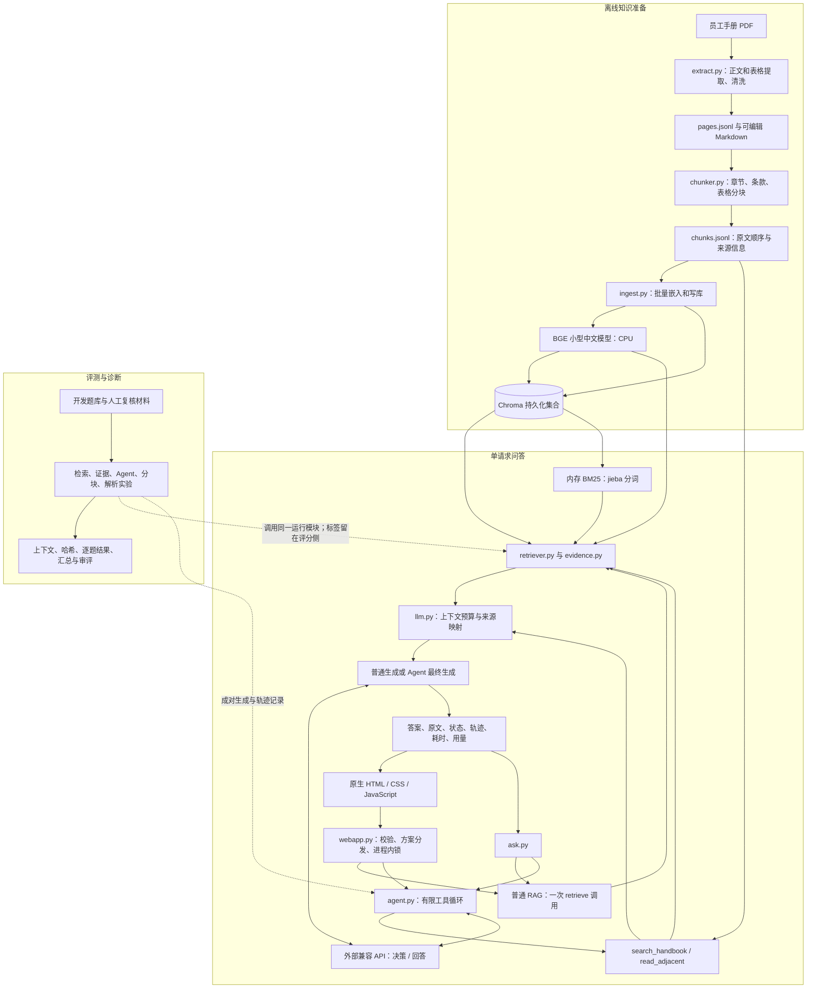
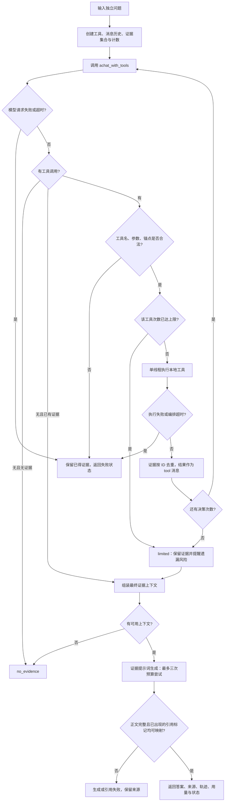
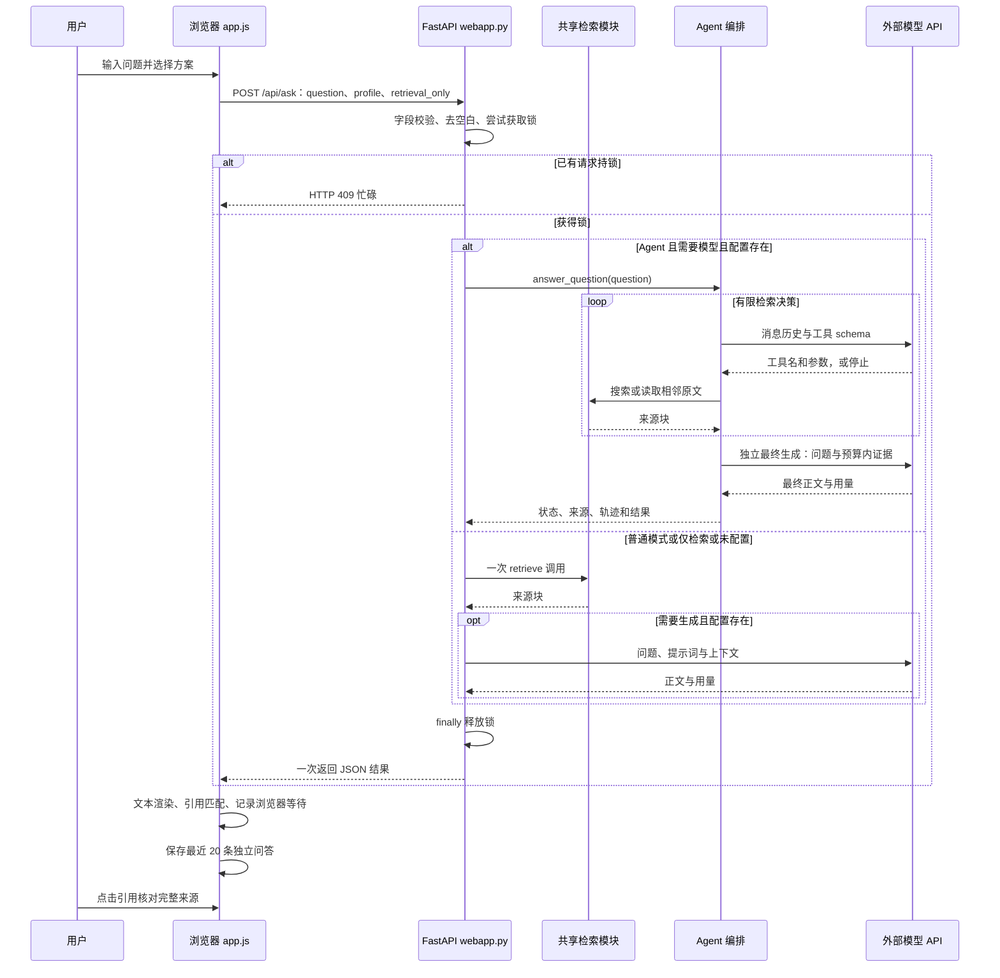

# 项目全景分析：员工手册 RAG 与受限检索 Agent

> 第一阶段 · 面向 AI Agent 实习、校招与技术面试
>
> 分析日期：2026-10-07；源码快照：`3a49dd8`，分支 `codex/pdf-table-loss-fix`。
>
> 本文基于当前本地源码、配置、测试和保存的实验记录。历史指标按各自语料与运行版本解释，不作为当前版本重新测得的质量结果。

## 0. 先建立正确的项目定位

**这是一个以员工手册为单一知识源、能够展示原文依据的本地问答系统，并提供模型驱动的动态补查模式。** 普通 RAG 先按固定检索策略找资料，再生成答案；Agent 模式让模型根据已经返回的资料决定下一步搜索什么或读取哪些相邻原文，应用代码负责执行和限制这些行动。

它的价值主张是：员工口语问题可能涉及多个条款，系统需要保留定义、适用资格、具体规则与例外，并让用户核对来源。这个目标对应的质量指标是证据覆盖、必要条件完整性、回答正确性与引用语义支持；代价对应本地检索耗时、模型请求次数和 token 用量。当前证据支持部分开发集上的改善，尚未证明真实员工业务收益。

### 0.1 已实现能力与边界

| 能力 | 当前实现 | 面试中应如何界定 |
| --- | --- | --- |
| 普通 RAG | PDF 解析、结构分块、BGE 向量、BM25、RRF、生成与引用 | 检索增强问答链路，固定管线本身不是自主 Agent |
| 动态检索 Agent | LlamaIndex `FunctionTool`、`OpenAILike`、自定义有限工具循环 | 单 Agent、单请求内的检索编排；没有采用默认 `FunctionAgent` |
| 证据补全 | 最多三条规则扩展查询、分面保留、补充查询的词法首位保护 | 领域规则，不是训练出的重排模型，也不是答案金标查询 |
| 交互 | 网页与 CLI；仅检索；原文、工具轨迹、用量与耗时 | 网页整包返回，没有流式生成 |
| 状态 | 请求内消息历史、已收集证据、计数与轨迹 | 没有跨请求模型记忆；浏览器最近 20 条记录只供查看 |
| 数据源 | 一份文本型 PDF；当前逐页记录 51 页、分块 123 个 | 历史冻结实验是 125 块；不得混称为同一快照 |
| 模型运行 | 本地 CPU 嵌入，外部 OpenAI 兼容接口生成/工具决策 | 没有本地训练、微调或 GPU 推理服务 |
| 系统成熟度 | 监听本机的可演示项目，有分层评测和故障处理 | 尚无账户、文档权限、租户隔离、生产部署或大并发验证 |

### 0.2 扫描范围与证据等级

扫描覆盖 `ragcore/` 的 16 个 Python 文件、6 个顶层实验脚本、9 个测试文件，以及 `ask.py`、`webapp.py`，合计 33 个 Python 文件；并核对前端、四份依赖清单、项目说明、当前数据统计及主要实验产物。函数/导入清单与测试数量通过语法树检查；`.env` 的凭据内容不进入本文。

- **源码事实**：可由本文给出的文件和函数复核，例如搜索上限、来源映射与锁。
- **历史测量**：已经保存的实验输出，受题库、语料、版本、模型路由和评分方式限制。
- **设计预期**：某项机制预计影响的指标；没有可比测量时明确说明。
- **未来方案**：用于回答系统设计追问；不表示已经实现。

当前 `data/chunks.jsonl` 的 SHA256 为 `6689f74c6d50718e48a76d1857128247f336bca005f8c8b655b06b11d74e9301`。当前块数与保存的入库统计均为 123。Agent 成对实验保存的语料哈希不同，因此其结果属于修复前的实验快照。

## 1. 项目整体架构图



**怎么讲这张图：** 左侧先把 PDF 转成有来源结构的知识块；在线侧复用同一检索能力，普通模式直接找一次资料，Agent 模式允许动态补查；最终模型根据预算内原文作答；评测侧保存输入与结果，把检索失败和生成失败分开分析。

这是本地单体应用，模块之间直接调用 Python 函数。Chroma 是持久化向量存储，BM25 是进程内索引，JSONL 保存解析与分块结果。它们没有被拆成独立网络服务，也没有消息队列或独立任务调度平台。

## 2. 目录结构分析

```text
RAG/
├── PROJECT_ARCHITECTURE.md       本次全景分析
├── AGENTS.md                    协作与评测约束
├── README.md                    总览、运行方法与历史结果
├── 京东集团员工手册.pdf          原始知识源
├── ask.py                       CLI 单次提问与交互循环
├── webapp.py                    FastAPI 入口与方案分发
├── ragcore/
│   ├── config.py                路径、切块、检索、上下文和输出预算
│   ├── extract.py               PDF 提取、表格覆盖检查、清洗
│   ├── chunker.py               章节/条款/表格分块和来源元数据
│   ├── embedder.py              CPU BGE 文档/查询嵌入
│   ├── store.py                 Chroma 客户端、集合、入库
│   ├── ingest.py                离线入库入口
│   ├── evidence.py              查询扩展、范围约束、融合和证据选择
│   ├── retriever.py             dense / BM25 / RRF 检索接口
│   ├── llm.py                   提示词、上下文组装、兼容 API、重试
│   ├── agent.py                 动态补查工具循环和最终回答
│   ├── eval.py                  关键词检索冒烟检查
│   ├── make_golden.py           半自动生成检索题库与校核清单
│   ├── eval_ir.py               检索指标和三路消融
│   ├── eval_robust.py           机械扰动、边界与可选模型改写
│   ├── redteam.py               风险问题与引用规则初筛
│   └── __init__.py              包入口
├── web/
│   ├── index.html               问题、方案、历史、回答和证据布局
│   ├── app.js                   API 请求、文本渲染、引用跳转、本地历史
│   ├── style.css                响应式样式与滚动区域
│   └── jd-logo.png              演示素材
├── tests/                       9 个测试文件、56 个现有测试方法
├── evaluation/
│   ├── run_evidence_experiment.py    检索/提示词/推理模式消融
│   ├── summarize_evidence_experiment.py  回答哈希与审评汇总
│   ├── run_agent_experiment.py       quality / agent 成对评测
│   ├── run_ingestion_experiment.py   SentenceSplitter 受控对照
│   ├── run_pdf_parser_experiment.py  原页探针与解析对照
│   ├── run_table_filter_regression.py  修复前后检索回归
│   ├── complex_cases_v1.jsonl        6 道复杂开发题
│   ├── pdf_parser_probes_v1.json     原页锚点/阅读顺序/表格探针
│   ├── baseline_v1_2026-09-26/       冻结语料、答案与审评规则
│   └── 各实验目录                   元数据、逐题输出、摘要和审评材料
├── data/
│   ├── handbook_editable.md     可编辑全文
│   ├── pages.jsonl              当前 51 页记录
│   ├── chunks.jsonl             当前 123 个来源块
│   ├── stats*.json              提取、分块、入库统计
│   ├── chroma/                  可重建的本地向量索引
│   ├── baselines/               本地备份/基线产物
│   └── eval/                    检索题库与早期报告
├── docs/
│   ├── screenshots/            网页演示截图
│   └── superpowers/            历史设计规格和实现计划
├── requirements-*.txt           分用途依赖清单
├── .env.example                配置变量示例
├── .env                        本地配置，Git 忽略
└── .venv/                      Agent 项目环境，Git 忽略
```

目录职责比较清楚：`ragcore/` 是运行能力，`web/` 是展示，`evaluation/` 是实验，`tests/` 是行为检查。`BASELINE_V1.md`、`EVIDENCE_OPTIMIZATION.md`、`COMPLEX_RAG_AGENT.md`、`INGESTION_EXPERIMENT.md`、`PDF_PARSER_EXPERIMENT.md` 等根目录文档解释不同阶段的结果。

注意版本管理细节：`.gitignore` 忽略整个 `data/`，但一部分 `data/eval/` 文件已受 Git 跟踪，仍然在仓库中；不能说所有评测材料都未提交。`.vscode/`、`.claude/` 是本地开发辅助目录，不是在线架构组件。

## 3. 核心模块职责分析

### 3.1 知识准备：extract → chunker → ingest

| 模块与关键函数 | 具体职责 | 为什么这样做、影响什么 |
| --- | --- | --- |
| `extract.py::extract_page_content` | 提取正文与表格；核对表格区域文字是否被单元格完整保留 | 防止表格检测误伤正文；影响原文可用性和后续召回上限 |
| `extract.py::strip_frame_noise / annotate` | 清理跨页重复边缘行与页码；标记封面、目录 | 减少检索噪声；启发式也可能误删，不能视为语义完美清洗 |
| `chunker.py::ChunkBuilder` | 跟踪章、节、条款；合并短条款，按上限切长文本 | 保留制度上下文并限制块长；影响召回、输入容量和嵌入截断 |
| `chunker.py::split_table` | 转成表格文本，长表按行组拆分并保留表头 | 尽量维持行列信息；没有实现视觉表格推理 |
| `embedder.py::embed_texts / embed_query` | 文档不加查询指令；查询加 BGE 指令；都归一化 | 保持检索模型的文档/查询约定；没有本项目独立测量指令收益 |
| `store.py::add_chunks` | 保存向量、原文及扁平化元数据 | 检索结果能回到原文，来源无需模型猜测 |
| `ingest.py::main` | 读取/重切块、批量嵌入、重建或追加集合、保存统计 | 将重计算移到离线；重建不是运行时无缝热更新 |

表格修复的关键逻辑在 `extract.py:90`：按同一个 bbox 读取区域原文，用 `Counter` 比较去空白后的字符及数量。只有区域字符都被单元格覆盖，才删除正文中的该区域并保留结构化表格；否则保留区域原文、放弃该表格的结构化结果。异常时尝试整页正文兜底。

这个检查解决了“检测到表格，却未提全其中内容”的问题，但字符集合和计数一致不证明阅读顺序或行列关系正确。页内表格在正文之后输出，也不保证完全还原 PDF 原始阅读顺序。它是内容保留保护，不是完整的版面解析验证。

当前切块参数为目标 500 字符、普通长文本上限 750 字符、重叠 80 字符，条款合并阈值为 300 字符。章/节切换会 flush；封面和目录跳过。`CHUNK_MIN` 虽在配置中声明，当前分块器未使用，不能据此宣称所有小于 100 字符的块会被合并或删除。长表分组也不能仅凭配置就保证每组严格不超过 750 字符。

### 3.2 检索：retriever + evidence

`retriever.py::retrieve` 是共享接口，Agent 没有另建一套检索系统。两个实验维度必须分清：

| 维度 | 候选值 | 决定的行为 |
| --- | --- | --- |
| `mode` | `dense / bm25 / rrf` | 使用哪条召回通道 |
| `strategy` | `baseline / expanded / coverage / guarded` | 是否扩展查询，以及如何在候选中选证据 |

- **dense**：查询向量 → Chroma cosine 检索，每个查询最多 20 个候选。
- **BM25**：从 Chroma 读全文 → jieba 分词 → `BM25Okapi`；每个查询最多 20 个候选，仅保留分数大于 0 的块。
- **RRF**：将名次转换成分数并累加，不直接混合向量距离与 BM25 原分数。
- **baseline**：只处理原问题，按融合排序取 Top-k。
- **expanded**：保留原问题，最多增加两个领域词汇查询，再融合。
- **coverage**：为原问题和补充分面保留证据位置，避免一个热门主题挤满 Top-8。
- **guarded**：在 coverage 基础上限制部分资格范围，并保护每个补充查询的 BM25 首位结果。

RRF 在 `evidence.py::fuse_ranks` 中的公式为：

```text
score(chunk) = Σ 1 / (60 + rank_in_channel)
```

它解决的是不同通道分数尺度不一致的问题；不理解哪个条款是必要条件。单路第 1 名约为 `1/61 = 0.0164`，两路第 20 名为 `2/80 = 0.025`，后者可能压过前者。`lexical_anchor_order` 正是针对这种观察做的规则保护，但词法首位也可能是噪声。

`select_evidence` 先从原问题分面取最多 3 块，再从每个补充分面取最多 2 块，最后按全局融合顺序补足，并按 ID 去重。所谓 coverage 是名额分配规则，不是自动计算语义完整度；`guarded` 也不是权限或安全认证机制。

重要边界：查询扩展写的是领域词汇与条件，没有运行时题号、gold ID 或标准答案；不过规则设计使用过开发题，因此仍有开发集过拟合风险。资格保护也只覆盖明确写出的规则，例如试用期迟到，不保证所有扩展查询都保留全部用户条件。检索不存在训练重排器或 Cross-Encoder。

### 3.3 生成：llm.py

`prepare_context` 把块转换为模型输入，`generate` 负责普通模式的接口调用与有限重试。

| 版本 | 上下文与生成行为 |
| --- | --- |
| baseline | 正文字数累计到 6000；遇到首个放不下的块就停止。页码/路径标记和分隔开销不计入该预算，来源映射为空 |
| evidence | 原文、来源标记、页码、路径、分隔符共同不超过 6000 字符；过大的块跳过，继续尝试后续块；建立 `来源N → chunk_id` 映射 |

6000 是字符限制，不是 6000 token，也不是模型完整输入长度限制。提示词和问题另外占用输入。块级装入还可能让预算内空间剩余。

证据提示词要求合并总则、具体规则和例外，保留转正、工龄、属地、年度累计等条件，缺少个人信息时给有条件的回答并澄清。它还避免从“这次提供的资料未明确”推断“整本手册没有规定”。这些是提示词约束，不能保证模型逐项遵守。

普通生成以 2048 token 起步，最多按 4096、8192 重试，总共最多 3 次应用调用。空正文或 `finish_reason=length` 会重试；新证据模式耗尽后拒绝返回截断答案，baseline 为保留旧行为可返回部分正文，网页标记 `truncated`。普通客户端还配置了 SDK `max_retries=1`，所以应用尝试次数不能直接当实际 HTTP 请求次数。

### 3.4 Agent：agent.py

`collect_evidence` 负责工具编排，`answer_question_async` 负责最终上下文、生成与结果，`answer_question` 用 `asyncio.run` 提供同步入口。更详细的执行步骤见第 5 节。

### 3.5 服务、展示与评测

| 模块 | 职责与不能混淆的边界 |
| --- | --- |
| `webapp.py::AskRequest / ask / run_question` | 校验、锁、profile 分发、错误状态和来源整理；业务失败多数通过 HTTP 200 内的 JSON status 表达 |
| `web/app.js::ask / show / inline / evidence` | 请求、整包渲染、来源跳转、最近 20 条记录；不发送历史给模型 |
| `ask.py::answer_once` | 单题 CLI、消融选项、Agent 入口；交互循环每次仍是独立问题 |
| `eval_ir.py` | 基于相关块标签的 Hit、Recall、Precision、MRR、nDCG；负样本不进入正样本均值 |
| `eval_robust.py` | 输入扰动和异常边界；可选模型改写需要外部调用，非全流程零成本 |
| `redteam.py` | 规则初筛：拒答/不确定/澄清等关键词与页码/路径；不判定最终语义正确性 |
| `evaluation/` | 保存开发实验、控制变量、来源/上下文/答案哈希、用量和审评，和在线逻辑分离 |

## 4. 数据流分析

### 4.1 离线数据如何变化

```text
PDF 页面
  → {page, text, tables, has_image, is_cover, is_toc, char_len}
  → {id, pages, chapter, section, clause_range, path, content, text, char_len}
  → 512 维归一化向量 + 原文 + 元数据
  → Chroma jd_handbook 集合
```

`content` 是块正文，`text` 还带 `【章节路径】` 前缀；嵌入、BM25 和生成都使用 `text`，不能说正文与来源路径完全隔离。`id` 为起始页加正文文本 SHA1 的前 10 位，内容/路径变更可能改变 ID。`pages` 可以跨页，`page_start` 用第一项；来源编号在每个请求内重新生成。

Chroma metadata 将页码数组序列化为逗号字符串，保存 `path`、`clause`、`char_len`。`read_adjacent_chunks` 则从 JSONL 的记录顺序读取，不以 Chroma 返回顺序或 ID 字典序判断相邻关系。

分块统计中的 `coverage_ratio=1.0661` 是字符总量比。重叠、表格序列化及计数口径会影响它，超过 1 不能解释为“106.61% 的原文被准确保留”。同样，`has_image=True` 只是页面有图片，不表示系统理解过这些图片。

### 4.2 普通在线数据流

```text
question / profile / retrieval_only
  → 校验与非阻塞锁
  → retrieve(question, k=8, strategy=...)
  → 候选名次 → RRF → 分面选择 → 来源块
  → prepare_context → 实际输入原文与来源映射
  → generate → 答案与每次应用调用的 usage
  → API 状态、来源、耗时与 token 汇总
  → 页面文本渲染、引用定位与 localStorage
```

普通质量模式在网页中展示真正进入上下文的来源；仅检索模式展示全部命中块。Agent 模式展示所有已经收集的来源，并用 `in_context` 区分最终是否纳入回答。**候选被召回、证据被收集、原文进入最终输入、模型据此正确作答，是四件不同的事。**

### 4.3 Agent 的两条数据通路

第一条用于决策：问题 → 决策模型 → 工具参数 → 原文工具结果 → 决策历史 → 下一次决策。

第二条用于回答：收集到的原文集合 → `prepare_context` → 独立最终生成。决策模型的中间文字不会作为最终证据，也不会直接作为最终答案。

`chunks` 用字典按 ID 去重并保留首次插入顺序；多次搜索后没有另做全局语义重排。所以早收集的块可能优先占用最终上下文。每次工具回复会按同一预算规则筛选可见块，但工具返回的原始块先全部加入收集集合；因此工具轨迹中的收集来源不一定都已被决策模型看到，也不一定都进入最终模型。

工具 JSON 回复带 ID、原文和元数据。6000 字符规则用于选择原文块，未严格计算序列化后的 JSON 总长度；决策历史也没有总 token 截断机制。`context_window=32000` 是适配器声明，代码未验证供应商实际窗口或整个历史一定适配。

### 4.4 评测标签流与数据边界

`run_agent_experiment.py::run_case` 只把 `case['question']` 交给 runtime。返回以后才用 gold IDs 比较 `gathered_ids` 与 `context_ids`，并增加题号和审评点。没有把预期答案或参考 ID 当工具决策输入。

当前使用的是本地解析与嵌入，但决策/生成会把问题和选中的手册原文发送给配置的模型 API；不能称为“所有数据都在本机处理”。密钥只供后端读取，网页不获得密钥。

## 5. Agent 执行流程分析

### 5.1 Agent 和固定流程的区别

普通模式也可能在 `retrieve` 内做三条规则查询，但查询来自确定性词汇规则，执行顺序预先固定。Agent 的下一次查询由模型结合前面的原文动态决定，形成“决策 → 工具 → 观察 → 再决策”的循环。

可以描述为 **ReAct 思路下的工具决策/观察循环**，但实际协议是 function calling，代码没有解析文本格式的 Thought/Action/Observation，也没有要求展示隐藏思维链。它没有多 Agent、长期记忆或独立 Plan-and-Execute 规划器。

### 5.2 两个工具是什么

| 工具 | 参数 | 真正执行的能力 | 应用约束 |
| --- | --- | --- | --- |
| `search_handbook` | `query: str` | `retrieve(query, k=8, strategy='guarded')`，默认 RRF | 参数唯一且非空，最长 500 字符；最多执行 3 次 |
| `read_adjacent` | `chunk_id: str` | 从当前 JSONL 读取锚点及前后各一块，边界处可少于 3 块 | 锚点必须已在本轮收集集合中；最多执行 2 次 |

因此“三次搜索”是三次工具调用，不等于三次底层查库：每次 guarded 最多生成三条查询，RRF 模式中每条都执行 dense 和 BM25。邻接读取扩展局部上下文，也可能跨章/节边界，不等于语义邻居检索。

### 5.3 从一次问题到停止



对应源码步骤：

1. `collect_evidence` 初始化 `[system, user]` 历史，并用 `FunctionTool.from_defaults` 包装两个 Python 函数。
2. 调用 `llm.achat_with_tools(..., allow_parallel_tool_calls=False)`，记录本次 usage，并解析结构化工具调用。
3. 应用再次检查白名单、参数集合、类型、长度、邻接锚点和次数。即使模型一次返回多个调用，也逐个验证和执行。
4. 工具在独立单工作线程中运行，避免 CPU/本地 I/O 阻塞异步超时检查。`tool_call_id` 将 tool 结果和该次模型调用对应起来。
5. 结果加入 `chunks`；本次可见原文与被省略 ID 作为 tool 消息回传。下一轮模型能根据观察改写查询。
6. 模型不再调用工具时停止；达到调用上限也停止，但有上下文时可给出带遗漏提醒的答案。
7. `answer_question_async` 重新构建最终上下文，使用 `EVIDENCE_PROMPT` 独立生成。超时、模型调用或工具执行失败时保留来源，当前不继续合成答案。
8. 最终出现的 `〔...〕` 标记必须在来源映射中，否则清空答案并返回 `citation_failed`。

### 5.4 预算由谁保证

| 预算 | 当前数值 | 限制含义 |
| --- | ---: | --- |
| 搜索执行 | 3 次 | 应用计数限制，工具失败的已尝试调用也占用次数 |
| 邻接读取执行 | 2 次 | 限定为已获得 ID，应用计数限制 |
| 检索决策模型调用 | 8 次 | 有限循环；不含最终生成 |
| 编排阶段期限 | 120 秒 | 决策循环与工具等待共用阶段期限 |
| 最终生成期限 | 120 秒 | 最多三次生成尝试共享这一期限 |
| 决策输出预算 | 每次 2048 token | 适配器配置；不是全请求输入/输出总预算 |
| 最终生成输出预算 | 2048 → 4096 → 8192 | 空输出/截断时提高，最多三次；不是无限重试 |
| 最终证据文本 | 6000 字符 | evidence 格式的标记和原文共同计数 |

最多 8 次决策加 3 次最终生成，即正常代码路径最多 11 次应用层模型调用；实际通常更少。Agent 适配器设 `max_retries=0`，但供应商内部重试或计费无法从这里确认。不存在全请求累计 token/金额预算，不能称为严格费用封顶。

两个 120 秒是分阶段限制，不是单个 120 秒端到端限制；初始化、依赖导入和其他同步开销也使它不能直接作为严格 240 秒服务 SLA。Python 不能强行停止已运行线程：超时会停止等待并丢弃迟到结果，后续请求的工具仍可能被该单工作线程拖慢。没有测得并发吞吐或稳定超时恢复收益。

`SEARCH_PROMPT` 要求至少搜索一次，但应用未单独硬编码强制首轮搜索；若模型直接给文字且没有证据，代码返回 `no_evidence`。提示词中的“最多几次”和代码计数的强制程度不同，面试中要分开说。

### 5.5 可以如何讲一个具体例子

输入：“我还在试用期，想请病假，工资和餐补分别怎么处理？申请时需要哪些材料？”

合理的动态补查过程是先搜索病假与资格，再根据原文缺口补查工资/福利分类和材料要求，必要时读取相邻条款，最后综合条件作答。这是帮助理解机制的示意，模型真实搜索顺序以 `trace` 为准，不能把示意当每次都执行的固定计划。

为什么需要补查：一条病假待遇可能不能同时说明转正资格、福利分类、证明材料与例外。目标是改善条件完整性和组合证据覆盖；当前 6 题成对实验尚未测出覆盖提升，详见第 9 节。

## 6. 用户请求生命周期分析

### 6.1 网页一次请求的顺序



1. 页面限制输入 500 字符；后端还用 Pydantic 限制 1–500 字符、清理空白，并限定四种 profile。格式无效返回 HTTP 422。
2. `pipeline_lock.acquire(blocking=False)` 实现进程内单请求占用。忙碌立即返回 409，没有服务端排队；`finally` 保证释放。
3. profile 决定普通链路参数，或进入真正的 Agent 分支。
4. 仅检索模式和未配置接口都不会进入模型驱动 Agent。Agent 的仅检索路径执行一次 guarded 检索；未配置时网页返回 `not_configured` 并保留原文。
5. 检索或生成发生异常时返回明确 status，已有来源可继续检查。Agent 依赖缺失返回 `agent_unavailable`，已开始的 Agent 失败不会静默改用普通生成。
6. 页面收到完整 JSON 才渲染；等待计时只是状态提示，不是流式模型输出。
7. 返回结果保存到浏览器 localStorage；下一次 API 请求只含新问题与方案，没有历史消息。

### 6.2 四种方案与默认值

| 方案 | 网页中的行为 | 对应参数 |
| --- | --- | --- |
| baseline 原方案 | 固定检索与旧回答格式，用于对照 | baseline strategy + baseline prompt + default thinking |
| quality 优化方案 | 固定 guarded 检索与证据回答 | guarded + evidence + low |
| fast 快速方案 | 同一检索与证据回答，关闭推理 | guarded + evidence + disabled |
| agent 复杂问题 | 模型驱动补查后独立回答 | 工具内部 guarded；最终 evidence + low；决策关闭推理 |

网页默认 `quality`，CLI 默认 `rrf + baseline + baseline + default`；两者默认值不同。`ask.py --agent` 使用固定 Agent 参数，普通 `--mode/--strategy/--prompt-version/--thinking-mode/--top-k` 不改变 Agent 的工具策略。CLI REPL 只是循环调用独立单题，没有持续对话。

### 6.3 可观测性、可用性与展示边界

- 普通模式的 `retrieval_seconds` 是开始请求到检索返回；Agent 的该字段是各工具执行/等待耗时之和。Agent 另有 `orchestration_seconds` 包含决策过程，不能只比较同名 retrieval 字段。
- `generation_seconds` 是最终生成阶段；`total_seconds` 是服务管线耗时；前端另记 `client_seconds`。冷加载与预热结果必须分开报告。
- 有 usage 的所有应用尝试都累计 prompt + completion；reasoning 是 completion 内部分项，不能再加一次。任何一次用量未知，汇总 total_tokens 为 `null`；仅检索没有用量也显示未调用/未知，而不是记录了零费用账单。
- 普通客户端 SDK 重试中的失败 HTTP 尝试并非都能独立取得 usage，因此“记录应用尝试”不等于完整计费审计。
- 网页用 `textContent`/文本节点显示模型内容，降低直接注入 HTML 的风险；没有完整 Markdown HTML 渲染器。
- `/api/health` 只报告服务、配置是否存在和锁状态。它没有真正探测模型连通性、余额、嵌入缓存和索引完整性，`ready` 不能当完整依赖健康认证。
- 锁只保护这个服务进程的网页管线；多进程实例、CLI 并行访问及索引更新不受同一锁协调。当前没有大并发吞吐数据。

## 7. 技术栈分析

| 层次 | 实际技术 | 选择理由与影响指标 | 当前证据边界 |
| --- | --- | --- | --- |
| 语言/运行 | Python 3.10、Windows、本地 CPU | 复用 PDF、检索、模型与异步生态；降低集成复杂度 | 没有与其他语言的研发时间或吞吐对照 |
| 后端 | FastAPI、Pydantic、Uvicorn | 统一校验并提供同源静态页面/API | 路由为同步函数，复杂 Agent 内部另用异步调用；不是全链路高并发异步服务 |
| 前端 | HTML/CSS/原生 JavaScript | 演示问题、答案、证据、工具步骤和实际等待 | 没有 React/Vue、前端构建系统或 SSR；选型性能收益未测 |
| PDF | pdfplumber | 正文与结构化表格可一起处理，便于来源保留 | 文本型 PDF；没有 OCR、LlamaParse 或视觉模型输入 |
| 分块 | 自定义结构分块 | 尊重条款与章节；保留来源结构 | SentenceSplitter 是独立实验，没有替代当前默认分块 |
| 嵌入 | sentence-transformers + `BAAI/bge-small-zh-v1.5` | 小型中文检索模型，本地 CPU；512 维向量 | 512 维不等于 512 token；历史实验另测过 BGE 输入截断 |
| 向量库 | Chroma PersistentClient、cosine | 小规模本地持久化索引，存原文/元数据/向量 | 尚无分片、生产备份策略或多租户过滤 |
| 词法检索 | jieba + rank_bm25 | 匹配制度词、数值和名称，补足语义召回 | 当前题库词面偏强，BM25 表现最好，不能推断所有语义改写都最好 |
| 融合/选择 | RRF + 规则分面保留 | 不需校准原分数；为互补证据留位置 | 规则不等于模型语义重排，未实现 Cross-Encoder |
| 模型调用 | OpenAI SDK、OpenAI 兼容协议、httpx | 复用接口配置与用量字段 | SDK 名称不意味着用的是 OpenAI 模型；特定 thinking 参数需要供应商支持 |
| Agent 组件 | LlamaIndex FunctionTool、OpenAILike | 工具 schema/响应解析；应用保留循环与预算控制 | 未采用 LangChain、LangGraph、多 Agent 或默认 FunctionAgent |
| 评测/验证 | unittest、MockTransport、JSON/JSONL、SHA256 | 无真实模型调用的控制测试；保存实验输入/输出以支持审计 | 没有持续线上监控、追踪平台或独立真实用户保留集 |

### 7.1 为什么不是“换一个框架就更好”

LlamaIndex 在两个位置出现：在线用于工具调用适配；离线实验用于 `SentenceSplitter` 与 `PDFReader`。框架组件不同，负责的任务也不同，不能把 Agent 引入和 PDF 解析改善归为同一收益。

历史 SentenceSplitter 实验降低了超 BGE 输入上限的块数，但在固定 Top-8 下没有提高证据摘录覆盖。这说明切块粒度同时改变向量输入长度、返回文字容量、结构边界和来源粒度，评价要控制上下文容量，不能只比较框架名称。

## 8. 第三方依赖分析

### 8.1 本次本地 .venv 实际版本

以下版本来自本次读取安装元数据，表示当前项目 `.venv`，不代表最新版或所有机器上的版本。

| 依赖 | 版本 | 本项目作用 |
| --- | --- | --- |
| fastapi / pydantic / uvicorn | 0.141.1 / 2.13.5 / 0.52.4 | HTTP、请求校验、服务启动 |
| httpx | 0.28.1 | 异步模型 HTTP；测试 transport；普通路径也可走 httpx2 |
| chromadb | 1.5.9 | 持久化/实验临时向量集合 |
| sentence-transformers | 6.0.1 | BGE encode 与本地模型缓存 |
| torch / transformers | 2.9.0 / 5.16.1 | 本地嵌入模型底层运行 |
| pdfplumber | 0.11.10 | PDF 正文、区域、表格提取 |
| rank-bm25 / jieba | 0.2.2 / 0.42.1 | BM25 与中文分词 |
| python-dotenv | 1.2.3 | 后端加载本地配置 |
| llama-index-core | 0.14.25 | ChatMessage、FunctionTool 与实验分块 |
| llama-index-llms-openai-like | 0.8.1 | OpenAI 兼容模型适配 |
| llama-index-llms-openai | 0.8.2 | 上述适配器所用基础实现 |
| openai | 2.54.0 | 当前项目环境的兼容 API SDK |
| llama-index-readers-file / pypdf | 0.7.0 / 6.16.2 | PDFReader 解析对照，不是默认解析链路 |
| pypdfium2 | 5.13.0 | 原页渲染与视觉核对工具；不是在线生成模块 |

异步、线程、锁、哈希、JSON、统计与测试等还大量使用 Python 标准库。`httpx2` 是普通模型客户端中的可选分支，代码优先尝试导入它，失败再用 `httpx`；不能把这当成所有环境都有的强依赖。

### 8.2 依赖清单与可复现性

- `requirements-internvl.txt` 补充 PDF/BM25/分词/dotenv；若干模型与数据库依赖只是“原 conda 已安装”的注释，不是完整可安装锁定清单。
- `requirements-web.txt` 使用版本范围声明 FastAPI/Uvicorn/httpx，Pydantic 属于关联依赖且被业务直接导入。
- `requirements-agent.txt` 精确固定 LlamaIndex 与 OpenAI 版本。
- `requirements-pdf-eval.txt` 在 Agent 清单上增加 Reader、pypdf、pdfplumber 和 PDFium。
- `.venv/pyvenv.cfg` 显示 `include-system-site-packages=true`，继承原 conda 包。新项目的 OpenAI 2.54.0 与旧环境注释的 3.7.0 不同；不能宣称环境完全独立，或仅靠这几份清单即可在空机器一键复现。

### 8.3 运行时最重要的外部依赖

本地部分依赖 PDF、当前分块、Chroma 集合与 HF 模型缓存。`embedder.py` 默认启用 HF 离线模式，缓存缺失时不会自动联网补全。BM25 路径不加载 BGE 做推理，但导入 `retriever` 仍会导入嵌入模块依赖。

外部部分依赖 API 的认证、余额、限流、网络、工具调用能力、上下文/输出限制和 thinking 参数兼容性。普通 API 默认 90 秒 HTTP timeout，SDK 最多一次自动重试；Agent 的 AsyncClient 为 45 秒 timeout、关闭 SDK 自动重试，并另外施加阶段期限。默认不继承系统代理，需显式设置 `RAG_HTTP_PROXY`；普通路径显式代理分支与 Agent 的客户端配置仍有差异。

`RAG_LLM_MODEL` 默认值为 `deepseek-chat`，历史实验请求别名是 `deepseek-v4-flash`，实际响应报告为 `deepseek-flash`。本文没有读取本地密钥或将当前实际模型配置等同于历史实验模型。别名相同也不能证明供应商底层模型版本冻结。

配置模板中的 `RAG_TOP_K` 只是注释示例，当前代码未读取这个变量；实际默认 k 来自 `config.py` 或 CLI 参数。还有 `BM25_NGRAM` 配置注释提到 bigram 兜底，但现实现直接导入 jieba，未实现该兜底。面试解释以调用代码为准。

## 9. 系统设计亮点与实测取舍

### 9.1 最有说服力的亮点

**亮点一：把“找到相关文字”和“找齐必要证据”分开。** 病假、事假、餐补等结论可能共同依赖定义、总则、具体规则和例外。多查询与分面保留解决的是互补证据缺失，而不是仅提高主题相似度。历史 9 道开发正题的完整参考覆盖从 7/9 到 9/9，有逐题证据；仍不代表所有问题都能正确作答。

**亮点二：模型负责提出行动，应用负责控制执行。** 工具白名单、参数/锚点检查、计数、阶段超时与有限重试独立于提示词。这样使失败能被解释和复现；它限制工具可达范围，没有证明全面防御提示注入或保证政策结论正确。

**亮点三：检索编排与最终回答分离。** 最终合成仅使用收集的原文，中间代理文字不成为证据。证据用来源编号映射到真实输入块，前端展示未纳入上下文的条款，避免“搜到了就认为模型看到了”。未做对照测量来证明这种分离本身提高准确率。

**亮点四：失败保留证据，并记录质量之外的成本。** API/工具失败、空答案、截断、无效引用和预算用尽分开表达。每次应用模型调用的用量都参与汇总；未知保留未知。其价值是诊断与可核对性，尚未量化用户体验或实际费用改善。

**亮点五：保留基线并做分层消融。** dense/BM25/RRF、四种证据选择策略、两个提示词、不同推理设置、quality/Agent 都能对照。评测标签仅在评分侧使用，实验保存上下文与哈希；这让“改善来自哪里”可以被追问，而不是只给一个整体准确率。

**亮点六：追到解析层修复真实漏字。** 第 48 页 URL 缺失源于表格区域过滤，先核对原页，再修复正文保留、回归检索并重建索引。这个例子能证明理解数据质量是 RAG 上限的一部分；修复后的 10 道探针覆盖仍不是全文解析准确率。

### 9.2 可以使用的测量，必须附带的边界

| 对照与数据集 | 基线 → 新结果 | 变化 | 能说明什么 / 不能说明什么 |
| --- | --- | --- | --- |
| 原检索题库 35 道正题，历史 dense vs RRF vs BM25 | Recall@3：77.14% / 91.43% / 97.14%；MRR：0.7049 / 0.8131 / 0.8762 | BM25 比 RRF 的 Recall@3 高 5.71 个百分点 | 此题库下 BM25 更强；题目由语料构造、词面重合偏高，不证明融合普遍更好 |
| 36 题中的 9 道正题，baseline → guarded | 完整参考覆盖@8：7/9 → 9/9 | +2 题，+22.22 个百分点；相对 +28.57% | 历史固定 125 块开发集的证据补全，不是回答准确率 |
| 同期 36 道模拟题，A → H | 模型复核严格正确：21/36（58.33%）→30/36（83.33%） | +9 题，+25 个百分点；相对 +42.86% | 检索、提示词、推理设置的组合结果；非真实用户测试、非全量人工金标 |
| 同期 A → H，生成耗时与已报告 token | 生成 P50：8.038→14.071 秒；总 token：261181→295563 | +6.033 秒，约 +75.1%；token +13.16% | 检索预计算后的生成时间，包含应用重试；不是端到端 SLA，也不是金额 |
| SentenceSplitter 256/32 对照，历史 125 块 | 超 BGE 512 token 块：18→0；26 段唯一摘录 Top-8 完整覆盖：26/26→25/26 | 截断风险块 -18；摘录覆盖 -3.85 个百分点 | 更短块不自动改善检索；6000 字符、最多 32 候选时该摘录子集恢复到 26/26 |
| 表格过滤修复，11 页 65 个锚点 | 存在锚点：60/65→65/65 | +5 个锚点，+7.69 个百分点 | 选定探针的文字保留改善；不是全 PDF 逐字准确率 |
| 同一修复，10 道检索开发探针 | Top-8 完整探针覆盖：8/10→9/10 | +1 题，+10 个百分点 | 固定下游实验的参考片段覆盖；未重跑回答正确率 |
| 同一修复，原题库回归 | 未变 ID 的完整覆盖 34/34→34/34；可定位摘录 26/26→26/26 | 持平 | P32 的变化来源另按原文摘录检查，不能用旧 ID 生硬评价新块 |

数据出处：`data/eval/report_ir.json`；`evaluation/guarded_experiment_2026-09-26/retrieval_summary.json`；`evaluation/evidence_optimization_summary_2026-09-26/summary.json`；`evaluation/ingestion_budget_2026-10-04/{metadata,summary}.json`；`evaluation/pdf_table_filter_fix_2026-10-04/{summary,gold_regression}.json`。

原 35 题在证据优化脚本中另报 `any_at3/any_at8`：32/35 和 35/35。它们是“至少命中一个参考块”的题数；完整参考覆盖是 gold 集合全部进入结果。旧单参考标签下 Hit 与 Recall 数值可以相同，多参考问题不能沿用这种简化。

### 9.3 Agent 最新成对实验：机制已通，收益未证实

保存实验使用代码 `174fdf3`、修复前语料，6 道新编复杂开发题，每种模式每题一次；串行并交替顺序，预热后计时。quality 和 Agent 使用同一语料与最终证据提示词，但客户端调用路径不同，不能把所有耗时差异精确归因为工具编排。

| 指标 | quality | Agent | Agent 变化 |
| --- | ---: | ---: | ---: |
| 流程完整返回 | 6/6 | 6/6 | 持平 |
| 收集证据完整参考覆盖 | 5/6 | 5/6 | 持平 |
| 最终上下文完整参考覆盖 | 5/6 | 5/6 | 持平 |
| 总耗时 P50 | 46.14 秒 | 49.52 秒 | +3.37 秒，约 +7.3% |
| 总耗时 P95，最近秩即 6 题最大值 | 69.05 秒 | 73.90 秒 | +4.85 秒，约 +7.0% |
| 平均总 token，含应用重试 | 14910 | 33471.17 | +18561.17，约 +124.5% |

出处：`evaluation/agent_experiment_2026-10-04/{summary,metadata}.json` 与 `answers.jsonl`。`review.md` 的模型复核、人工裁决仍为未评审，所以该实验**没有答案正确率**。两种模式都漏掉 complex02 的一个参考块；该块是否必要，还需审查答案与原文。

结论是：动态补查机制可运行，但在这次小样本没有显示参考覆盖增益，调用用量更高。保留网页默认 quality、让用户显式选择 Agent，符合现有证据。未来应使用未参与设计的跨章节问题、盲审必要条件与引用支持，并重复成对运行后再决定自动路由；这项自动路由尚未实现。

### 9.4 必须区分的三类“正确”

1. **检索/证据覆盖**：找到了哪些参考来源。参考块可能冗余，替代证据也可能足够；不是答案判定。
2. **引用结构正确**：页码/来源编号能对应输入来源。Agent 只检查已经出现的标记是否存在；没有强制每个事实带引用，也没有验证语义支持。
3. **答案正确与引用语义支持**：结论、适用条件、例外和每项事实是否真正被所引条款支持，需要独立审评。

冻结旧答案经模型重评及 3 处用户裁决得到 19/36（52.78%），完全引用支持 14/36（38.89%）；同期重新生成的 A 是 21/36（58.33%）。前者是旧输出重评分，后者是另一批输出，不能拼成一次优化前后对照。H 的 83.33% 未附新一轮逐项引用语义支持率，不能声称该指标也已改善。

早期红队 21/21 是规则初筛通过，非语义正确率。现有 56 个测试证明的是所覆盖的控制行为，非模型回答正确率或全面系统安全性。

### 9.5 Staff Engineer 会继续指出的限制

| 当前限制 | 实际影响 | 合理的下一步及测量方法，均未在本文实施 |
| --- | --- | --- |
| `_corpus` 常驻缓存；BM25 缓存按 ID 序列区分 | 服务内重建后不一定刷新正文/索引；相同 ID 的内容变化也不会触发重新分词 | 显式版本化/失效并做更新后的来源一致性测试；当前演示可重启加载 |
| JSONL 和 Chroma 没有原子发布快照 | 邻接工具和搜索可能在更新过程中读到不同版本 | 给请求固定语料版本，构建后切换快照；测更新一致性和恢复时间 |
| 默认重建先删除集合再写入；`--append` 调用 `col.add` | 非事务切换；源码不提供真正 upsert，重复 ID 行为取决于数据库 | 用版本集合与明确增量接口；测中断恢复与重复入库行为 |
| 单进程锁，单本地工具线程 | 不排队；超时任务可能占住线程；多进程不受同一锁控制 | 先测固定并发吞吐、P95、忙碌率和故障恢复，再决定任务队列/工作进程 |
| 决策历史无总 token 控制；最终证据按首次获得顺序装入 | Agent token 增加，后收集的必要证据可能被预算挤掉 | 区分必要证据、压缩重复工具上下文；保持 baseline，成对测输入覆盖与答案质量 |
| 缺少文档权限和来源新鲜度机制 | 无法给不同员工/部门做授权检索，也无法证明手册现行 | 检索前权限过滤、版本日期与责任部门校验；测越权泄漏与版本命中 |
| 提示词注入仅有规则提醒 | 原文中的恶意指令仍可能影响模型选择或答案 | 构造注入开发/保留题，测工具违规率和答案偏离率；工具白名单不等于全面防御 |
| 模拟题库小且用于优化；模型审评非完整人工金标 | 指标可能受词面和规则过拟合影响 | 独立真实问法、双人抽查/盲审、重复模型采样；分别报告各项指标 |
| 只有来源编号检查，没有逐事实语义验证 | 正确编号仍可能支持不了结论，漏引用也可能通过 | 逐项断言审评，分别测引用存在率、支持率、条件完整率与拒答错误率 |
| 没有账单价格与完整失败 usage | token 不能自动换算真实成本 | 接入真实计费记录，报告每个成功正确回答的费用及未知比例 |

这些是从当前代码推导的边界与测量方向，不是已经发生的生产事故，也不代表已完成对应改造。

## 10. 面试官最可能关注的部分

以下按源码复杂度和 AI 应用岗位常见能力要求预测，未针对某家公司的真实面试统计。先练 P0；每个回答都应能落到函数、输入输出和证据。

| 优先级 | 主问题 | 面试官可能继续追问 | 你应掌握的源码与回答重点 |
| --- | --- | --- | --- |
| P0 | 这个项目解决什么问题？ | 为什么直接把 PDF 塞给模型不行？ | 知识离线处理、来源可核对、上下文预算；51 页/123 块当前数据，未做直接长上下文方案的收益对照 |
| P0 | 普通 RAG 和你的 Agent 区别是什么？ | 多查询扩展是不是已经算 Agent？ | `retrieve` 是规则决定查询；`collect_evidence` 的模型根据 tool 结果决定下一步；只有后者有动态工具循环 |
| P0 | 工具到底是谁执行的？ | schema 不合法、模型乱调、一次调四个怎么办？ | FunctionTool 生成工具协议，应用校验与 `lookup[name].call` 执行；多调用也逐一检查次数 |
| P0 | 如何防止 Agent 死循环和高成本？ | 八次是不是包含最终回答？超时线程真停了吗？ | `AgentLimits`、两阶段 timeout、最多 8+3 应用调用；线程只停止等待；没有总 token/金额封顶 |
| P0 | dense、BM25、RRF 为什么一起用？ | BM25 更好为什么还保留 RRF？ | dense 语义与 BM25 词法互补是设计动机；历史 BM25 最强，保留消融；不能声称融合普遍获胜 |
| P0 | 为什么 Top-8 仍会漏证据？ | 多查询为什么也可能变差？ | 召回缺词、RRF 共识偏好、热门分面占位；领域扩展、原问题保留和词法锚点保护；有范围漂移风险 |
| P0 | 83.33% 怎么测出来的？ | 人工吗？保留集吗？基线 52.78% 还是 58.33%？ | 同期 A→H 的 36 模拟开发题、模型复核、组合改动、25 个百分点；冻结旧答案重评分单独解释 |
| P0 | Agent 的收益是什么？ | 既然没提升，为什么还做？ | 六题实验覆盖持平，token +124.5%；验证机制而非证明质量收益；默认 quality，补足独立评测后决定适用范围 |
| P0 | 有引用就不幻觉吗？ | 引用编号正确但事实错误怎么办？ | `prepare_context` 映射和 Agent 标记检查只验证结构；语义支持、漏条件、漏引必须另测 |
| P1 | PDF 怎么处理表格和跨页条款？ | 真实发现过什么漏字问题？ | `extract_page_content` 的 Counter 覆盖保护、第 48 页 URL；`ChunkBuilder` 保留跨页页码；字符覆盖不证明行列/阅读顺序 |
| P1 | 500 字符怎么选？为什么不用 SentenceSplitter？ | 向量截断、Top-k 与字符预算是什么关系？ | 结构切块是现有启发式，未证明最优；历史 18 超长块；256/32 摘录 Top-8 25/26，等预算恢复到 26/26 |
| P1 | 模型思考会影响哪些指标？ | 为什么有空正文，重试是不是免费的？ | reasoning 与正文共享输出预算；2048/4096/8192；质量/耗时/token 分开报告，reasoning 不重复计数 |
| P1 | 是多轮吗？有长期记忆吗？ | 用户补充条件会自动承接吗？ | 请求内 `history` 服务工具编排；前端历史只展示；下一轮必须包含必要上下文，未实现跨轮记忆 |
| P1 | 怎么定位一个错误答案？ | 如何知道是没召回还是生成没用？ | 原页→解析→块→候选→Top-k→最终 context→答案→引用审评；保存哈希和 source IDs，不能只看最终文本 |
| P1 | 用 LlamaIndex 替你完成了什么？ | 为什么没用默认 FunctionAgent / LangGraph？ | schema/消息/适配器来自框架，预算和循环自己控制；没有比较框架性能，不把未用框架说成不足 |
| P1 | 服务怎么处理失败和并发？ | 409、业务失败、API 超时如何区分？ | `AskRequest`、非阻塞 Lock、JSON status、sources 保留；同步路由、单进程范围，没有吞吐收益测量 |
| P2 | 如果上线给多个部门使用呢？ | 数据权限、索引更新、数据外发和新鲜度？ | 先说明当前未做，再给权限前置过滤、版本快照和独立部署方案；这是未来设计，不是现有能力 |
| P2 | 你怎么控制成本并量化产品价值？ | token 之外的成本、冷启动和重试？ | 分阶段耗时、实际 usage/未知比例、外部账单；衡量每个正确解决问题的费用与人工核对时间，当前未测业务收益 |

### 10.1 一分钟项目介绍示例

“我做的是一个员工手册问答项目。它先在本地解析 PDF，按章节和条款分块，用 BGE 与 BM25 做检索，再让模型依据原文回答，并展示页码和条款供核对。当前修复后的语料是 51 页、123 块。

我重点分析了证据为什么丢失：口语词汇与制度词不一致、融合排序挤掉互补条款，以及模型漏掉适用条件。保留原方案做消融后，历史 9 道开发正题的完整证据覆盖从 7/9 到 9/9；同批 36 道模拟题的模型复核严格正确率从 58.33% 到 83.33%，但生成 P50 从约 8 秒到 14 秒，token 增加约 13%。这些是开发集结果，还不是独立真实用户准确率。

之后我增加了受限工具检索 Agent，让模型根据已找到的原文动态补查，代码限制工具、次数和超时。六道复杂题的成对实验没有显示覆盖提升，成本更高，所以仍保留普通优化 RAG 为默认。我能区分功能跑通、参考证据覆盖和答案正确性，并用保存的上下文与轨迹定位问题。”

示例里的“我做了”描述项目工作范围；实际个人承担了哪些判断、实现和验证，应按自己的真实参与说明。代码由 AI 辅助生成时，重点是能解释控制逻辑、验证方式和设计取舍，不虚构独立完成经历。

### 10.2 应避免的表述与更准确的讲法

| 容易被追问击穿的说法 | 更准确的表述 |
| --- | --- |
| “用了 RRF，所以比 BM25 准” | “保留三路消融；当前历史题库 BM25 更强，融合的互补价值需在真实改写上验证。” |
| “9/9，系统准确率 100%” | “9 道开发正题的完整参考证据覆盖是 9/9，答案正确率独立测量。” |
| “Agent 提高了复杂问题准确率” | “机制可运行；六题覆盖持平，答案尚未审评，耗时和 token 增加。” |
| “有引用，模型就不会幻觉” | “来源映射可检查；引用支持不了事实、漏资格和无引用断言仍需审评。” |
| “全程本地、没有数据外发” | “解析和嵌入本地运行，选中的原文与问题会发送给配置的生成 API。” |
| “支持多轮记忆” | “有请求内工具历史和浏览器记录，没有跨请求模型记忆。” |
| “超时后线程已经杀掉” | “停止等待、忽略迟到结果，后台线程可能仍运行。” |
| “LlamaIndex 替换了全部 RAG 管线” | “在线使用工具组件，复用现有检索；Reader/句子切块保持在独立实验中。” |
| “全套依赖完全隔离，一键复现” | “项目环境继承已有 conda，部分版本已固定，还需要模型缓存与本地索引。” |

### 10.3 推荐学习顺序

下一阶段最优先逐函数走读一次普通 quality 请求，再跟一条 Agent trace。先读 `webapp.py::run_question → retriever.py::retrieve → evidence.py::select_evidence → llm.py::prepare_context / generate`，然后读 `agent.py::collect_evidence / answer_question_async`，最后解释对应实验数据。这样可以先吃透固定链路，再理解动态补查为何新增决策与成本。

替代路线是先读 PDF 丢字修复，练习从原页到索引的排错；或先核对 36 题审评口径，练习准确讲述量化结果。第一阶段只交付架构分析，不自动开始模拟面试或修改业务代码。

## 附录 A. 源码定位索引

行号以分析快照为准；函数名比行号更适合后续定位。

| 主题 | 定位 |
| --- | --- |
| 参数常量 | `ragcore/config.py` |
| PDF 区域内容保留 | `ragcore/extract.py:90`，`extract_page_content` |
| 页边噪声与注释 | `ragcore/extract.py:147`、`:186` |
| 分块状态与 ID | `ragcore/chunker.py:121`，`ChunkBuilder` |
| 顺序构块 | `ragcore/chunker.py:228`，`build_chunks` |
| BGE 缓存与编码 | `ragcore/embedder.py:23`、`:28`、`:40` |
| Chroma 集合与入库 | `ragcore/store.py:21`、`:31`、`:41` |
| 检索 corpus / BM25 缓存 | `ragcore/retriever.py:31`、`:41` |
| 检索入口 | `ragcore/retriever.py:84`，`retrieve` |
| 扩展与证据选择 | `ragcore/evidence.py:6`、`:39`、`:47`、`:55` |
| 上下文与来源映射 | `ragcore/llm.py:52`，`prepare_context` |
| 普通生成 | `ragcore/llm.py:143`，`generate` |
| Agent 限制与适配器 | `ragcore/agent.py:27`、`:46` |
| 邻接读取 | `ragcore/agent.py:80`，`read_adjacent_chunks` |
| 工具决策循环 | `ragcore/agent.py:95`，`collect_evidence` |
| 最终回答与来源检查 | `ragcore/agent.py:207`，`answer_question_async` |
| 同步入口 | `ragcore/agent.py:278`，`answer_question` |
| 网页分发与状态 | `webapp.py::AskRequest / ask / run_question` |
| 浏览器历史与文本渲染 | `web/app.js::ask / persist / inline / show` |
| Agent 成对评分 | `evaluation/run_agent_experiment.py:16`、`:41`、`:80` |
| 评测标签隔离、预算、超时与失败 | `tests/test_agent.py`、`tests/test_agent_evaluation.py`、`tests/test_webapp.py` |
| 解析与生成保护 | `tests/test_extract.py`、`tests/test_generation_evidence.py` |

## 附录 B. 本次验证记录

本次仅新增架构文档，不修改业务逻辑、题库、生产数据或索引，不发起真实生成/工具决策 API 调用。

静态核对包括全部 33 个 Python 文件的函数/导入结构、56 个现有测试方法、当前 51 页/123 块、分块语料哈希、依赖安装元数据，以及文档中的主要测量对应的原始汇总。本次使用项目 `.venv` 执行 `python -X utf8 -m unittest discover -s tests -v`，56 项全部通过，测试报告耗时 35.639 秒。测试含脚本模型与 MockTransport，不是新一轮答案质量实验。

旧证据优化脚本校验生产语料必须逐块匹配冻结 125 块，当前修复后是 123 块。因此重现实验需恢复独立冻结快照/实验索引或设计当前版本新对照，不能直接在当前数据上运行并沿用旧评分。本文所有历史收益均保留对应数据范围和时间口径。
