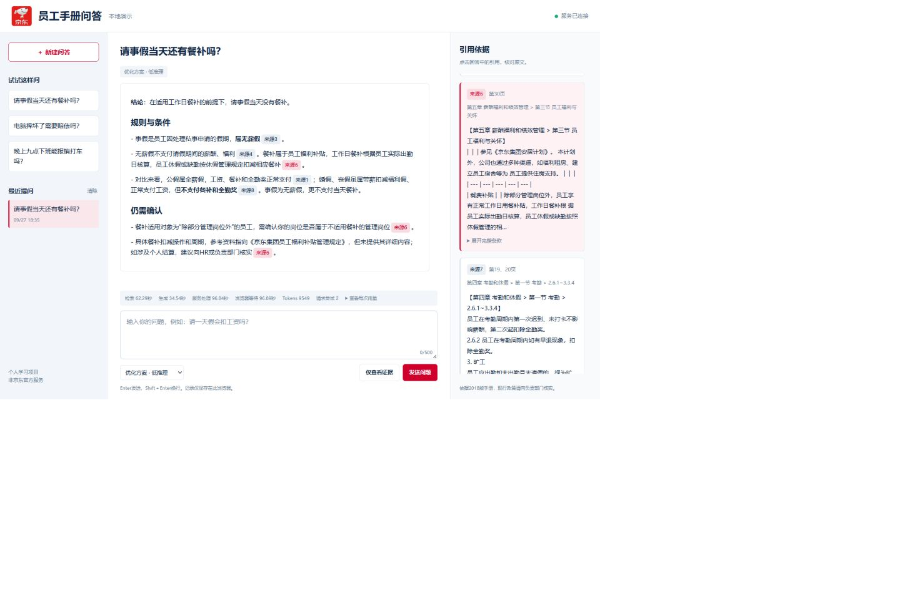

# 京东员工手册 RAG

新增 **复杂问题 · 动态补查** 模式：使用 LlamaIndex 工具调用，复用现有 guarded 检索，最多执行 3 次搜索和 2 次相邻原文读取。网页与 CLI 均保留原模式。启动方法、边界及开发集评测见 [COMPLEX_RAG_AGENT.md](COMPLEX_RAG_AGENT.md)。原有 36 题和新编复杂题均属于模拟开发/回归数据，不能据此声称真实用户准确率。

LlamaIndex 句子切块的检索对照、相同上下文预算与证据摘录评测见 [INGESTION_EXPERIMENT.md](INGESTION_EXPERIMENT.md)。实验索引独立，当前数据处理方案保留。

同一 PDF 的解析对照与原页核对见 [PDF_PARSER_EXPERIMENT.md](PDF_PARSER_EXPERIMENT.md)：发现现有表格区域过滤的一处文字遗漏，并在 10 道开发探针中观察到参考覆盖变化；不代表全文解析准确率或真实用户收益。

冻结回答基线见 `BASELINE_V1.md` 和 `evaluation/baseline_v1_2026-09-26/`：同批36个原回答经逐项审查后重评为19正确、15部分正确、2错误，严格正确率52.78%；全部引用复核项受支持14/36（38.89%）。这是模型复核加3处用户裁决，不是全部人工金标；初轮88.89%保留为历史结果。

最新证据链优化见 `EVIDENCE_OPTIMIZATION.md`。在36题开发集的9道正题上，guarded检索的完整证据覆盖@8由7/9提高到9/9；原35道正题Recall@3保持32/35、Recall@8保持35/35。同期36题模型复核严格正确率：原方案58.33%，guarded+证据提示词+低推理83.33%（增加25个百分点）；生成P50由8.04秒升至14.07秒，tokens增加13.16%。这是模拟开发集结果，引用语义支持率尚未重评，不能将100%证据覆盖写成100%回答正确率。

以《京东集团员工手册.pdf》为语料的问答实验项目。PDF 提取、分块、嵌入和检索在本地 CPU 上运行；回答生成调用 OpenAI 兼容 API。项目重点是可追溯引用、检索消融，以及对高风险员工问题的失败模式评测。

## 管线

证据丢失位置诊断见 `EVIDENCE_LOSS_DIAGNOSIS.md`，逐题数据见 `evaluation/evidence_diagnosis_2026-09-26/`。同代码及索引正文重放的36题Top-8全部对齐历史记录，重建上下文未发现预算截断；9道正样本完整gold覆盖在候选层为8/9、输入层为7/9。诊断区分召回、排序和生成条件遗漏，未修改生产策略或调用生成API。历史候选及请求正文没有保存，因此此轮属于重放/重建证据。

```text
PDF（51 页）→ 逐页正文和表格提取 → 125 个带页码与章节路径的文本块
           → bge-small-zh-v1.5 向量索引 + jieba/BM25
           → dense、BM25 或 RRF 检索 → 带来源引用的回答
```

主要实现位于 `ragcore/`：`extract.py`、`chunker.py`、`ingest.py`、`retriever.py`、`llm.py`。数据与评测报告位于 `data/eval/`。`data/chroma/` 是可重建的本地索引，未提交到 Git。

## 本地运行

已验证的环境为 Python 3.10、CPU、预先安装 ChromaDB、sentence-transformers、PyTorch 和 OpenAI SDK 的 conda 环境；其余补充依赖见 `requirements-internvl.txt`。嵌入模型需要预先缓存到本机：当前实现默认启用 Hugging Face 离线模式。复制 `.env.example` 为 `.env` 并配置生成模型的 API 参数；`.env` 不会提交。

在项目根目录运行：

```powershell
python -m ragcore.extract
python -m ragcore.chunker
python -m ragcore.ingest
python ask.py "员工请事假需要提前几天申请？"
python ask.py "加班费怎么计算？" --no-llm
python ask.py "请了一天事假，那天15块钱餐补还发吗？" --strategy guarded --prompt-version evidence
```

运行评测（红队全量运行会调用生成 API；`--rescore` 只重评已保存的回答）：

```powershell
python -m ragcore.eval_ir
python -m ragcore.eval_robust
python -m ragcore.redteam
python -m ragcore.redteam --rescore
```

## 本地网页演示



前端使用原生 HTML/CSS/JavaScript，后端使用 Python FastAPI，直接复用现有 RAG。选择这套技术是为了先验证完整交互和证据链，减少新增框架与跨语言服务的维护成本；目前没有测量这项选型带来的性能收益。

在已配置好上述 RAG 依赖、模型缓存、索引和 `.env` 的环境中运行：

```powershell
pip install -r requirements-web.txt
python webapp.py
```

打开 <http://127.0.0.1:8000>。页面提供真实问答、仅检索、引用定位与完整原文、实际耗时和每次模型用量，以及最近20条浏览器本地记录。API 密钥仅在后端使用。

- 默认“优化方案”使用 guarded 检索、证据提示词和 low 推理；“快速方案”关闭推理；“原方案”用于对照。现有 CLI 默认参数保持原样。
- 第一次检索包含模型及索引加载，可能明显慢于预热请求。回答完成后一次返回，不模拟流式输出。
- 同时只处理一个管线请求，其余请求返回忙碌提示；生成失败仍可核对检索证据。
- 点击引用只能核对来源映射，不代表系统已经验证结论的语义支持。不能匹配实际来源的标记不会变成可点击的已核实引用。
- 当前仅监听本机，历史记录保存在浏览器，可通过页面清除；没有账户、权限或部署配置。京东标识用于个人学习演示，页面注明非官方服务。

功能验证和单次耗时记录见 [LOCAL_WEB_DEMO.md](LOCAL_WEB_DEMO.md)。

## 已有评测

| 层次 | 数据和结果 | 解释 |
|---|---|---|
| 检索 golden set | 46 条已复核标注：35 条正样本、11 条负样本 | 题目主要由语料生成，词面重合可能使 BM25 占优；负样本中的困难样本不足 |
| 检索消融 | 正样本 Recall@3：BM25 97.14%、RRF 91.43%、dense 77.14%；MRR 分别为 0.8762、0.8131、0.7049 | 在当前数据上，BM25 优于融合；不能据此声称融合一定更好 |
| 输入扰动 | 截短问法的 Recall@5：BM25 97.14%、RRF 85.71%、dense 77.14% | 机械扰动测试，尚不能代表真实用户分布 |
| 红队问答 | 21 条风险用例的规则初筛 21/21；空回答 0、生成异常 0 | 规则只检查已知风险模式；**不是人工判定的回答准确率** |

完整结果和逐题输出见 `data/eval/report_ir.md`、`data/eval/robust_report.md`、`data/eval/redteam_report.md`。红队回答的 176 处引用中，页码不存在的引用为 0；有 1 处把两个前言页塞进同一引用标记，触发章节路径告警。规则通过不代表回答事实正确，仍需逐条核对。

回答层题库另收录 36 条模拟员工问法：9 条口语化正样本、15 条困难负样本、12 条含糊或缺少个人条件的问题，见 `data/eval/answer_eval_review_v1.md`。用户已审查认可全部问法，手册证据和预期行为的逐题复核见 `EVIDENCE_AUDIT.md`。2026-09-26 已对保存的 36 个回答完成 306 个去重事实复核项的模型审查，见 `CLAIM_AUDIT.md`：273 支持、10 不支持、20 部分支持、3 漏引、0 待用户裁决（原3处已按用户意见改判部分支持）。同一规则的并列数值和材料清单可合为一项，因此不是严格原子断言计数。它们不计入上面的检索层基线，也不能称为真实员工提问的正式人工准确率；该冻结审查阶段未重跑系统；后续优化收益见 `EVIDENCE_OPTIMIZATION.md`。

## 设计取舍与当前边界

- 检索支持 dense、BM25 和 RRF 对照。现有 golden set 显示 BM25 更强，后续应先补充真实改写与困难负样本，再决定是否调整融合策略。
- 回答附页码及章节引用；对辞职、解雇、赔偿、纪律等高风险问题提示核实正式渠道，不代写辞职申请或协议。文档生效日期不等于其当前仍有效。
- 生成采用自适应输出预算，红队重跑未出现空答案或截断兜底；目前没有独立的端到端人工正确率或引用支持率标注。
- 只处理文本型 PDF 及提取出的表格，没有图像理解、多轮对话或权限控制。公开展示前需确认手册的分享权限。
