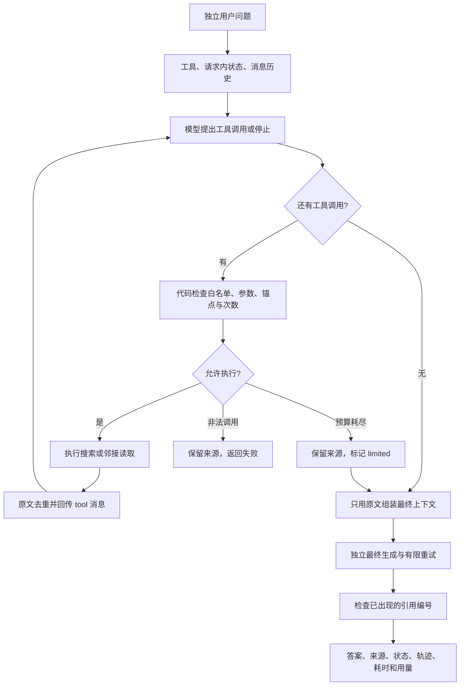

# 模块深度拆解 01：受限检索 Agent

> 第二阶段，本次只讲 `ragcore/agent.py`。分析日期：2026-10-07；源码快照：`e9b1147`。
>
> 学习目标：能够讲清楚“为什么需要动态补查、模型如何提出工具调用、应用如何约束执行、如何判断收益”，而不是背 Python 语法。本文只分析与提出重构方案，不改业务代码。

## 模块作用

### 为什么存在：固定检索不一定找齐组合证据

输入“试用期请病假，工资、餐补和申请材料分别怎么规定？”时，答案可能同时依赖资格条件、福利分类、病假薪酬条款和材料要求。一次固定检索可能找到病假待遇，却漏掉资格或证明材料。

普通 RAG 是“按既定策略找资料 → 根据资料回答”。本模块增加“根据已找到的原文判断还缺什么 → 补查 → 再看结果”的能力。它是一个**单请求内、只允许检索与读取原文的单 Agent**，不执行审批、修改数据库或替用户作决定。

你可以把它讲成两种工作：

1. **证据收集**：模型决定搜索词或相邻读取锚点，应用执行并回传结果。
2. **证据合成**：应用重新组织原文，独立调用模型生成带来源的回答。

最终回答不复用检索代理的中间结论。检索代理即使写了政策猜测，也不会因为“它说过”就进入最终证据。

### 模块边界与关键入口

| 入口/对象 | 负责什么 | 不负责什么 |
| --- | --- | --- |
| `AgentLimits`，L26–33 | 默认调用次数、阶段期限、决策输出预算 | 用户权限、累计 token/费用封顶 |
| `configured_llm`，L45–59 | 创建决策或合成用模型适配器与 HTTP 客户端 | 验证接口真实工具能力、实际窗口或底层模型版本 |
| `read_adjacent_chunks`，L80–92 | 从来源顺序取锚点前后各一块 | 语义邻居检索、章节内精确关系建模 |
| `collect_evidence`，L95–204 | 工具循环、参数验证、去重、停止、轨迹和用量 | 证明证据充分，或输出最终政策答案 |
| `answer_question_async`，L207–275 | 最终上下文、合成、引用编号检查和结果汇总 | 逐事实语义支持校验、跨轮用户记忆 |
| `answer_question`，L278–280 | 为现有同步网页/CLI 提供入口 | 在已经运行的事件循环中直接复用同步入口 |

上游是 `webapp.py` 或 `ask.py`；下游复用现有检索和上下文准备。这里只解释这些依赖的接口，不展开其他模块。

### 应影响什么指标：目标与测量分开

设计目标是提高跨条款问题的必要证据覆盖与条件完整性；动态补查会增加决策模型调用、重复输入的 token 和等待时间，收益必须覆盖这些代价。

保存的 6 道复杂模拟开发题成对实验给出了下面的结果：

| 指标 | 普通 quality | Agent | 差值 |
| --- | ---: | ---: | ---: |
| 完整返回 | 6/6 | 6/6 | 0 |
| 收集来源完整参考覆盖 | 5/6 | 5/6 | 0 |
| 最终上下文完整参考覆盖 | 5/6 | 5/6 | 0 |
| 总耗时 P50 | 46.14 秒 | 49.52 秒 | +3.37 秒，约 +7.3% |
| 平均总 token，含应用重试 | 14910 | 33471.17 | +18561.17，约 +124.5% |

出处：`evaluation/agent_experiment_2026-10-04/summary.json`。该实验运行代码为 `174fdf3`、使用修复前语料，每种模式每题一次、串行交替、预热后计时；客户端路径也不同。不是当前版本重新测得的结果，不是独立真实用户保留集。`review.md` 的模型复核和人工裁决仍未填写，因此**没有 Agent 答案正确率，也没有证据证明 Agent 提高了质量**。

历史 36 题的 58.33%→83.33% 属于普通 RAG 的检索/提示词/推理设置组合实验，不能拿来作为本模块的收益。

## 核心代码流程

### 先理解控制流程，再进入代码



这个图中的“停止”不是语义审核通过。模型表示不再调用工具，应用就停止补查；是否找齐必要证据要由另外的评测判断。

### 1. L23、L26–41：把运行限制和模型提示分开

关键源码：

```python
@dataclass(frozen=True)
class AgentLimits:
    searches: int = 3
    reads: int = 2
    model_calls: int = 8
    orchestration_seconds: float = 120
    synthesis_seconds: float = 120
    output_tokens: int = 2048
```

| 行 | 逻辑与设计意义 |
| --- | --- |
| L26–27 | 一个请求携带一组不可变配置；避免执行中被意外修改。它没有验证数值为正，当前依赖默认值与受控调用 |
| L28 | 搜索工具最多执行 3 次；不是底层只能查 3 次，guarded 工具内部还会扩展查询 |
| L29 | 相邻读取最多执行 2 次；控制扩大证据范围的工作量 |
| L30 | 最多 8 次检索决策模型调用；不包含最终回答阶段 |
| L31 | 检索决策与工具等待共享编排期限 |
| L32 | 最终生成的多次尝试共享另一阶段期限；不是每次重试都有 120 秒 |
| L33 | 决策模型每次输出预算 2048；最终生成会被 L231–234 的预算覆盖 |

L36–41 的 `SEARCH_PROMPT` 定义职责：收集原文、保留用户条件、检查定义/规则/例外、缺证据时补查。提示词表达期望行为，真正次数限制在后面的代码里。

关键辨析：提示词要求“必须至少搜索一次”，代码却没有强制自动首搜。如果模型直接停下且无来源，L144–147 返回 `no_evidence`。不能声称提示词中的每个要求都有硬约束。

L23 创建独立的单工作线程执行器。为什么不让本地工具直接在事件循环里运行？因为模型等待是异步 I/O，本地检索却包含同步 CPU/文件工作；直接运行会使事件循环无法及时处理超时。单工作线程只限制同时运行的本地任务数，不意味着任务被取消后线程也已经停止。

### 2. L45–77：决策和最终合成使用不同设置，但同样保留用量

| 行 | 逻辑与设计意义 |
| --- | --- |
| L47–51 | 延迟加载适配器，读取配置，配置缺失立即抛错；`api_ready` 只检查参数存在，不保证 API 可用 |
| L52–53 | 显式决定代理，`trust_env=False` 避免默认继承系统代理；HTTP timeout 为 45 秒 |
| L54–57 | OpenAILike 负责兼容协议；声明 chat/function calling、32000 窗口、2048 初始输出、关闭 SDK 重试 |
| L58–59 | 决策关闭推理，最终合成开启低推理；目标是把更多推理成本留给最终政策回答，但尚无只改变该拆分设置的独立对照 |
| L62–68 | 从 SDK 响应的 raw 部分读取 usage 与 finish_reason；数据缺失保留空字段 |
| L69–72 | 记录阶段、尝试序号、输入/输出/推理 token、停止原因和实际响应模型名，避免只记最终答案的用量 |
| L75–77 | 失败记录异常类型与状态码，不把原始异常文本带回结果；失败用量未知，不能记成零成本 |

`is_function_calling_model=True` 是告诉适配器如何调用，不会让不支持工具的供应商模型突然获得能力。`context_window=32000` 是声明，不是输入长度校验或实际供应商窗口证明。上下文管理器结束时会关闭本阶段 HTTP 客户端；决策阶段和最终合成分别创建客户端。

### 3. L80–92：邻接读取只能读来源顺序，不能替代语义判断

| 行 | 逻辑与设计意义 |
| --- | --- |
| L82–83 | 从 `CHUNKS_JSONL` 加载块记录；每次读取都重新读整份文件，当前 123 块规模可承受，但没有测得此设计的速度优势 |
| L84–85 | 顺序查找 ID，取得原始记录位置；不按 ID 字典序或检索名次取邻居 |
| L87 | 取前一块、锚点、后一块；在文件边界处返回更少块 |
| L88–90 | 返回原文、页码、起始页、路径，统一成后续可组装的来源格式 |
| L91–92 | 返回找到的来源；找不到则明确失败，不虚构邻居 |

这个函数自身只检查“文件里是否有该 ID”；“必须是本轮已取得的锚点”由 L154 的工具执行门检查。当前可用锚点来自本轮**收集集合**，不严格限于已经装入某次 tool 回复的来源。读取也可能跨章/节，无法保证邻块一定语义相关。

### 4. L95–113：依赖可注入，请求状态不跨轮继承

关键源码：

```python
    limits = limits or AgentLimits()
    if llm is None:
        async with configured_llm(limits) as model:
            return await collect_evidence(question, llm=model, search=search, read=read, limits=limits)
```

| 行 | 逻辑与设计意义 |
| --- | --- |
| L95 | 模型、搜索、邻接读取和 limits 都能替换：测试时无需网络和真实检索，也能检查工具循环 |
| L97 | 未传配置时使用默认限制 |
| L98–100 | 未传模型时创建真实适配器，再用相同参数调用有模型的分支；只进行这次资源装配，不是 Agent 每轮递归 |
| L101–106 | 创建框架消息/工具对象；默认搜索复用 `retrieve(query, k=8, strategy='guarded')`，默认读取复用邻接函数 |
| L107 | `chunks` 存来源并去重；`trace` 存执行过程；`usage` 存模型调用，这三种数据不能互相代替 |
| L108 | 搜索与读取分别计数，不拿同一个计数混算 |
| L109–113 | 开始计时，初始化状态与活动阶段；`complete/evidence_ready` 是默认控制状态，不是证据审查结论 |

所有这些变量在函数内部创建。第二次用户提问不会继承第一次的消息或来源，所以这是请求内工具状态，没有长期记忆。

### 5. L115–125：把 Python 函数暴露成模型能请求的工具

关键源码：

```python
    tools = [FunctionTool.from_defaults(fn=search_handbook), FunctionTool.from_defaults(fn=read_adjacent)]
    lookup = {t.metadata.name: t for t in tools}
    history = [ChatMessage(role='system', content=SEARCH_PROMPT), ChatMessage(role='user', content=question)]
```

| 行 | 逻辑与设计意义 |
| --- | --- |
| L115–117 | 搜索包装器接收 `query`，调用注入的检索函数，把来源列表序列化为文本 |
| L119–121 | 邻接包装器接收 `chunk_id`，调用读取函数，返回同样的结构化内容 |
| L123 | FunctionTool 根据函数签名、名称和说明生成工具 schema，使模型能返回结构化工具名/参数 |
| L124 | 应用建立白名单名称到真实函数工具的映射；模型只给名称，真正执行的是应用 |
| L125 | 初始化 system 与 user 消息；后续 assistant 工具调用与 tool 结果也加入此历史 |

常见误解是“FunctionTool 会自动把整个 Agent 跑完”。它只提供工具包装与调用能力；本项目调用、循环、预算与错误处理都在应用函数里。

### 6. L127–147：Agent 的决策循环与停止条件

关键源码：

```python
                response = await llm.achat_with_tools(tools, chat_history=history, allow_parallel_tool_calls=False)
                usage.append(response_usage(response, 'orchestration', attempt))
                if usage[-1]['finish_reason'] == 'length':
                    status, stop_reason = 'limited', 'model_output_limit'
                    return
                calls = llm.get_tool_calls_from_response(response, error_on_no_tool_call=False)
                history.append(response.message)
```

| 行 | 逻辑与设计意义 |
| --- | --- |
| L129 | 以应用循环次数控制检索决策模型调用，避免无限等待模型自行停下 |
| L130 | 标记当前等待模型，后面超时可与等待工具区分 |
| L132 | 模型看到工具定义和历史观察，提出下一步行动；请求不允许并行工具，但仍需防御模型返回多个调用 |
| L133 | 决策调用即使没有正文，也要记录 token；Agent 成本不限于最终回答 |
| L134–136 | 决策输出被截断时停止，不冒险执行可能不完整的工具参数；标记 limited，有已有来源时可继续合成 |
| L137 | 解析结构化工具选择，允许“没有工具调用”作为正常停止，而不是硬抛异常 |
| L138 | 保存这次 assistant 消息，下一次 tool 消息才能接到对应调用后面 |
| L139–143 | 模型调用/解析失败时退出，保留此前来源；没有无限重试，也不静默换普通 RAG |
| L144–147 | 无工具调用就停；无来源时 `no_evidence`，已有来源时维持当前状态 |

这里是动态行为的来源：模型可以看过一次搜索结果后改写第二次搜索词。内部 guarded 扩展仍然是规则机制，不是模型计划；两者位于不同层。

### 7. L148–167：执行前的硬检查，是模块的工程核心

关键源码：

```python
                if (name not in lookup or not isinstance(args, dict) or set(args) != {key}
                        or not isinstance(args[key], str) or not args[key].strip()
                        or len(args[key]) > 500
                        or (name == 'read_adjacent' and args[key] not in chunks)):
```

| 行 | 检查/行动 | 保护的边界 |
| --- | --- | --- |
| L148–150 | 对每个返回调用取得工具名、参数和预期参数名 | 即使一批多个调用，也不跳过逐个检查 |
| L151：名称 | 工具必须在 `lookup` 中 | 不把任意模型文本转换成代码执行 |
| L151：参数 | 必须是字典且只有一个规定字段 | 缺字段和额外字段都拒绝，减少错误调用范围 |
| L152–153 | 字符串、非空、长度不超 500 | 避免非法/异常输入；不代表语义正确或资格未漂移 |
| L154 | 邻接锚点必须在本轮收集的 `chunks` | 拒绝编造来源 ID，不允许任意遍历全部文档 |
| L155–157 | 非法调用记录 rejected 并返回 `agent_failed` | 不自动猜测模型意图或修改参数；保留先前来源 |
| L158–162 | 工具实际计数已达上限时拒绝执行，返回 limited | 第四次搜索、第三次读取均不会执行 |
| L163 | 执行前占用预算 | 调用后来失败也算一次已尝试，不以失败为借口无限重试 |
| L164–167 | 创建轨迹与计时，标记活动阶段 tool | 后续能定位哪次工具执行/等待出现问题 |

此处是“模型提出行动”和“系统执行行动”的分界。白名单校验防止调用不在能力范围内的工具；不是用户授权系统，也不能证明提示注入会被完全阻止。对于搜索 query 是否保留“试用期”等条件，目前没有独立语义校验。

### 8. L168–182：执行工具，把原文作为下一次决策的观察

关键源码：

```python
                    output = await asyncio.get_running_loop().run_in_executor(
                        _tool_executor, partial(lookup[name].call, **args))
                    rows = json.loads(output.content)
                    for c in rows:
                        chunks.setdefault(c['id'], c)
                    entry['source_ids'] = [c['id'] for c in rows]
```

| 行 | 逻辑与设计意义 |
| --- | --- |
| L170–171 | 代码调用白名单里的真实工具，在独立执行器中运行；模型不会自己运行 Python |
| L172 | 将工具返回文本解析回来源记录；格式坏了会进入工具失败路径 |
| L173–174 | 按 ID 去重并保留首次插入顺序；重复查到同一块不会占两份来源，但也不会更新旧值或重新排序 |
| L175 | 轨迹记录本次工具返回的所有 ID，便于回放与诊断 |
| L177 | 调用 evidence 版上下文准备，按预算决定本次哪些块可见 |
| L178–180 | tool 回复只携带被选择块的原文/ID/页码/路径，并列出被省略 ID |
| L181–182 | 加入 tool 消息，`tool_call_id` 对应上一步 assistant 的调用 ID；模型下一轮能理解这是哪次行动的结果 |

需要区分三个集合：**收集到的原文集合、决策模型本次看到的原文集合、最终生成看到的原文集合**。L174 在预算过滤前收集全部来源；最终 L211 又做一次全局装入，所以它们不保证完全相同。

6000 字符只用于选择本次可见原文，不严格限制工具 JSON 的序列化总长度；ID、元数据与转义另占空间。每次回复受控也不代表累计 history 受控，因为原问题、assistant 调用和多次 tool 回复会继续增长。

### 9. L183–204：保留失败证据，但取消等待不等于取消工作

| 行 | 逻辑与设计意义 |
| --- | --- |
| L183–186 | 工具执行、JSON 解析等失败返回 `retrieval_failed`；之前取得的块保留，但当前不继续合成 |
| L187–190 | 不论成功还是失败，都记录工具耗时；这是工具执行/等待时长，不包含全部模型决策等待 |
| L191 | 8 轮结束仍未正常停下，标记 `model_call_budget`；证据存在时可进入有限回答 |
| L193–194 | 整个 loop 被编排阶段的 `wait_for` 包住，不是给每轮重新分配完整 120 秒 |
| L195–198 | 超时发生在工具阶段时更新工具轨迹；不虚增一次模型请求 |
| L199–200 | 超时发生在模型阶段时记录一次失败模型调用，token 未知 |
| L201–204 | 将来源、trace、usage、状态/原因、工具耗时、编排耗时和次数返回给合成阶段 |

为什么使用独立执行器？同步入口会用 `asyncio.run`，其默认执行器的结束清理可能等待已运行工具线程，从而延长响应时间。单独的执行器让请求停止等待后不因默认执行器清理继续等该工具。

代价是已运行线程可能仍占用唯一工作线程，后续工具会等待它。这只能说明当前请求能更早结束等待，没有证明后台资源立刻释放。编排期限也不含之前所有导入/初始化，所以不能当严格端到端 SLA。

### 10. L207–221：把证据收集结果转成回答输入

| 行 | 逻辑与设计意义 |
| --- | --- |
| L208–210 | 新建默认配置/总计时，完成收集阶段 |
| L211 | 用收集的原文重新组装最终上下文，最终证据不是代理说过的话 |
| L212 | 将“来源编号→ID”反转，支持为每个实际块找到展示编号 |
| L213–215 | 所有收集来源都可展示；没进最终 context 的块标记“未纳入回答”和 `in_context=False` |
| L216–219 | 初始化结果、保留阶段用量/轨迹/停止原因、映射与最终上下文；原始 context 可供评测保存，网页入口会去掉该字段 |
| L220–221 | 只有存在 context 且收集状态 complete 或 limited 才开始合成；失败/超时保留原文但不生成政策答案 |

一个重要状态区别：**预算到顶还能有已知有效来源；工具或模型异常则未正常完成编排。** 代码允许前者有限作答，拒绝后者继续合成。这是当前保守策略；不是所有系统必须采用的唯一方案。

### 11. L224–247：独立合成与预算重试，检查到真实请求层

关键源码：

```python
                    for number in range(LLM_GEN_ATTEMPTS):
                        budget = min(LLM_MAX_TOKENS*(2**number), LLM_MAX_TOKENS_CAP)
                        if model is not None:
                            # LlamaIndex's model default overrides per-call max_tokens.
                            model.max_tokens = budget
```

| 行 | 逻辑与设计意义 |
| --- | --- |
| L225–226 | 合成只有 evidence system prompt、用户问题和原文；没有决策历史和代理中间答案 |
| L228–231 | 默认最多 3 次，以 2048、4096、8192 token 输出预算逐次尝试 |
| L232–234 | 同时修改适配器 `model.max_tokens`，防止实际 HTTP 请求仍使用模型默认 2048；不能只相信调用参数写了 4096 |
| L235–236 | 测试时可注入 synthesizer；真实路径用 `model.achat`，不继续开放检索工具 |
| L237–239 | 每次合成都追加 usage 与 max_tokens，保留重试成本；attempt 是整个结果的序号，不是独立的合成轮次 |
| L240–242 | 正文非空且没有报告 length 才返回；空/截断继续下一预算，最后结果交由外层决定失败 |
| L243–246 | 测试与真实模型走同样有限尝试逻辑；真实合成创建独立客户端并启用 low 推理 |
| L247 | 所有合成尝试共用 synthesis deadline；不能无限扩预算或无限重试 |

重试增加的是输出预算，目的是应对推理占用与正文截断；不会补回已经丢失的证据。API 请求异常会跳到外层 L255–257，不在此循环按更大预算反复尝试认证、余额或连接错误。决策模型调用也没有这套合成重试。

还有一个边界：当前成功条件是“有正文且 finish_reason 不是 length”，缺少 finish_reason 也可能通过。不能把它讲成“必须收到 stop，所有供应商异常收尾都被拒绝”。

### 12. L248–275：引用门、失败状态和用量汇总

关键源码：

```python
            if not answer or result['usage'][-1]['finish_reason'] == 'length':
                result['status'] = 'generation_failed'
            elif any(label not in mapping for label in re.findall(r'〔([^〕]+)〕', answer)):
                result['status'] = 'citation_failed'
            else:
                result['answer'] = answer
```

| 行 | 逻辑与设计意义 |
| --- | --- |
| L248–250 | 预算耗尽仍空或截断，拒绝展示不完整答案 |
| L251–254 | 只检查已经出现的 `〔...〕` 标记能否映射实际输入来源；失败时不把答案写进结果 |
| L255–258 | 请求异常/最终阶段超时保留来源，记录未知 usage 与失败状态/耗时 |
| L259–260 | 收集可能有块但全部放不进最终预算，此时改为 no_evidence |
| L261–268 | 为 limited、timeout、工具/模型/引用失败等状态给用户可理解的提示，避免完整成功与部分结果混淆 |
| L269–270 | 只有所有已记录模型调用的输入/输出 token 均已知，才允许算全请求总 token |
| L271–274 | 分别记录工具耗时、最终生成、完整编排、总时间与次数；prompt+completion 相加，reasoning 不再重复加 |
| L275 | 返回完整结果，保留诊断证据 |

为什么引用检查不等于质量校验？回答“工资肯定照发〔来源1〕”，来源1却只讲证明材料，编号存在仍能通过。完全没有 `〔...〕` 的答案，正则结果为空，也可能通过。代码没有逐事实检查“有没有引用”，也没有检查“引用是否支持结论”。

`stop_reason` 从收集阶段复制，合成失败时只改 `status`，所以可能出现 `status=citation_failed`、`stop_reason=evidence_ready`。应按“收集停止原因”解释后者，不把它当最终成功原因。

### 13. L278–280：为什么还需要一个同步入口

```python
def answer_question(question):
    """Synchronous entry point for the existing local API and CLI."""
    return asyncio.run(answer_question_async(question))
```

它让现有同步 FastAPI 路由和 CLI 无需整体改写就能调用异步 Agent。异步的作用是等待网络时不堵事件循环，并允许阶段取消；它没有让这条 Agent 链路并行执行多个工具。

若上游以后改成异步路由，应该 `await answer_question_async(...)`，而不是在已经运行的事件循环中再次 `asyncio.run`。当前网页仍有进程内单请求锁，不能据此宣称异步 Agent 已实现高吞吐。

### 用一条具体轨迹贯穿这些代码

下面是解释控制行为的脚本化例子，不是宣称真实模型每次采用此查询顺序：

| 步骤 | 决策/观察 | 代码状态 |
| --- | --- | --- |
| 1 | 模型选择 `search_handbook(query='试用期 病假')` | 参数检查通过，搜索计数 1；假设返回 a |
| 2 | 应用返回 a 的原文 tool 消息 | a 加入 chunks；assistant/tool 消息成对进入 history |
| 3 | 模型选择 `search_handbook(query='病假 工资 材料')` | 搜索计数 2；假设返回 b |
| 4 | 模型返回无工具调用 | 收集停止，当前来源 a、b；决策模型调用共 3 次 |
| 5 | 最终独立合成 | 原文装入预算，建立来源1/2；生成与编号检查后返回 |

这条动态补查与 tool 消息回传由 `test_adaptive_search_adds_missing_evidence_and_tool_results` 验证；测试模型预先脚本化了动作，所以只证明应用能正确控制该序列，不证明真实模型总能发现材料缺口。

## 设计思想

### 1. 将不确定的决策放在确定的执行边界内

模型负责解读自然语言和提出搜索行动，应用负责白名单、参数、已知来源、预算与阶段停止。这样无需假设模型始终听话，违规调用也能在执行前被拒绝。

替代方案是只靠提示词写“别超过三次”；实现更短，但模型一次多调用或不遵守指令时没有可靠边界。反过来，完全规则化的检索更确定、更便宜，但不能根据任意观察动态提出补查。项目保留 quality 和 Agent 两条路径，适合做取舍评测。

**影响指标**：工具违规执行率、超预算率、失败可定位性；相对提示词单独控制的收益尚无测量。已有测试验证第四次搜索和非法参数不执行，是控制正确性证据。

### 2. 单 Agent、有限循环，先把闭环做清楚

问题主要是收集同一手册里的互补证据，不需要多个角色独立协作。自定义循环较容易看到每次调用、停止与成本，并复用现有检索。

| 替代方案 | 适合什么情况 | 本项目的取舍 |
| --- | --- | --- |
| 固定 quality RAG | 常见单问题、可控领域扩展已足够 | 当前默认；六题覆盖不输 Agent，token 更低 |
| 默认 FunctionAgent 等框架工作流 | 需要框架生命周期、更多内置行为，并能明确配置约束 | 当前只用组件，自控循环；没有框架性能对照，不声称更快 |
| 显式状态图/工作流 | 分支、恢复、人审节点和跨步骤状态增长 | 当前流程小，先用函数闭环；复杂后才有理由迁移 |
| Plan-and-Execute | 长任务确需稳定计划、依赖与重规划 | 本模块未实现独立计划对象，直接动态补查足以表达当前机制 |
| 多 Agent | 子任务独立、职责差异与并行收益可评测 | 现有六题无收益证据，不先叠加调用与协调成本 |

面试时可以说“ReAct 思路的工具决策与观察循环”，但不要说源码实现了文本 Thought/Action/Observation 解析。实际是 function calling，也不展示隐藏思维链。

### 3. 收集与合成分离，保持证据来源清楚

如果直接返回决策模型最后一句话，它可能混合没查证的猜测和真实条款；同一历史还包含工具调用与重复结果。当前独立合成只使用问题与原文，可以明确核对哪些资料进入最终输入。

代价是额外一次最终模型调用，证据还需重新装入预算。它提供了清楚的数据边界，没有证明单独分离阶段就提高答案准确率。

更进一步的替代方案是结构化必要事实/引用槽位再生成答案，但会增加抽取误差和调用成本，需要独立测量，不能只因为看起来更严谨就认定值得。

### 4. “可追溯”必须落在实际上下文

来源编号在应用侧生成并映射真实 ID，避免让模型自由编造页码；收集集合和实际输入集合分开，能定位预算截断造成的缺证据。

不过当前按首次获得顺序装入，不保证后查到的例外更优先；工具 history 累计也没有总 token 预算。这是下一轮比“加一个更大模型”更明确的测量方向。

### 5. 失败是结果的一部分，完整返回不等于回答正确

limited 允许基于已知证据有限作答，明确提醒可能遗漏；异常/超时则保留来源供用户核对，当前不给最终答案。这样避免把半截政策当完整结论。

可替代为“失败后用已得证据继续生成有限回答”，改善可答率，但可能增加不充分证据下的错误。没有对照前应报告这只是方案，并同时测完整返回率、误导回答率、拒答错误率和用户核对时间。

### 6. 依赖注入让工程逻辑能独立验证

脚本模型控制动作，假 search/read 控制返回来源，假 synthesizer 控制最终正文，MockTransport 控制真实适配器发出的 HTTP 内容。这样把“应用能否正确控制”与“模型是否作出正确决定”分开。

特别有价值的是请求体测试：L234 修正的不是纸面预算，而是实际送到 HTTP transport 的 `max_tokens`。测试观察到两次请求预算 2048、4096。它不调用真实供应商，不证明真实模型输出质量，但能证明配置确实到达接口层。

## 如果重构

以下只提出方案，尚未实施，也没有对应性能收益。优先顺序按风险和现有实验现象决定；保留当前 baseline/quality/Agent 路径做对照，不让金标进入运行逻辑。

### P0：先控制累计上下文与无收益补查

**现状**：每次 decision 携带累计 history，已有工具结果被重复作为下一轮输入；最多三次搜索也可能得到高度重复的块。最终集合仍按先到先装入，没有必要性优先级。历史 Agent 平均 token 为 33471.17，是 quality 的约 2.245 倍，但完整参考覆盖持平。

**方案**：在保留原始 trace 的前提下，向下一次决策提供去重的结构化已得证据与待确认事项，限制整个消息输入预算；对重复查询/没有新增来源的补查设置停止规则。保留直接原文证据，不用代理摘要替换最终依据。处理没有新来源的搜索时要允许确有价值的不同问题，不能简单一律停。

**怎么测**：相同语料、模型、最终预算与独立题库成对比较；分别记录决策输入 token、总 token、搜索新增来源数、最终必要证据覆盖、条件完整性、答案正确性和 P50/P95。要允许“省 token 但漏证据”的退步被看见。没有可比测量前不写降低百分比。

### P0：把完成状态、证据充分度、引用检查拆清楚

**现状**：`complete` 表示控制流程未报错；`stop_reason` 属于收集阶段；没有引用的正文也能通过编号检查。用户可能把这些字段理解成质量保证。

**方案**：使用明确结果类型区分 `collection_status`、`collection_stop_reason`、`synthesis_status` 和 `citation_structure_status`；空/截断/缺失结束标记按已知供应商协议处理。先定义引用存在率与逐事实支持审评规则，再决定哪些场景阻止展示，避免机械“无引用全拒绝”误伤澄清或未知说明。

**怎么测**：补充无引用事实、正确编号错误语义、缺失 finish_reason、限额后合成失败等控制案例；将结构验证与语义支持评分分开。结构正确率提高不自动等于回答正确率提高。

### P1：为真正的工作取消和语料版本建立边界

**现状**：单线程超时后仍可能运行；全局 worker 可拖慢下一个请求。search 读 Chroma，邻接工具读 JSONL，没有同一版本快照契约。

**方案**：小规模先显式记录 running/abandoned 状态和下一请求的可用性；若测出持续占用导致超时，考虑独立工具工作进程、可中断 I/O 或可控任务队列。语料使用请求固定的版本/索引快照，邻接读取和搜索绑定同一版本。进程方案有启动与内存开销，不能假定一定更快。

**怎么测**：连续提交“慢工具超时→下一正常请求”故障序列，记录响应耗时、后台占用、成功率与恢复时间；在重建过程中检查来源版本一致性。只让当前响应早返回，不足以证明故障恢复成功。

### P1：统一预算来源与明确配置契约

**现状**：`AgentLimits` 与 `SEARCH_PROMPT` 分别写了 3 搜索/2 读取；自定义限额可能与提示词不同。`output_tokens` 用于决策，而最终使用 `config.py` 常量，名称容易让人以为它控制两阶段全部输出。配置也没有正值校验。

**方案**：区分决策预算和合成预算；从配置生成提示词中的次数说明，验证非负/正值和预算上限；控制日志明确阶段与调用序号。有限拆分即可，不为 280 行代码新增通用 Agent 平台。

**怎么测**：非默认限制、零调用、修改合成预算、非法配置的边界测试，并继续验证真实 HTTP 请求体。主要目标是行为一致性与可维护性，尚无延迟或质量收益。

### P2：收益成立后再考虑自动路由和更多工具

只有独立真实问题显示动态补查的质量收益，才考虑自动判断问题复杂度；否则路由误判会为普通题增加成本。新增修改型工具还需要独立授权、确认、幂等与审计，不能直接继承这个只读检索工具门。

可衡量的路由指标是：复杂题漏路由率、普通题误路由率、实际答案收益与平均总费用。当前没有自动路由，也没有必要用多 Agent 作为“项目更高级”的证明。

## 面试考点

| 考点 | 面试官想确认什么 | 回答必须落到哪里 |
| --- | --- | --- |
| Agent 与 RAG 区别 | 是否理解自主行动来自哪里 | L132 决策、L181 tool 观察和下一轮 history，不把规则扩展说成模型规划 |
| Function calling | 是否清楚模型与执行器职责 | L123 schema、L137 解析、L151 参数校验、L171 真实执行 |
| 控制与状态 | 是否处理异常路径而不只写 happy path | 限额、no_evidence、limited、模型/工具/引用失败与保留来源 |
| 异步/超时 | 是否理解响应取消与线程生命周期 | L23 独立 executor、L170 本地工具、L194/L247 两阶段期限 |
| 证据与引用 | 是否区分来源结构和语义正确性 | L174 收集、L211 context、L251 标记检查；无引用也可能通过 |
| 记忆与上下文 | 是否知道哪些历史真正传给模型 | request 内 history，无跨请求记忆；累计输入没有统一 token 上限 |
| 成本与收益 | 能否从实验做系统取舍 | 六题覆盖 5/6→5/6，token +124.5%；没有答案质量审评 |
| 工程验证 | 是否验证真实行为而非只看代码 | 17 项 Agent 测试；参数传到 MockTransport 的预算验证；模型质量另测 |
| 重构判断 | 能否优先解决已经观察到的问题 | 先控重复输入、质量状态与资源恢复；保持对照，避免先加框架/多 Agent |

### 本模块现有测试提供了什么证据

| 测试名 | 验证内容 | 不能推出的结论 |
| --- | --- | --- |
| `test_adaptive_search_adds_missing_evidence_and_tool_results` | 脚本补查能加入来源、回传 tool 消息、记录轨迹 | 真实模型能够自主正确拆解所有复杂问题 |
| `test_fourth_search_is_not_executed_even_in_one_batch` | 同一批第 4 次搜索不会执行 | 所有输入都能在 3 次内找齐证据 |
| `test_third_read_is_not_executed_and_duplicates_are_removed` | 第 3 次读取拒绝，来源 ID 去重 | 去重后的证据顺序是最优排序 |
| `test_unknown_anchor_never_reads_corpus` | 未知锚点不会实际读取 | 已知锚点的相邻块一定相关 |
| `test_invalid_tool_arguments_do_not_reach_search` | 额外字段等非法参数不会进检索 | query 的语义和资格一定正确 |
| `test_timeout_preserves_preceding_evidence` | 决策超时保留先前来源 | 超时前的来源足以作答 |
| `test_sync_entry_does_not_wait_for_timed_out_local_tool` | 模拟慢工具下，当前同步响应不等待线程结束 | 线程已被杀死、后续请求不受影响 |
| `test_tool_timeout_is_not_counted_as_an_extra_model_request` | 工具超时不虚增模型调用 | 真实失败账单用量完全已知 |
| `test_retry_token_budgets_reach_real_llamaindex_request_transport` | 模拟 HTTP transport 收到 2048→4096 | 真实供应商能按该设置提高输出质量 |
| `test_final_context_excludes_overflow_and_sources_match_citations` | 超预算块省略、来源对应输入、全部已知用量相加 | 引用事实的语义已得到验证 |
| `test_unknown_citation_blocks_final_answer` | 不存在的来源标记阻止展示 | 正确编号错误断言或无引用答案也被阻止 |

还有对模型文字不作最终答案、模型调用上限、失败异常脱敏、合成超时、截断重试、原文顺序读取的测试。17 项合计验证控制逻辑；不要将“测试通过”讲成“Agent 准确率”。

## 高频追问

下面按连续深挖组织，帮助练习论证链。它们是基于源码的预测，不是某家公司实测题频。

### 追问链 1：你这是不是只把 RAG 包了个工具？

**第一问：** “search_handbook 不就是 retrieve 吗？”
答题方向：工具能力复用 retrieve，但调用次数、下一查询与是否读相邻块由模型根据观察选择。能力没换，控制流程改变了。

**第二问：** “guarded 本来就多查询了，区别在哪？”
答题方向：guarded 的补充词由确定性规则生成；Agent 根据前一次原文动态决定下一次工具参数，两者不是同一层。

**第三问：** “那为什么要多一个 Agent？”
答题方向：提出跨条款自适应补查假设；承认六题没有覆盖收益、调用成本更高，保留默认 quality。若没有新增评测证据，不宣称业务必须使用 Agent。

### 追问链 2：工具执行到底受谁约束？

**第一问：** “schema 定义了类型，为什么还要校验？”
答题方向：schema 是协议提示，运行层仍检查实际解析参数；不能以供应商/模型一定守协议为前提。

**第二问：** “一次返回四个搜索，怎么限三次？”
答题方向：逐个校验并在执行前检查/增加计数，第四个返回 limited，前面结果保留；不是只检查模型轮数。

**第三问：** “白名单能防止提示注入吗？”
答题方向：只能限制可调用能力；模型仍可能搜索错误事项或误读政策。只读工具降低副作用，没有完整注入防御评测，更没有用户授权模型。

### 追问链 3：超时以后，工作真的结束了吗？

**第一问：** “为什么用 run_in_executor？”
答题方向：让同步 CPU/文件工具不阻塞事件循环，使 wait_for 有机会取消等待。

**第二问：** “Future cancel 就把线程杀掉了吗？”
答题方向：已运行的线程不会被强制终止；结果迟到不再纳入当前请求，但资源还可能占用。

**第三问：** “那你真的解决故障恢复了吗？”
答题方向：现有测试证明当前响应不继续等，未证明后续请求无影响；应测连续请求故障恢复，必要时用独立进程或可中断工作方式。

### 追问链 4：预算是八次，还是三次？

**第一问：** “为什么最多三搜索却允许八模型调用？”
答题方向：模型还需决定读取和停止；搜索/读取限制实际工具执行，八次限制决策模型轮数，独立计数。

**第二问：** “最终回答也在八次里吗？”
答题方向：不在。最多另有三次最终生成应用调用，正常代码路径理论最多 11 次；不等于实际一定调用 11 次。

**第三问：** “那有总费用上限吗？6000 是 token 吗？”
答题方向：没有累计 token/金额封顶；6000 是最终证据字符限制，决策 history 还会增长。必须记录全部 usage，并用真实账单另算金额。

### 追问链 5：来源对了，答案为什么还可能错？

**第一问：** “citation_failed 检查了什么？”
答题方向：已经出现的 `〔...〕` 标记是否存在于最终 mapping。

**第二问：** “来源1只是材料要求，模型却引用它说工资，能拦住吗？”
答题方向：不能，那是语义支持问题，正则与 ID 映射不懂政策。

**第三问：** “完全没写引用呢？”
答题方向：当前正则为空会通过；需要独立定义事实覆盖和引用语义审评。澄清/未知说明与制度事实应分开评价。

### 追问链 6：你做了哪些可验证的工程判断？

**第一问：** “为什么要改 model.max_tokens？”
答题方向：LlamaIndex 适配器实际请求体可能被模型默认配置覆盖；只改调用参数不证明生效。

**第二问：** “怎么证明不是你猜的？”
答题方向：现有 MockTransport 测试读取真实构造 HTTP 请求的 max_tokens，断言 2048、4096。

**第三问：** “真实模型质量提升多少？”
答题方向：这只是控制/兼容性测试，不是答案实验；模型质量需单独审评，Agent 六题尚未给出正确率。

## 标准回答

标准回答用于练习论证顺序，不建议原样背诵。个人参与和实现归属按真实情况说明；AI 辅助实现不影响解释设计与验证，但不能虚构独立完成经历。

### 1. 用 60–90 秒介绍这个模块

“这个模块处理的是跨条款问题的一次动态证据补查。普通 RAG 的查询和证据选择预先固定，而这里让模型看到已经返回的手册原文，再选择补查哪个事项，或读取一个已知来源的前后块。

LlamaIndex 提供工具 schema 和模型协议适配，我的项目代码负责工具名和参数检查、已知来源约束、次数、超时、去重与失败状态。一次最多三次搜索、两次相邻读取和八次检索决策；最终生成另有最多三次输出预算尝试。最后只用收集的原文生成答案，代理中间文字不作为证据。

我把机制与收益分开评价。六道复杂开发题中，两种模式完整参考覆盖都是 5/6，Agent 平均 token 从 14910 增到约 33471，增加约 124.5%；答案还没完成审评，所以不能说 Agent 提高了准确率。当前保留普通优化 RAG 为默认，Agent 用于显式复杂模式，再通过独立题集判断它在哪些问题值得使用。”

### 2. “你如何保证模型不会乱调用工具？”

“我不只依赖提示词或 schema。在每个工具调用执行前，应用检查名称白名单、参数必须只有规定字段、类型和长度是否合法；相邻读取还必须使用本轮已取得的来源 ID。次数在真实执行前逐个检查，所以一个模型响应返回四次搜索，第四次也不会执行。

这些约束能控制执行范围，已有脚本测试验证非法参数和超额搜索不会到达工具。但它不保证搜索语义正确，也不是完整提示注入防御或用户权限系统。”

### 3. “你如何处理超时？为什么要独立线程池？”

“模型网络请求是异步的，本地检索却包含同步 CPU 和文件工作。如果直接在事件循环里执行，超时检查就可能被阻塞，所以把本地工具放到独立单工作线程里，编排用阶段期限控制等待。

用独立执行器还避免同步入口 asyncio.run 清理默认线程池时继续等慢工具。已有测试验证当前响应可以停止等待。但取消等待不会杀掉已运行线程，它仍可能拖慢后续请求；如果上线，我会测连续请求的资源占用和恢复时间，必要时改为可中断或独立进程执行。”

### 4. “为什么证据收集和最终回答分开？”

“检索代理负责决定补查，不负责最终政策结论。如果直接拿它最后一句话作答，会混合猜测与原文。当前最终阶段只收到用户问题、证据提示词和预算内来源，能够明确核对实际输入。

代价是额外调用和上下文重新组装；分离阶段本身没有独立准确率收益测量。它改善的是证据边界与诊断能力，仍需测必要条件、最终答案和引用语义支持。”

### 5. “你怎么控制成本，最先会优化什么？”

“当前控制了工具次数、决策轮数、分阶段时间和输出预算，并汇总所有有记录模型调用的输入/输出 token；失败用量未知就保留未知。reasoning 已属于 completion，不重复加，也不把 token 直接当金额。

但这是有限运行，尚无累计输入/费用封顶。六题 token 增加而覆盖没有增益，我会先减少历史中重复原文和无新增信息的补查，补充全请求输入预算，再成对测独立问题的必要证据覆盖、答案条件完整性、总 token 和端到端耗时。不能只把调用数减少就宣布优化成功。”

### 6. “引用校验保证了什么？如何继续提高可靠性？”

“当前只保证已出现的来源标记能映射最终输入的原文，遇到来源99这种不存在的编号会拒绝展示。但正确编号可能支持不了事实，没写引用也可能通过，因此不能称为幻觉检测。

下一步先区分制度事实、澄清和未知说明，逐项审查事实与引用关系，分别测引用存在率、语义支持率和条件完整性。若加模型核验，也要人工抽查并测额外延迟/成本，不能把另一次模型输出当金标。”

### 7. “既然 Agent 没提升，项目有什么价值？”

“当前证据不支持质量提升，这个结论本身决定了默认方案保持普通 quality。我验证的是受限动态补查的运行机制、工具执行控制、故障保留来源和请求体配置，也测到了新增模型决策的成本。

后续价值取决于是否存在固定检索难以处理、动态观察能补齐的独立问题。应先收集这些真实跨条款问法并审评，找到收益成立的范围；如果仍然没有收益，就保留更简单、更便宜的方案，而不是为了叫 Agent 强行上线。”

### 8. “为什么不是多 Agent 或 Plan-and-Execute？”

“现在任务是同一手册里的有限证据补查，两个工具和请求内状态就能表达。源码没有独立计划对象，也没有多 Agent 协作；称为工具决策/观察循环更准确。

只有任务变长、子任务依赖/恢复复杂，或独立分工和并行收益得到验证时，我才会考虑显式计划或多 Agent。当前六题没有质量收益证据，继续叠加角色很可能只增加调用和评测难度。”

### 掌握标准与下一步

你应能不看代码讲清楚：一次工具调用从 schema 到模型响应再到代码执行的全过程；三种证据集合为何不同；停止、完整返回与答案正确为何不同；线程超时后的资源边界；以及为什么当前数据支持保留 quality 默认。

**推荐下一模块：`ragcore/retriever.py`**，从 Agent 的 `search_handbook` 接口往下理解一次 guarded 检索如何生成候选和选证据。替代路线是先讲 `llm.py` 的上下文与引用，或讲 `tests/test_agent.py` 的控制验证。本次不继续展开第二个模块。

### 本次验证范围

笔记中的源码摘录、行号、测试方法和六题指标按当前文件核对；只新增 `notes/module_agent.md`，不修改业务代码、语料或评测题库，不调用真实生成 API。本次在项目 `.venv` 中执行 `python -X utf8 -m unittest discover -s tests -p test_agent.py -v`，17 项全部通过，测试报告耗时 45.785 秒；它验证控制逻辑，不产生新的模型质量结论。
