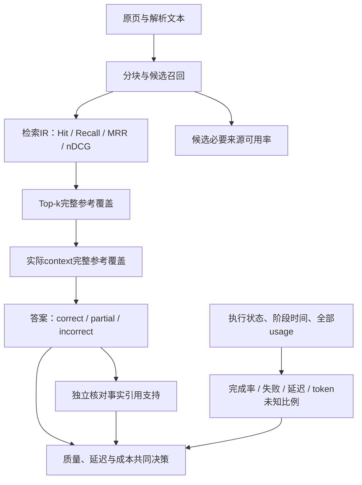

# 模块深度拆解 05：分层评测、实验归因与失败诊断

> 分析日期：2026-10-09；源码快照：`25bc121`。本篇是一个评测功能模块：先解释 `ragcore/eval_ir.py` 的检索评分，再分别解释保存实验、回答复核汇总和Agent成对评测。
>
> 核心文件：`ragcore/eval_ir.py`、`evaluation/run_evidence_experiment.py`、`evaluation/summarize_evidence_experiment.py`、`evaluation/run_agent_experiment.py`。不是把四个脚本当成同一种评分器。本次仅读源码、核对历史产物和离线控制，不重跑付费模型、不覆写历史报告。

## 模块作用

### 为什么存在：让“效果更好”成为可核对的结论

只看几次演示不能证明系统可靠。系统可能返回非空答案，却漏必要条件；可能命中一个参考块，却缺例外；可能更快，却只是关闭了推理或排除了失败。

本模块建立三类证据：

1. **控制证据**：标签不进入运行逻辑、超时/失败没有被偷偷算成功。
2. **效果证据**：固定数据上召回、必要来源覆盖、答案审评发生了什么变化。
3. **取舍证据**：在明确的耗时与用量口径中，收益付出了多少代价。

没有一个指标能同时证明这三类事情。项目也没有使用一个统一“AI准确率”覆盖所有层次。

### 指标分层图



来源块覆盖是可复核的代理指标；参考集合可能冗余或缺等价来源。判断回答充分性最终仍需要事实与条件审评。

### 各脚本职责与数据范围

| 文件/产物 | 职责 | 当前口径 |
| --- | --- | --- |
| `ragcore/eval.py` | 早期小样本关键词烟测 | Top3原文包含任一关键词，不是答案质量 |
| `ragcore/eval_ir.py` | 标签集合与返回ID排序的确定性评分 | 历史46题：35正、11负；正题均值与负题诊断分开 |
| `ragcore/eval_robust.py` | 机械扰动、边界输入与可选模型改写 | 稳健性/异常检查，不能代替真实用户泛化 |
| `ragcore/redteam.py` | 规则关键词/引用初筛 | 确定性信号，不是语义终判 |
| `run_evidence_experiment.py` | 固定快照的检索与生成消融、保存原始输入输出 | 36模拟开发题，另检索回归原35正题 |
| `summarize_evidence_experiment.py` | 校验哈希、读取已有复核意见、汇总 | 模型复核与未复核分开，不在汇总时自动判事实 |
| `run_agent_experiment.py` | quality/agent同题成对运行与输入覆盖统计 | 历史6道复杂开发题，答案未独立审评 |

标签集合定义了“参考”，不是运行时答案提示。所有评分应在检索/问答返回后发生；这个边界是避免泄漏的起点，不是泛化保证。

## 核心代码流程

### 1. eval_ir L51–53、L93–104：先调用检索，再用gold评分

```python
    positives = [g for g in golden if g["type"] != "negative" and g["gold_chunk_ids"]]
    negatives = [g for g in golden if g["type"] == "negative"]
    cutoff = max(max(ks), MAX_K)
```

```python
        for g in positives:
            hits = retrieve(g["question"], k=cutoff, mode=mode)
            retrieved[(mode, g["qid"])] = [h["id"] for h in hits]
```

| 行 | 逻辑与设计意义 |
| --- | --- |
| L51–53 | 从JSONL读取题库；加载标签仅供评测，不自动证明标签已人工确认 |
| L94 | 有参考ID的非negative样本进入正题均值 |
| L95 | negative单列，不放入正题Recall均值 |
| L96 | 检索深度至少20，也不小于最大请求k；MRR在这份返回列表内计算 |
| L100–104 | 每题/每mode调用检索，只传问题、k和mode；qid只用于评测结果索引 |

这里retrieve不传strategy，因此用默认baseline；不能把旧三路IR表解释为guarded评测。若以后修改默认strategy，旧脚本行为也可能漂移，需要固定配置与版本。

非negative但gold为空的题既不进positives也不进negatives，应显式检查这种漏标情况，而不是把所有文件行都自动算入分母。

### 2. eval_ir L58–78：Hit、Recall、Precision与MRR各看什么

```python
def hit_at_k(rel: set, ret: list, k: int) -> float:
    return 1.0 if rel & set(ret[:k]) else 0.0
```

```python
def recall_at_k(rel: set, ret: list, k: int):
    if not rel:
        return None
    return len(rel & set(ret[:k])) / len(rel)
```

| 指标/行 | 计算 | 适合判断什么 | 不判断什么 |
| --- | --- | --- | --- |
| Hit@k，L58–59 | 命中任一参考块就1 | 是否完全没找到参考 | 必要来源是否齐全 |
| Recall@k，L62–65 | 参考命中数 / 参考总数 | 参考集合漏了多少 | 返回块是否都有效、答案正确 |
| Precision@k，L68–71 | 参考命中数 / 请求k | 在标注集合口径下的密度 | 非gold来源必然无用 |
| RR，L74–78 | 首个命中的1/rank，未命中0 | 第一条参考出现早晚 | 后面的必要参考缺失 |
| MRR | 各正题RR均值 | 平均首命中位置 | 无界全文搜索排名 |

Precision分母是请求k，返回少于k也不改分母。例如gold={a,b}、返回只有a、k=8时是1/8，而非1/1。它是此脚本的定义，解释数据时不能悄悄换算法。

MRR使用实际返回cutoff列表。默认至少20，但不是无限排名；参考在未返回的位置时RR=0。

空gold的Recall返回None。脚本将negative单列主要是因为任务意义不同：需要测正确拒答与错误回答，而不是给空集合定义完美检索覆盖。Precision公式本身可计算0，不应机械重复注释中“所有指标都无定义”的说法。

### 3. eval_ir L81–88：nDCG奖励较早的多个参考

```python
    dcg = sum(1.0 / math.log2(i + 1) for i, d in enumerate(ret[:k], 1) if d in rel)
    idcg = sum(1.0 / math.log2(i + 1) for i in range(1, min(len(rel), k) + 1))
    if idcg == 0:
        return None
    return dcg / idcg
```

L81–83先处理空gold；L84对返回位置命中的参考加折扣；L85构造理想排序；L86–88归一化。这是二元相关性，没有给不同条款设置分级相关度或“必要性”权重。

多个参考早出现会更高，但同样不判断来源间是否互补或结论是否受支持。公式假定返回ID唯一：Recall使用set避免重复计数，DCG逐位置判断；若外部输入重复ID，DCG可能重复加分。当前检索按ID去重，评测输入契约仍应说明。

### 4. 手算一个例子：同一结果能“命中”但不“齐全”

gold={a,b}，返回顺序=[x,a,z,b]，k=3：

| 指标 | 结果 | 原因 |
| --- | ---: | --- |
| Hit@3 | 1 | a在前三 |
| Recall@3 | 0.5 | 两个参考只命中一个 |
| Precision@3 | 1/3 | 分母是请求3 |
| RR | 0.5 | 首命中在第2位 |
| nDCG@3 | 约0.38685 | 第2位折扣除以两参考的理想DCG |
| 完整参考覆盖@3 | 0 | b没进入前三 |

本次直接调用当前指标函数核对这一例，属于算法计算验证，不是新的质量实验。原35正题每题一个gold时Hit与Recall数值可相同；组合题必须继续分开。

### 5. eval_ir L106–175：宏平均、切片与“失败”定义

| 行 | 逻辑与设计意义 |
| --- | --- |
| L108–124 | 每mode汇总MRR，每k逐题计算指标 |
| L125–132 | 按题目平均，题目权重相同；不是所有gold块混在一起的micro Recall |
| L135–155 | 按question type切片，每个切片报告自己的n |
| L158–175 | 若ks有5则以Recall@5=0为失败诊断，否则用最后k |

“失败清单”只列完全未命中；Recall=0.5的多参考漏条款不会进入该清单。不能拿“失败清单为空”证明必要来源齐全。

字段`returned_top5`在diag_k不是5时仍使用这个名字，内容其实是ret[:diag_k]。解释时看实际参数，别只凭字段名。

这类整数集合算分，在同一rel/ret/k下结果固定；但语料、标签、索引、排序同分处理或配置变化可改变输入。代码注释“方差为0”只能用于固定输入的计算，不是整个检索系统或未来用户分布没有不确定性。注释里的LLM评分波动范围本篇没有独立测量，不作为本项目收益证据。

### 6. eval_ir L177–205、L291–336：负题诊断与报告写入

L179–188对负题仍执行rrf检索并记录Top1和返回数量，即使本轮modes只选择dense，负题诊断也用rrf。没有在此生成答案或判拒答。

L190–205报告含样本数、cutoff、聚合、切片、失败、负题和每题返回IDs。L291后的CLI检查mode、读取题库、对未reviewed条目发警告，最后覆写指定IR报告文件。

警告不阻止未reviewed样本参与评分；`reviewed=True`也只是数据字段，不等于答案人工金标。CLI没有完整校验空ks、非法非正k或无正题，空题集可能在max/平均处出错。

本次不运行main，避免当前123块语料覆盖旧125块的报告。只读旧报告或用Mock调用run，与真实重跑整个评测是不同动作。

### 7. evidence实验 L25–85：固定语料、保留原基线，再比较策略

主文件 `evaluation/run_evidence_experiment.py`。

| 行 | 逻辑与设计意义 |
| --- | --- |
| L25–44 | 选择实验模式/输出目录，记录Git版本，加载runtime与36题 |
| L45–51 | 读取原35正题和冻结块，对当前索引逐ID核对正文与数量 |
| L52–58 | 读取保存基线Top8，预热后开始计时 |
| L59–75 | 调用retrieve只传question和strategy；返回后才计算gold覆盖与保存输入 |
| L76–85 | 开发检索覆盖只取9道naturalistic_positive，原35正题另报 |

冻结125块校验是防止实验条件悄然改变。当前生产123块已经修复解析，旧脚本不能直接通过这一校验，也不能为了重跑旧指标修改生产语料。需要独立恢复实验快照/索引，或在当前版本建立新对照。

运行逻辑没有题号或标准答案输入，但扩展规则曾受开发题反馈。**无gold ID泄漏不等于没有开发集过拟合。** 必须另外留未用于调参的问法与条件组合。

完整参考覆盖使用`bool(gold) and gold <= set(hit_ids)`。检索汇总只选有参考的正题，不把空gold的数学子集恒真当完美覆盖。

### 8. evidence实验 L86–144：变体、重复运行与完整原始记录

| 变体 | strategy | prompt_version | thinking |
| --- | --- | --- | --- |
| A | baseline | baseline | default |
| B | expanded | baseline | default |
| C | coverage | baseline | default |
| D | coverage | evidence | default |
| E | guarded | baseline | default |
| F | guarded | evidence | default |
| G | guarded | evidence | disabled |
| H | guarded | evidence | low |

L86–103根据保存记录跳过已运行题或重跑不完整项，并定义变体。L105–129按任务创建独立usage_sink，保存检索IDs、完整context/map、system、哈希、答案、错误与generation_seconds。L132–144用线程池执行并追加JSONL，指定API状态出现后停止后续批次。

重试不完整项会使一个variant/qid有多条记录；旧失败保留在文件中，不能既把最新结果当成功率，又忽略重跑与历史用量。

实验默认多worker，检索预计算。输出顺序是任务完成顺序，不是固定题序；生成耗时含本次应用重试，不包含在线检索，也不是网页端到端。当前没有随机化所有变体/多次重复的统计设计。

prompt_version不只是system文本，还改变资料包装、装入规则和最后截断策略，所以E/F不是纯system prompt消融。

### 9. 汇总 L14–47：哈希保护记录一致性，审评意见来自哪里

主文件 `evaluation/summarize_evidence_experiment.py`。

```python
            assert row['qid'] in case_ids
            assert hashlib.sha256(row['context'].encode()).hexdigest() == row['context_sha256']
            assert hashlib.sha256(row['system_prompt'].encode()).hexdigest() == row['system_sha256']
            latest[(row['variant'],row['qid'])] = row
```

| 行 | 逻辑与设计意义 |
| --- | --- |
| L16–20 | 读取已有复核意见、答案哈希和固定36题ID集合 |
| L22–30 | 收集多个实验文件，校验题号和输入哈希，以文件遍历的最后一条覆盖latest |
| L34–38 | 按variant形成最新记录，单列完整输出 |
| L39–47 | 读取grade/reason，核对被审答案哈希，限定correct/partial/incorrect |

这里没有重新调用judge。哈希能证明被评的是同一字符串，不能证明评分者判断正确或标签可信。

latest依赖文件记录顺序，不是比较时间戳选最优。把失败重跑后最后成功作为最新成绩，是脚本口径；必须保留全历史、首次成功和重跑次数供解释。

评分口径在 `evaluation/baseline_v1_2026-09-26/RUBRIC.md`：correct要求主问题与必要条件完整；partial包括漏条件、无依据附加规则等；incorrect包括结论冲突或本可回答却错拒。partial不算严格正确。

复核者是Codex模型。旧冻结基线注明三处用户裁决，不是36题全部由用户标注；这一点也不能扩大成新A–H所有答案的人工审评。

### 10. 汇总 L49–68：分母、未知、延迟筛选都影响结论

```python
            'strict_accuracy':counts['correct']/36 if sum(counts.values())==36 else None,
```

| 行 | 逻辑与设计意义 |
| --- | --- |
| L49 | 汇总已有prompt/completion报告，None用0仅便于加已知小计 |
| L50 | clean_timed只取有usage且没有error_type的最新运行 |
| L51–62 | 报完整/错误/未复核、严格正确、首尝完整、应用次数、已知token、未知次数、P50/P95 |
| L63–65 | 单列所有保存尝试的报告token，并写明时间/成本边界 |
| L66–68 | 写汇总与复核清单；本次不执行此写入流程 |

B/C/D未复核，strict_accuracy为None，不是0%。只有全36题有grade才算correct/36；未来题集改规模时这个硬编码分母也需改契约。

token小计不是未知费用为0。未知次数必须一起展示，SDK内重试与供应商收费也可能没有完整记录。reasoning已经包含在completion中，不重复加；没有价格就不报金额。

clean_timed并非“只算语义正确/首次完成”。它排除API错误，但可能包含未完整或多次重试的输出。因此不能拿此P95代表所有失败用户体验；另需包括失败的全请求分布。

P95使用nearest-rank：排序后取ceil(0.95*n)-1。小样本时可能就是最大值，统计上并不稳定。

### 11. Agent评测 L16–26：运行器只收question，评分后置

主文件 `evaluation/run_agent_experiment.py`。

```python
    result = runner(case['question'])  # The only input to runtime: never labels or IDs.
    gathered = [s['id'] for s in result.get('sources', [])]
    context = [s['id'] for s in result.get('sources', []) if s.get('in_context')]
    gold = set(case.get('gold_chunk_ids', []))
```

L17调用runtime，L18–20才读取sources和gold。L21–26为结果补qid、参考IDs、收集/输入完整覆盖与待审点；model_review、human_adjudication初始化None。

gathered指此评测返回的sources集合，context只取in_context=True；coverage能定位“找到了却没装入”。quality评测适配器保留所有retrieved来源，而网页普通生成只展示included，二者来源展示契约不同，不应拿网页JSON直接代替所有评测阶段数据。

无gold时覆盖值为None，单独用于拒答与范围边界审评；不计成100%。三个现有Agent评测测试直接验证标签隔离、空gold和成对失败处理。

### 12. Agent评测 L29–49：完成对照与全样本同时报，避免藏失败

```python
    eligible = set.intersection(*(set(r['qid'] for r in group if r['status'] == 'complete')
                                 for group in groups.values())) if groups else set()
```

L29–38汇总每组状态、时间、已知用量数量、参考数量与两类覆盖。L41–49同时报告全部样本profiles和各组都complete的配对交集paired。

成对完整组避免一边成功题、一边失败题的耗时直接混比，但有幸存者偏差。必须同时保留全样本失败率/状态；只报告paired会隐藏“某策略经常失败”。

eligible按qid集合求交，代码假定每个profile/qid一条结果；如果传入重复qid记录，分布仍会按记录数统计，可能与交集n不同。当前脚本单次串行产生一对，未来续跑/合并需校验唯一性。

status=complete仅是执行结果条件，不等于答案审评correct。覆盖也可能在limited/failed输出中存在；两项分开才有诊断价值。

### 13. Agent评测 L52–129：预热、串行交替顺序与停止规则

| 行 | 逻辑与设计意义 |
| --- | --- |
| L52–77 | quality适配器执行guarded/evidence/low，保存全部命中与实际context/map、usage、耗时 |
| L80–94 | 读取题集、可选limit、profile；预热检索 |
| L95–101 | 保存代码、语料、题集、runtime哈希和模型名，注明模拟开发探针 |
| L103–104 | 预热LlamaIndex导入，不调用模型 |
| L106–117 | 本次串行；偶数题正常profile顺序、奇数题倒序，逐条落盘 |
| L118–122 | 特定API状态停止批次，避免持续认证/余额/限流失败 |
| L123–129 | 写汇总与待审工作表，不自动填答案质量分 |

交替先后顺序减少固定时序偏向，但不是独立重复样本或随机化研究；题目难度、供应商负载仍影响耗时。

`answers.jsonl`以w打开，不是安全自动续跑；默认输出会覆写同名实验。重跑应使用新的目录，保持历史可复核。本篇不执行main。

### 14. 稳健性与红队脚本：确定性规则不等于语义审评

`eval_robust.py::make_variants`做去标点、数字全角、口语前缀、删字、半句等；边界只检查是否抛异常。`run_perturbation`把发生错误的记录排除于指标均值，并单报errors，必须二者一起看。

并非每次扰动保持意图：半句可能丢失事项，“刚入职”前缀可能改变资格。沿用原gold有时只适合探针，不是新的人工有效真实问法集。可选LLM改写也需检查意图与条件，不能仅因用了模型就称保留集。

`redteam.py::check_expect`用关键词信号、必须词组和引用格式初筛。比如有“不能”可能被当拒答信号，但句子可能是“不能忽略例外”，并未拒答。早期21/21规则通过不是21题答案语义全对，更不是系统完整抗注入安全性。

## 设计思想

### 1. 根据问题选择评分仪器，不拿一个分数包办

检索ID集合适合确定性评分；必要条件与事实支持需要审评；预算/标签隔离适合控制测试；延迟和成本读取真实运行记录。

替代方案是全部交给LLM-as-judge，或只看关键词。前者也需要固定rubric、盲审与一致性校准，后者容易把否定/条件忽略。当前没做独立judge可靠性实验，不能报“评审器准确率”。

### 2. 保留baseline和输入哈希，支持正确归因

一次改检索、提示词、思考和预算，只能证明组合在此批数据上的差异。若要知道哪个机制有效，需要同输入、单变量或逐因素对照。

当前有三路检索、四种strategy和A–H组合，有用但不是所有组件独立充分消融。语料与块ID也会随修复变，必须按文本/页码/事实重标，不能机械沿用旧ID。

### 3. 正负题、未明确条件和完整事实分开

36题分为9道naturalistic_positive、15道hard_negative、12道ambiguous。正题测回答完整；负题测能否拒绝无依据断言；含糊题可给条件规则/澄清，不必全部拒答。

拒答越多不是越安全，可答题错拒也应判错。局部没检索到不等于全册无规则；必要事实评价不能停在“引用一个块”。

### 4. 给出可以防守的历史结果

**检索证据：** 历史35正题dense/RRF/BM25 Recall@3分别77.14%、91.43%、97.14%；Recall@8分别94.29%、100%、100%。题目反向源自语料，词面偏向需说明，不能宣称RRF普遍最好。

9道开发正题baseline完整参考覆盖7/9，guarded9/9，增加22.22个百分点；原35正题Top8命中保持35/35。出处为两个evidence/guarded实验的retrieval_summary。是来源覆盖，不是答案正确率，且已参与规则设计。

**回答证据：** `evidence_optimization_summary_2026-09-26/summary.json`中A正确21/36、H30/36，58.33%→83.33%，增加9题、25个百分点，相对增加42.86%。同组生成P50约8.038→14.071秒，增加6.033秒、75.06%；报告token261181→295563，增加34382、13.16%。这是组合改动与模型复核开发集结果。

**旧基线重评分：** `baseline_v1_2026-09-26/summary.json`是旧保存输出19/36=52.78%；注明rerun=false，原32/36与19/36属于同批输出的重评分，不是性能退步实验。不能把旧19/36、新A21/36、H30/36随意混作同一次前后对照。

旧基线fully_supported_answers=14/36，与strict_correct=19/36不是同指标；新A–H复核记录标记citation_semantic_review未评分，不能声称新H引用支持也83.33%。

### 5. Agent成对结果：没有收益时也要讲清

出处：`evaluation/agent_experiment_2026-10-04/summary.json`、metadata与12条保存输出。

| 项目 | quality | agent | 差异 |
| --- | ---: | ---: | --- |
| 执行complete | 6/6 | 6/6 | 持平，非答案正确 |
| gathered完整参考覆盖 | 5/6 | 5/6 | 持平 |
| context完整参考覆盖 | 5/6 | 5/6 | 持平 |
| 总处理P50秒 | 46.144 | 49.515 | +3.371秒，约+7.31% |
| 总处理P95秒 | 69.046 | 73.898 | 小样本nearest-rank取最大值，不能当稳定线上P95 |
| 平均报告token | 14910 | 33471.167 | +18561.167，约+124.49% |
| 模型审评 / 人工裁决 | 未评 | 未评 | 没有答案正确率结论 |

六题全部有已知用量；这仍不是所有失败运行/供应商费用账单。实验预热、串行、包含Agent编排与合成，不与36题预计算检索的生成P50直接拼接比较。

12条记录的model_review和human_adjudication当前均为None。不能因agent多次搜索、流转完成或覆盖5/6，就说它提升复杂问题准确率。

### 6. 诊断上限要与优化收益分开

历史 `evidence_diagnosis_2026-09-26/summary.json`：9正题候选完整覆盖8/9，保存Top8与重建context均7/9，36题Top8全部对齐、未观察到预算丢块。

8/9是固定候选内选择可达到的参考覆盖上限，不是已经实现的重排提升，也不是答案准确率上限。候选未含直接追偿条款时，候选内重排无从补回。

该诊断是同代码/文本本地重放与context重建，历史没有完整候选和请求日志。Top8对齐不证明历史所有执行状态相同；generation_calls=0也不能产生新答案结论。

历史重点结果基于125块，当前修复后123块。语料版本哈希不同，不直接继承所有收益。本次核对历史哈希和评分来源，没有在当前版本重跑答案或改标签。

## 如果重构

以下均为未实施方案，不把预期写成已测提升。

### P0：评测schema与分母校验

校验题号/profile记录唯一、gold有效、样本分组和非正k；分母来自数据集manifest，不硬编码36。明确无gold、未审评、API失败、预算失败与重复重跑。

测汇总与逐题记录能否一致复算、漏样/重复样检测率、错误分母发生率。此项改善可信度，不直接声称提高回答质量。

### P0：报告全样本、首次运行与最新重跑三套口径

paired完整样本和clean_timed有用，但不能隐藏失败。保留全样本状态、首次完整率、最终恢复率、最新运行与所有历史尝试用量，以及未知比例。

测失败-inclusive P95、超时率、每个正确回答费用和重跑恢复率。当前无真实账单、缺失败usage就明确未知，不能用有响应的小计当全成本。

### P1：独立题集和人工校准

开发集继续做回归；新建未参与规则设计的真实改写、资格组合与负题。冻结标签与rubric，模型审评/人工裁决分别保存，对分歧做盲审，不用生产答案当gold。

测独立严格正确率、条件完整、错误拒答、引用支持与审评一致性。参考块允许等价证据，必要事实标注更接近业务，但也需要人工复核；当前没有这类新保留集效果数据。

### P1：候选、最终输入和事实引用贯通

保存真实候选、选择原因、实际发送messages/hash、map与逐事实引用。减少事后重放推断，不把块级完整覆盖替代事实充分性。

测解析丢失、候选缺失、Top-k丢失、预算丢失、生成遗漏各类占比和记录开销。当前诊断阶段计数不是整体系统准确率，增加可观测性也不直接改变模型质量。

### P1：更严格的成对消融与重复采样

比较思考设置时固定实际context/system，比较检索时固定嵌入、预算、生成与评分。对同题做多个随机种子/时间段、交替或随机化顺序，记录版本与缓存状态。

测差异分布、置信区间、P50/P95和质量成本前沿。六题中P95等于最大值，不能给稳定尾延迟承诺；小样本+5.56个百分点也可能只是两题变化，需要复验。

### P2：稳健性题标注意图变化

机械扰动与真实同义改写分开，半句/新增资格不自动继承原gold。规则红队保留为初筛，再做独立语义和行为检查。

测保持意图题的质量、改变条件题的正确澄清、崩溃率、违规工具执行率与引用支持；不要把不崩溃叫安全通过或把关键词命中叫语义正确。

## 面试考点

| 考点 | 面试官真正关心的能力 |
| --- | --- |
| 指标公式 | 会不会用多gold例子区分Hit/Recall/完整覆盖/MRR/nDCG |
| 题库偏差 | 是否知道反向出题、开发反馈与保留集区别 |
| 数据泄漏 | 是否能指出runtime实际收到的参数与评分发生时机 |
| 分母与失败 | 是否隐藏未复核、空gold、失败或重跑 |
| 归因 | 是否固定输入，避免组合收益全归一个组件 |
| 审评 | 是否分清模型复核、用户裁决和事实引用支持 |
| 成本与延迟 | 是否包含重试、未知用量、预热与计时边界 |
| Agent价值 | 机制完成但质量未证明时是否诚实作决策 |

### 本次离线验证范围

三项 `tests/test_agent_evaluation.py`全部通过，测试报告0.102秒：

1. runtime只收到question；收集到a/b但context只有a时，两种完整覆盖不同。
2. 无gold题覆盖为None，不作为完美。
3. 一策略失败时不进成对完整组，但全样本状态与已知用量数量仍保留。

另外用当前eval_ir指标与Mock run核对手算、精确Precision分母、至少20的cutoff，以及只选dense时负题仍以rrf诊断。核对保存实验的context/system和被评答案哈希，不执行写报告main。

这些验证不是新的模型效果实验，也不证明所有评测边界已覆盖。IR主脚本当前没有专门的完整自动测试文件覆盖全部CLI/重复ID/空题集行为。

## 高频追问

### 追问链1：你说83.33%，这个分母是什么？

第一问“真实用户还是模拟题？”——36模拟开发/回归题，30题模型复核correct，不是独立用户准确率。

第二问“partial算正确吗？”——不算；correct要求必要条件完整，partial单列。

第三问“引用支持也83.33%？”——不是；A–H本轮引用语义未单独评分，不能套同一个百分比。

### 追问链2：为什么基线有52.78%和58.33%两个数字？

第一问“是不是挑了更低的基线？”——52.78是旧保存输出重评分19/36，A58.33是同期对照生成21/36。

第二问“32/36变19/36是系统退步？”——同批答案改评分口径，不是重跑性能实验。

第三问“优化该怎么报告？”——A→H同组组合差异21→30；旧基线另列来源，不混用。

### 追问链3：Recall@8=100%，答案为什么还错？

第一问“是不是检索已经解决了？”——只保证命中标注参考，原题常单gold；组合规则仍可能不齐。

第二问“全部gold齐了呢？”——还看实际context、生成遗漏与错误适用。

第三问“gold本身不完整呢？”——需要必要事实与等价来源标注，不能用集合分数取代充分性判断。

### 追问链4：你的题号与标准答案会不会泄漏给模型？

第一问“传入runtime是什么？”——IR只question/k/mode，Agent run_case只question，返回后加标签。

第二问“无泄漏就泛化了吗？”——规则看过开发题仍可能过拟合，需要独立问法。

第三问“如何验证？”——现有测试用fake runner记录输入；另需保留集冻结和日志确认，不把开发成绩当泛化。

### 追问链5：只比较成功题公平吗？

第一问“失败对没完整结果怎么比耗时？”——paired完整子集便于可比，但同时报全样本失败。

第二问“P95排除API错误会怎样？”——不能代表所有用户等待，需要失败-inclusive口径。

第三问“重跑到成功的成本呢？”——最新运行与所有历史报告用量分开；缺失记未知，真实费用查账单。

### 追问链6：Agent到底有什么收益？

第一问“六题全完成证明更准吗？”——只是6/6执行完成，答案都未独立审评。

第二问“证据有提升吗？”——两组context完整覆盖均5/6，当前没观察到提升。

第三问“为什么继续保留？”——验证动态补查机制和控制边界；平均token增加124.49%，默认quality较合理，需独立长任务与答案评测后再决定适用范围。

## 标准回答

### 1. 60–90秒介绍项目评测

“我把评测按层拆开：先验证解析和来源，再用参考ID计算检索命中、Recall、MRR与nDCG；组合问题额外看候选、Top-k和实际context的完整参考覆盖。最终答案按correct/partial/incorrect复核，引用支持另评分，不能拿检索覆盖替代正确率。

运行器只收问题，标签在返回后才加；实验保留baseline、语料和输入哈希以及逐题usage。历史36模拟开发题A到H模型复核正确21到30，58.33%到83.33%，但生成P50与token都有代价，且是组合优化，不是保留集结论。

Agent六题对照覆盖持平，token更高，答案未审评，所以我不宣称它提高准确率。后续优先独立题、人工校准、全样本失败与实际费用，保持所有收益可回到原始记录。”

### 2. “如何区分检索指标？”

“gold={a,b}而Top3只含a时，Hit是1、Recall是0.5、完整参考覆盖是0。MRR只看首命中早晚，nDCG综合多个参考的位置，仍不理解事实必要性。

当前Precision按请求k作分母，短返回也不改；宏平均按题给同权。单gold题Hit与Recall数值一样不意味着概念一样，组合题必须分开报告。”

### 3. “83.33%是否可信？”

“可信的范围是保存的这36开发题、此rubric和模型复核意见：H30/36，A21/36。输入与被审答案hash可校验，partial不算正确，未审评变体不报正确率。

不可信的扩展是称真实用户83.33%、人工金标、全靠某个单模块或引用支持也83.33%。规则已经看过开发题，没有独立保留集与重复采样，泛化与稳定性要另测。”

### 4. “如何证明某个优化有效？”

“先固定数据、模型、实际context和评分口径，再只改目标变量。F/H保存输入与提示词hash36/36相同，适合观察思考配置；E/F虽然检索IDs相同，资料包装与system都变，不能称纯system消融。

报告逐题差异、绝对百分点、延迟与全部用量，做多次成对重复。只有组合对照时就报告组合差异，不把结果拆成未经测量的组件收益。”

### 5. “如何处理失败与未知成本？”

“全样本状态和配对完整子集同时报，不隐藏一边失败的题。生成耗时包括应用重试，但旧汇总排除API错误，因此必须注明不是所有用户端到端P95。

汇总每次prompt与completion，reasoning不重复加。最新运行用量、被替代历史尝试和未知usage分别保存，缺值不是零成本。token不能直接换金额，费用还要供应商账单。”

### 6. “为什么Agent不是默认？”

“现有六道复杂开发题，两组执行都complete6/6、输入完整参考覆盖都是5/6；Agent总处理P50约49.52秒、quality46.14秒，平均token33471对14910，增加约124.49%。答案尚未独立审评。

这证明流程能工作但未证明质量收益。保留Agent用于动态补查探索，默认普通优化RAG，等独立更长任务与答案审评有收益再决定，不把工具次数多说成更智能。”

### 7. “一个失败题怎么定位？”

“沿原页、解析块、两路候选、最终Top-k、实际context、正文和引用逐层查。候选缺条款要调整解析/召回；候选有但Top-k丢看选择；context有而回答漏才进生成分析。

历史九题候选完整8/9、Top8/context7/9是阶段诊断，不是优化前后。它来自重放重建，没有完整历史请求日志，所以我会给出证据边界并优先保存真实执行数据。”

### 掌握标准与后续方向

能够从一个多gold例子讲清指标，解释36/35/9/6四种样本范围、旧基线与新对照、模型复核与人工裁决、配对幸存者偏差、重试成本与哈希作用，就能防守项目的主要量化追问。

服务与评测两模块本轮分别完成。离线知识构建尚未单独深拆，不能将这里的解析诊断举例替代它的源码讲解。后续最有价值的是补该链路，或围绕已经生成的五篇笔记练习整项目陈述；无需自动启动模拟面试。

### 本次验证记录

只新增本篇笔记，不改题库、评分口径、源码、生产数据或旧报告。三项现有评测测试通过；离线核对指标函数与Mock run；读取历史汇总与原始记录、校验输入/被评答案哈希。未调用真实模型，不把历史成绩当本轮重测结果。
