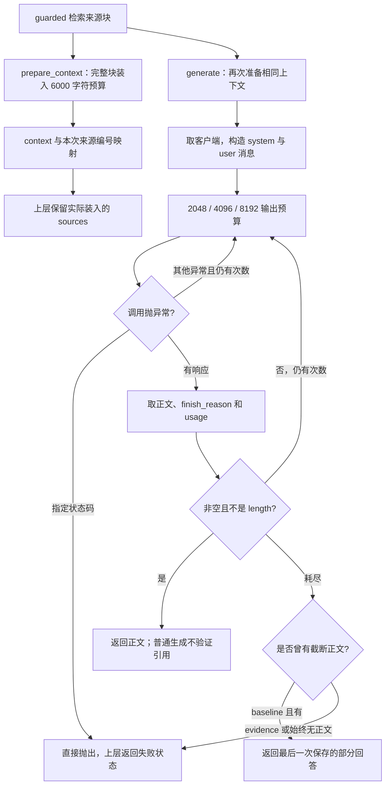

# 模块深度拆解 03：上下文装入、来源编号与生成控制

> 第二阶段，本次主模块为 `ragcore/llm.py`。分析日期：2026-10-09；源码快照：`e9621d0`。只新增讲解笔记，不实施重构，不调用真实生成 API。
>
> 按面试功能链路划分共六个模块，不按 Python 文件数计算。已完成 Agent 编排与混合检索；本篇完成生成模块。之后还有三个：离线知识构建、服务请求与前端、评测与诊断。离线知识构建内部包含解析、分块、嵌入与入库，后续会按子阶段独立讲清，不能因为组合成一条链路而跳过源码。

## 模块作用

### 为什么存在：从“找到了来源”到“模型实际据此回答”

上一模块的 `retrieve` 返回最多八个来源块。这并不表示八块全部进入模型，也不表示模型会正确理解其中的条件。

本模块负责四件事：

1. **装入参考资料**：保持传入顺序，在字符预算内选择完整块。
2. **建立来源标记**：将本次真正装入的块映射为 `来源1`、`来源2`，帮助上层追踪。
3. **发起生成请求**：发送问题、原文和提示词，设置输出预算与思考参数。
4. **处理生成失败并记录用量**：区分空正文、输出截断、API 错误和正常非空正文。

需要建立三个集合：**检索返回的块 → 实际装入的块 → 答案实际引用的块**。三者可以不同；即使三者都包含某条款，也没有自动证明模型的结论受该条款支持。

本模块是普通 RAG 的生成入口。Agent 复用这里的 `EVIDENCE_PROMPT` 与 `prepare_context`，最终生成由 `agent.py` 自己实现，不直接调用这里的 `generate`。所以不能把普通生成的异常重试和 Agent 合成的阶段期限混为一套机制。

### 三个接口，各有一个清楚的职责

| 接口 | 输入与输出 | 应记住的边界 |
| --- | --- | --- |
| `prepare_context(chunks, prompt_version)`，L52 | 来源块 → `(context, mapping)` | 不调用模型；预算过滤后的编号才有效 |
| `generate(question, chunks, ...)`，L143 | 问题与块 → 字符串或异常 | 普通生成不返回 source_map，也不执行引用语义校验 |
| `last_usage()`，L138 | 读取最近一次响应用量的副本 | 不是整条请求的总成本，也不是线程隔离的记录 |

生成的两个主要维度也要分开：

| 维度 | 当前选项 | 控制什么 |
| --- | --- | --- |
| `prompt_version` | baseline / evidence | 提示词、参考资料包装、超预算块处理、最终截断兜底 |
| `thinking_mode` | default / disabled / low | 请求里是否发送思考设置及低强度参数 |

网页默认 quality 使用 guarded 检索、evidence 提示词、low 思考；fast 保持前两项但使用 disabled；baseline 三项分别是 baseline、baseline、default。名称“quality”与“fast”是产品配置名，不是每个问题都会获胜的保证。

## 核心代码流程

### 一条普通 quality 请求怎么经过本模块



图省略了无上下文时的本地提示返回；实际 `generate` 在装入上下文前先获取客户端。重试始终使用同一份 messages，不续写旧回答、不重新检索。

### 1. L15–23、L82–91：配置存在不等于接口可用

L15–21 引入上下文预算、输出预算、上限、尝试数和项目路径。L23 从项目 `.env` 加载配置；本次不读取或展示任何密钥内容。

```python
def env_config() -> dict:
    api_key = os.getenv("OPENAI_API_KEY", "").strip()
    base_url = os.getenv("OPENAI_BASE_URL", "").strip()
    model = os.getenv("RAG_LLM_MODEL", "deepseek-chat").strip()
    return {"api_key": api_key, "base_url": base_url, "model": model}
```

| 行 | 关键逻辑与设计意义 |
| --- | --- |
| L83–84 | 取密钥和地址并去掉首尾空白；避免将空白配置当成可用值 |
| L85 | 未设置模型变量时使用代码默认模型名；这不是本次核验到的供应商实际部署模型 |
| L89–91 | `api_ready` 只检查密钥和地址是否非空，没有发健康请求 |

所以网页显示“已配置”不等于认证成功、有余额或模型支持当前参数。模型名称、供应商回包、网络错误需分别看；不要用“换一个 key”解释所有连接失败。

### 2. L94–127：显式网络策略和客户端复用

```python
    proxy = os.getenv("RAG_HTTP_PROXY", "").strip()
    if proxy:
        return httpx.Client(proxy=proxy, timeout=90)
    return httpx.Client(trust_env=False, timeout=90)
```

| 行 | 关键逻辑与设计意义 |
| --- | --- |
| L102–105 | 优先用当前环境的 httpx2 分支，缺失时退回 httpx |
| L107–110 | 未指定代理时明确关闭环境继承；指定代理时显式传入地址 |
| L113 | `lru_cache(maxsize=1)` 复用一个客户端，避免逐次生成都构造连接客户端 |
| L118–120 | 首次构造时检查配置存在，缺失就抛出 RuntimeError |
| L121–126 | 指定密钥、地址、90 秒 timeout、SDK 的一次自动重试和 HTTP 客户端 |

代码注释记录了历史系统代理导致 TLS 失败的排错背景；本次没有重放该故障，不能把历史说明当新的测量。

两个边界要补上：

- 关闭环境继承的是没有显式代理的分支；显式代理分支没有额外设置 `trust_env=False`，不能笼统说所有分支都禁用了环境设置。
- 客户端缓存保存首次构造时的 key/base_url；后续 `env_config` 会读取 model 等当前环境值，但不自动重建已缓存客户端。运行中切换地址/认证需要显式清缓存或重启，当前没有完整热配置契约。

`timeout=90` 也不是整条用户请求严格 90 秒内完成的 deadline。请求可能有应用层重试和 SDK 重试；本模块没有像 Agent 那样再包一个阶段总期限。

### 3. L52–64：baseline 保留旧行为，也保留旧预算边界

```python
        if prompt_version == "baseline":
            if used + len(text) > LLM_CONTEXT_BUDGET:
                break
            parts.append(f"〔第{c['page_start']}页·{c['path'] or '无章节'}〕\n{text}")
            used += len(text)
```

| 行 | 关键逻辑与设计意义 |
| --- | --- |
| L53–54 | 只接受两种已知版本，拼错版本直接失败 |
| L55–59 | 初始化片段、已用字符数、编号映射，按原顺序读取 text |
| L61 | baseline 仅把 text 的长度算入预算；text 已包含分块时的章节前缀 |
| L62 | 第一块放不下就终止整次遍历，后面的短块也不再考虑 |
| L63 | 额外加页码/路径标记与换行，但这些包装没有计入 used |
| L64 | 只增加正文 text 长度；baseline mapping 始终为空 |

因此“baseline 参考资料字符串最多 6000 字符”不准确。它只是已装入的 text 长度之和不超过 6000，实际字符串还有来源包装和块间空行。

保留 baseline 的动机是做真实消融，避免一边改新方案，一边悄悄修旧基线，使实验失去对照。但保留对照不等于建议生产继续使用旧的截断策略。

### 4. L65–74：evidence 计入包装，超预算时跳过而不是截半块

```python
            label = f"来源{len(parts)+1}"
            part = f"〔{label}〕 第{c['page_start']}页·{c['path'] or '无章节'}\n{text}"
            cost = len(part) + (2 if parts else 0)
            if used + cost > LLM_CONTEXT_BUDGET:
                continue
            parts.append(part)
            mapping[label] = c['id']
            used += cost
```

| 行 | 关键逻辑与设计意义 |
| --- | --- |
| L66 | 编号以已经装入的 parts 数量为准，不以原检索位置编号 |
| L67 | 标记、起始页、路径和完整原文一起构成一个 part |
| L68 | 包装字符和后续块前的两个换行一起计入 cost |
| L69–70 | 放不下就跳过这块，继续尝试后面的短块；不剪掉句子后半部分 |
| L71–73 | 只有真正装入才添加内容、编号映射与费用计数 |
| L74 | 用相同的两个换行拼接，所以这里的 used 对应实际 context 长度 |

映射是 **本次装入来源编号 → 稳定 chunk ID**。例如检索依次返回 a、超大 b、小块 c，b 被跳过后得到 `来源1→a、来源2→c`，不是来源3→c。编号在另一次请求中可能重新分配，不能用 `来源2` 作为跨请求永久锚点。

当前只展示 `page_start`，块可能跨多页；完整页码列表在 chunk/上层 sources 中。编号也不区分同一块中的哪一句事实支持结论。

更深的限制：这是顺序贪心装入，没有判断“这块虽长却包含必要例外”，也没有去重传入的 chunks。Agent 收集端会按 ID 去重，但函数本身不保证所有调用方都去重。

### 5. 本次离线手算与真实函数核对

下面只用合成字符串调用当前 `prepare_context`，没有调用模型，也不算回答质量实验。

| 输入 | baseline | evidence | 说明 |
| --- | --- | --- | --- |
| 第一块 text 长6001，第二块“可回答的规则” | context 长0 | context 长19，映射 `来源1→small` | break 会隐藏后面的短证据，continue 可以保留 |
| 临时预算40；两块text分别为30个“甲”和5个“乙”，页码1/2、路径“规则” | 两块都装入，实际context长55 | 第一块连包装放不下，第二块装入，长18，映射 `来源1→b` | 包装计费改变选择；baseline实际字符串会超过名义预算 |

这证明控制逻辑，不证明跳过大块后一定更正确。第二例中第一块也可能是必要事实，evidence 仍会丢掉它。因此要测“必要事实进入最终输入的覆盖”，不能只测字符串是否短于预算。

这里临时修改预算只发生于独立进程的 Mock patch，没有改配置文件。实际默认仍为 6000 字符。

### 6. 6000 字符、输出2048 token、模型窗口：不是同一件事

| 参数/量 | 当前含义 | 不代表什么 |
| --- | --- | --- |
| `LLM_CONTEXT_BUDGET=6000` | evidence 参考资料字符串的 Python 字符长度上限 | 6000 token、整条输入长度、供应商 context window |
| `LLM_MAX_TOKENS=2048` | 第一次请求的输出 token 预算 | 全链路总 token、固定正文2048 token |
| `LLM_MAX_TOKENS_CAP=8192` | 单次最大输出预算 | 8192个汉字、三次累计消费上限 |
| `LLM_GEN_ATTEMPTS=3` | 应用层最多三次生成尝试 | HTTP底层一定只发三次、一定能生成完整答案 |
| 实际 prompt_tokens | 供应商本次报告的输入 token | 等于6000或能按字符精确换算 |

输入还包括 system prompt、用户问题、资料标题和协议包装。当前没有用目标模型 tokenizer 检查整个 messages 是否超窗，也没有从模型窗口中减去预留输出量。

历史配置注释记录过输出1024时 reasoning占满预算、正文为空的现象；这只是该兼容模型的历史行为，不是所有模型/供应商共享相同预算规则的保证。本次不做在线模型验证。

### 7. L25–49：从“禁止编造”变成可执行的回答原则

提示词存在于代码中，模型是否遵守要通过答案审评验证。

| 范围 | baseline 的重点 | evidence 新增的设计动机 |
| --- | --- | --- |
| 根据什么回答 | 仅依据资料 | 同时理解定义、分类总则、具体规则及例外 |
| 条件不足 | 泛化的资料不足提示 | 给条件规则、少量澄清，保留岗位/工龄/地点等资格 |
| 数值解释 | 尽量引用原文 | 不把上限说成额外额度，不漏年度累计、折算、转正条件 |
| 未查到内容 | “手册未查到” | 只说提供的资料未明确，避免从局部检索推断整本无规则 |
| 来源 | 生成页码/路径式标记 | 复制输入已有的 `〔来源N〕`，减少自由编造来源字段 |
| 冲突与时效 | 提示适用边界和现行未知 | 列明条款张力，不自行裁定优先级；专项制度内容保持未知 |

为什么强调总则与例外？“事假”块可能描述流程，“无薪假”总则说明福利影响，“餐补”表说明实际出勤核算。模型需要把已提供的事实结合起来，不能把某个局部段落没出现“餐补”误说成无规定。

提示词可以改善“如何使用已给出的证据”，不能找回未进入 context 的条款。也没有数据库权限控制或文档版本核验；说“不要推断当前最新”不等于已经确认现行手册。

两种消息角色分开能清楚表达任务与资料，但参考资料仍是普通文本，代码没有对资料中的恶意指令做完整隔离/验证。提示词是引导，不是已验证的抗注入能力。

### 8. L154–166：调用顺序、空上下文与消息结构

```python
    LAST_USAGE.clear()
    cfg = env_config()
    client = get_client()
    context, _ = prepare_context(chunks, prompt_version)
    if not context:
        return "（未能检索到相关手册内容，请换一种问法。）"
```

| 行 | 关键逻辑与设计意义 |
| --- | --- |
| L154–155 | 校验 thinking_mode，不静默忽略非法值 |
| L156 | 清空全局最近用量，不能沿用上一题响应信息 |
| L157–158 | 先取配置与客户端；即使 chunks 为空也可能先因缺配置抛错 |
| L159 | 再构造上下文；mapping 在 generate 中被丢弃，不在此做引用校验 |
| L160–161 | 所有块放不进时返回本地提示，没有发生成请求；不是模型作出的拒答 |
| L163–166 | system 提供规则，user 提供问题与参考资料；没有传上一轮聊天记录 |

“没有相关内容”还可能来自预算全部跳过，不一定是候选检索为空。这种提示的含义需结合检索结果判断；当前函数返回字符串，没有区分两种原因的结构化状态。

网页会先为展示 sources 调用一次 `prepare_context`，generate 又调用一次。相同输入、版本与常量时结果相同，但代码没有直接把已构造的 context/map 传给生成；重构时应避免两端准备逻辑逐渐分叉。

### 9. L169–177：重试是重新生成，不是继续写剩下的答案

```python
    for i in range(LLM_GEN_ATTEMPTS):
        budget = min(LLM_MAX_TOKENS * (2 ** i), LLM_MAX_TOKENS_CAP)
        try:
            resp = client.chat.completions.create(
                model=cfg["model"], messages=messages,
                temperature=0.2, max_tokens=budget,
                **({'extra_body': {'thinking': {'type': 'disabled'}}} if thinking_mode == 'disabled' else
                   {'extra_body': {'thinking': {'type': 'enabled'}}, 'reasoning_effort': 'low'} if thinking_mode == 'low' else {}),
            )
```

| 行 | 关键逻辑与设计意义 |
| --- | --- |
| L169 | 默认最多三次应用尝试，i从0开始 |
| L170 | 默认输出预算依次2048、4096、8192，增加到上限 |
| L173–174 | 每次用相同messages，temperature=0.2；增大的是输出预算，不是检索/输入预算 |
| L175 | disabled 发送显式关闭思考的兼容请求字段 |
| L176 | low 发送启用思考以及 reasoning_effort='low'；default不加这两类控制字段 |

default 的含义是“不显式改写供应商默认设置”，不是代码确认“没有思考”。兼容供应商是否支持或遵守这些字段，本地 fake 客户端测试不能证明。

每次重新发送问题和全部上下文，前次输出不加入下一次 messages。因此重复尝试可能重复产生输入与输出用量，也可能生成另一种措辞；这是可靠性与延迟/成本的取舍，不是免费的续写。

2048+4096+8192=14336 是三次申请的输出预算之和；实际消费必须读 usage，不能把预算之和记成实耗。输入 token 在每次尝试也可能重复计费，真实金额需供应商账单/价格，本次不估算。

### 10. L178–186：别拿增大预算治疗所有 API 错误

```python
        except Exception as exc:
            status = getattr(exc, 'status_code', None)
            if usage_sink is not None:
                usage_sink.append({'attempt': i+1, 'max_tokens': budget, 'error_type': type(exc).__name__, 'status_code': status, 'prompt_tokens': None, 'completion_tokens': None})
            # Larger token budgets cannot fix credentials, balance, invalid parameters or rate limits.
            if status in (400, 401, 402, 403, 404, 429):
                raise
            attempts.append(f"第{i + 1}次(预算{budget})调用异常: {type(exc).__name__}: {exc}")
            continue
```

| 行 | 关键逻辑与设计意义 |
| --- | --- |
| L179 | 读取异常携带的HTTP状态；并非每种异常都携带状态 |
| L180–181 | 为调用方记录失败尝试，未知token用None，不能编成0 |
| L183–184 | 指定状态直接抛出，避免余额不足或错误参数时继续提高输出预算 |
| L185–186 | 其他异常记录后进入下一轮，预算也会随i增大 |

因此应用层不仅重试空/截断，也会重试未在名单中的异常。增大输出预算本身修不好网络问题；目前没有单独的网络退避、抖动和总时间封顶。

注意双层重试：`get_client` 的 `max_retries=1` 属于 SDK 内部；上述循环属于应用。本次读取安装 SDK 的 `_base_client.py`，其常规状态策略会重试408、409、429、5xx，还可受响应头影响。所以“应用收到429后立即抛出”不等于“线上429从未被SDK重试”。

三次应用调用在每次均触发一次SDK重试的情况下，可有最多六次SDK发送尝试，不把重定向等协议行为算入此数。`usage_sink` 记录应用收到的响应/错误，不覆盖SDK内部每一次发送，也不能证明失败请求没有产生供应商费用。

### 11. L188–206：usage 是实测记录，缺值必须保留未知

| 行 | 关键逻辑与设计意义 |
| --- | --- |
| L188–189 | 假定有第一个choice，取正文并strip；reasoning内容不当作可展示正文 |
| L190–192 | 从usage和可选details读取reasoning_tokens；字段缺失可得到None |
| L194–201 | 保存申请模型/返回模型、尝试与预算、思考设置、输入/输出/reasoning、结束原因与正文字符数 |
| L203–204 | 覆盖全局LAST_USAGE，只保留最近一次成功收到的响应元数据 |
| L205–206 | 向本请求usage_sink追加副本，保留多次应用尝试的记录 |

在当前记录口径里 reasoning 是 completion 的组成部分。汇总总token用 `prompt_tokens + completion_tokens`；再加reasoning会重复计数。未知completion/reasoning不能根据预算或正文字符数反推出精确值。

`last_usage()`返回字典副本只防止调用者改动原字典，不提供线程隔离。实验并发调用时，应使用每个任务独有的usage_sink；全局LAST_USAGE可能被其他请求清空或覆盖。网页单进程锁缩小了网页并发范围，但不把这个全局变量变成通用并发安全设施。

还有边界：只有 `.create` 在try块里；`resp.choices[0]` 等解析在外。如果兼容接口返回空choices或结构不符，解析异常不会走这套预算重试，应由上层处理。当前没有完整的响应schema防御。

### 12. L207–228：传输完成、正文完整、事实正确是三道门

```python
        if content and choice.finish_reason != "length":
            return content                       # 只有"有正文且正常收尾"才算成功
```

实际判断是“非空且finish_reason不是length”，并不是严格要求 `finish_reason=='stop'`。代码注释的“正常收尾”比实际条件更宽；异常或未知结束原因若携带非空正文也可能返回，不能说全部已被拦截。

| 行 | 关键逻辑与设计意义 |
| --- | --- |
| L207–208 | 满足上述条件就返回，没有逐事实审评或引用检查 |
| L210–215 | 有正文但length时存为fallback，记录截断并尝试更大输出预算 |
| L216–219 | 无正文时记录结束原因和reasoning，再尝试下一轮 |
| L221–225 | 曾有部分正文且尝试耗尽：evidence抛异常，baseline保留历史部分回答兜底 |
| L226–228 | 始终没有可用正文时抛EmptyGenerationError，避免空串绕过调用方失败处理 |

evidence 不展示最终截断政策，动机是例外或适用条件可能恰好在被截掉的后半段。代价是本可参考的部分文本不被当作完整答案；上层仍可以保留原文来源供用户核对。

普通 RAG 没有在这里校验 `〔来源999〕`。Agent 的最终路径在 `agent.py` L251 检查标记是否属于map，但也不验证每条事实语义支持、漏引用或错误适用。必须把“提示词要求引用”“编号合法”和“事实有依据”分开。

还有一个诊断细节：fallback可能来自较早一次响应；若后来失败或空正文，最后一条usage不必对应fallback。上层只看最后finish_reason判断部分答案的办法有边界。这是源码推导的风险，本次没有发现生产事故或实施修复。

### 13. 接上一模块的餐补示例：能够核验到哪一步

上一笔记中，当前123块索引的guarded单题检索选中了无薪假总则与餐补条款。到本模块还要问：

1. 两块是否都放进evidence预算？检查map中实际chunk IDs，而不是只看retrieved_ids。
2. 模型请求的资料是否确实含这两段原文？保存context及哈希，确认发送的消息。
3. 最终结论是否保留事假性质、实际出勤和适用条件？需要答案审评。
4. 引用是否支持该事实？编号存在只是第一步。

本篇没有再次调用模型为该题生成新答案，所以不把上一例的检索成功写成当前回答正确。若要做可比生成实验，需固定语料、实际context、模型/参数、题集和审评口径。

## 设计思想

### 1. 原文优先，来源编号由应用建立

模型容易把页码、条号与结论一起生成错。应用先建立本次真实装入的来源编号，模型只复制标记，减少自由生成来源字段的负担。

替代方案是继续用页码/路径标记，或要求结构化输出claim和source IDs。前者容易让标记变长并由模型改写；后者便于校验，但仍需要事实支持审评。当前未比较独立的引用存在率/支持率收益。

### 2. 保留完整块与跳过大块：避免文本被剪一半，但不是最优证据选择

截断原文可能丢掉同段的限定或例外，所以当前不剪半块；continue又避免某个大块让后面所有短块不可见。

替代方案是优先级装包、段落级/句子级选取或更小的结构分块。每种方案都可能丢必要条件。应在相同总预算内测必要事实覆盖、重复文本比例、最终条件完整率与延迟，而不是仅让context更短。

当前没有“换成token装包后准确率提高多少”的测量。也没有证明按传入顺序装入是最优；guarded顺序与Agent首次收集顺序各有不同来源。

### 3. 提示词围绕已观察的错误机制，但防止把开发题记忆当泛化

evidence针对总则遗漏、资格缺失、金额/时限编造、条款冲突与局部未查到作全局否定等现象写出具体规则，优于只重复一句“不要幻觉”的设计动机。

不过这些规则经过开发题反馈，因此属于受开发集影响的优化。即使没有题号/gold ID硬编码，也可能对题库表达过拟合；需要独立问法与未见条件组合。

### 4. 有限预算重试是可靠性控制，不是答案正确性验证

空串不能作为成功答案；length可能截掉关键条件。因此重试既覆盖空正文也覆盖截断，最后显式失败。

替代方案包括更大初始预算、关闭思考、请求更简洁的答案或切换备用模型。它们可能减少重试，却改变质量、延迟与费用。当前保留思考配置对照；不能说8192就保证正确或所有题都应该关闭思考。

### 5. 用可比实验讨论取舍：先看配置，再看数字

历史36模拟开发/回归题，模型复核严格正确率。来源：`evaluation/evidence_optimization_summary_2026-09-26/summary.json`，变体定义见 `evaluation/run_evidence_experiment.py`。不是完整人工金标，不是独立真实用户保留集。

| 变体 | 检索 / 提示词 / 思考 | 严格正确 | 生成P50秒 | 最新各题运行所报告token总量 | 应用尝试总数 |
| --- | --- | ---: | ---: | ---: | ---: |
| A | baseline / baseline / default | 21/36，58.33% | 8.038 | 261181 | 54 |
| E | guarded / baseline / default | 24/36，66.67% | 8.786 | 279986 | 58 |
| F | guarded / evidence / default | 28/36，77.78% | 14.725 | 351224 | 64 |
| G | guarded / evidence / disabled | 27/36，75.00% | 2.141 | 111854 | 36 |
| H | guarded / evidence / low | 30/36，83.33% | 14.071 | 295563 | 58 |

这些token包括该汇总所选最新运行的应用重试；不是每题一次调用的固定费用，也不是包含所有被替代历史失败运行的总账单。A/E/F/G/H在该汇总中的未知usage尝试均为0；其他变体有未知，不应直接等同真实花费为0。

有三组不同含义的比较：

- **E→F**：同检索IDs36/36，但实际context哈希与system哈希均不同36/36。正确增加4题、11.11个百分点；P50增加5.939秒，token增加71238、25.44%。prompt_version同时改变来源包装、装入与截断兜底，不能称为“仅修改system prompt”的纯消融。
- **F→H**：同检索IDs、context哈希、system哈希均36/36，显式思考设置不同。正确增加2题、5.56个百分点；P50减少0.654秒、4.44%，token减少55661、15.85%。这次记录支持该配置值得继续验证，但缺少重复采样/随机化顺序，不能说low必然更准更快。
- **G→H**：上述三类输入也完全相同36/36。H正确多3题、8.33个百分点，同时P50增加11.930秒，token增加183709、164.24%。说明此批题上质量与速度取舍明显；不代表所有新问题都有同样差异。

整体A→H正确增加9题、25个百分点，P50增加6.033秒、75.06%，token增加34382、13.16%。这是组合改动，不能全部归因于本生成模块。

这些都是历史125块快照上的结果；本篇没有在当前123块语料重跑生成实验。生成耗时含应用重试；检索预计算，排除API错误运行，不是网页端到端P50，也没有换算金额。

本次检查了保存答案中36对记录的检索IDs、context/system哈希是否一致，未重新审评或重生成。历史结论需连同题库、日期、配置和审评者一起说明。

### 6. 把可观测性和全局状态解耦

按请求传入usage_sink能将同一题的多次响应保留下来，避免只看最后一次而低估总用量。全局LAST_USAGE适合历史串行CLI取最近记录，但不能代表并发请求的成本。

替代方案是返回带answer、status、map、attempts、usage的结构化结果，并用请求ID关联底层发送日志。当前未实现该统一结果，改造应保持baseline与网页状态兼容。

## 如果重构

以下是方案与测量方法，不修改业务代码，不承诺未测收益。

### P0：统一生成结果与截断状态，不让调用方从字符串猜

现状：正常答案、本地无上下文提示与baseline部分fallback都可能是字符串；最后usage也可能不对应实际返回的fallback。

方案：返回明确的complete、no_context、truncated、failed状态，以及实际采用的attempt、context/map、答案和全部应用usage。规定可接受的finish_reason，区分响应schema异常与可重试异常。

测量空响应、length、未知结束原因、截断后网络错误等故障下的状态正确率、错误展示率和来源保留。当前没有这些完整边界的对照，更不能说已消除所有静默失败。

### P0：先装入再取客户端，区分未召回与预算排空

现状：客户端构造在空上下文判断之前；所有块放不下也使用“未检索到”的文案。

方案：准备好上下文后决定是否调用模型，显式返回候选为空或预算过滤为空的不同状态；来源保留并提示为何无可用输入。避免网页与generate各自准备一遍造成契约分叉。

测量无上下文时模型调用数、误导文案比例、展示来源与实际消息一致性。预期改善控制与诊断，未测到答案质量收益。

### P1：整条消息按目标token窗口预算，仍保持原文可追踪

现状：6000是参考资料字符数，未计整个system/user的token，也未预留模型输出窗口。

方案：为固定供应商/模型确认token计数方式，对完整messages估算或精确计数，预留输出和安全余量。包装也计费；不把字符预算简单乘一个常数当精确token值。baseline作为独立对照保留。

测量估算与reported prompt_tokens偏差、超窗错误率、预算内必要事实覆盖、条件完整率、P50/P95和装入计算开销。当前没有token预算替代的成对结果。

### P1：按必要证据装包，并验证引用支持

现状：顺序贪心跳过大块，普通generate丢弃map且不验引用。编号在提示词中存在不等于实际引用正确。

方案：先保持稳定的context/map结果，再加标记存在检查、漏引用检查；语义支持另做claim→证据评审。若优化装包，可比较完整块与保留条件的更细片段，禁止用模型摘要无痕替换原文来源。

测量标记非法率、事实引用覆盖率、支持率、条件遗漏率、错误拒答与新增延迟。检查器也可能误判，开发集外要独立审评；不能用编号100%合法替代答案正确率。

### P1：分开重试类型，增加整请求期限与实际账单口径

现状：预算不足与部分网络错误共用翻倍循环，SDK又有自动重试，没有普通生成总deadline。

方案：预算不足才升输出上限；短暂错误按明确次数、退避和期限处理；不可修复配置错误直接失败。显式决定SDK/应用各负责什么，保留每次底层发送的未知用量状态，不推定失败免费。

测量首尝完整率、重试恢复率、总P95、期限超出率、失败消费未知比例与每个正确回答费用。限时停止等待不证明供应商请求已经停止计费。

### P2：模型配置和客户端生命周期形成明确契约

现状：key/base_url缓存，model每次读取，全局LAST_USAGE共享。

方案：请求固定模型配置版本；切换配置时明确客户端重建/连接释放策略；移除全局用量作为主要结果来源。小项目可以先明确重启要求，不必过早做动态配置平台。

测量配置切换一致性、并发usage归属、连接资源与失败恢复时间。复用连接的独立延迟收益当前没有开关对照。

## 面试考点

| 考点 | 面试官要确认什么 | 结合源码的落点 |
| --- | --- | --- |
| 检索与输入预算 | 是否知道Top8不等于全部可见 | prepare_context的break/continue、实际map |
| 字符与token | 是否理解两种预算的边界 | 6000参考字符、整条messages、2048输出token分别解释 |
| 来源标记 | 是否把结构追踪说成事实验证 | map来自实际装入；普通生成不验；Agent也仅有标记合法性检查 |
| 生成重试 | 是否只凭“有HTTP响应”认为成功 | 非空与非length、预算序列、baseline/evidence兜底差别 |
| 思考模式 | 是否知道请求参数与供应商行为不同 | default不加字段、low/disabled明确发送，测试不证明服务器遵守 |
| 成本统计 | 是否只报最后一次usage | 本请求sink全部尝试，reasoning不重复加，失败usage未知 |
| 网络与缓存 | 是否会定位连接/配置问题 | 未配置检查、显式代理、客户端缓存与整请求无总deadline |
| 实验归因 | 是否把组合收益说成单点收益 | E/F改变包装与提示词；F/H输入hash相同；A/H组合变化 |

### 当前测试到底验证了什么

`tests/test_generation_evidence.py`共六项，本次全部通过，测试报告耗时0.012秒：

| 测试 | 验证内容 | 不验证什么 |
| --- | --- | --- |
| `test_source_labels_match_included_chunks` | 输入两块的编号与ID映射一致 | 两块是否充分或答案是否正确 |
| `test_oversized_chunk_does_not_hide_later_small_evidence` | evidence跳过超大块，保留后面的短块，字符串≤6000 | 被丢大块是否是必要条款 |
| `test_thinking_toggle_is_explicit_and_default_request_is_unchanged` | 传给fake客户端的参数与返回模型记录 | 供应商是否支持/遵守字段 |
| `test_evidence_mode_rejects_a_truncated_final_answer` | 三次length后evidence抛异常，保留三条usage | 真实模型扩大预算后会否恢复 |
| `test_exhausted_balance_is_not_retried_with_larger_budget` | fake 402在应用层只调用一次 | SDK内部是否重试其他状态或实际账单 |
| `test_retry_usage_is_per_request_and_preserves_every_response` | 截断后完整响应均记录，另一请求不改前一sink | 全局LAST_USAGE线程安全 |

另运行 `tests/test_webapp.py` 的11项现有测试，全部通过，测试报告耗时0.668秒。与本模块相关的检查包括实际装入来源展示、用量相加、失败保留证据、baseline截断状态、未配置和retrieval-only不调用模型；其余服务控制将在服务模块独立讲解。

17项通过是控制行为证据，不是重新获得36题答案正确率。当前这六项测试也没有覆盖所有响应schema、结束原因和客户端配置更新边界。

## 高频追问

以下是基于源码的预测追问链，不是某家公司真实面试题统计。

### 追问链 1：为什么Top8全召回了，答案还是漏条件？

**第一问：** “拿到八块，模型不就都看到了吗？”

答题方向：检索集合与输入集合不同；检查context/map，预算可能跳过来源。

**第二问：** “都进入模型后还错呢？”

答题方向：模型仍可能漏资格、误用总则/例外、错引；进入输入是必要步骤，不保证使用正确。

**第三问：** “怎么定位？”

答题方向：保存检索IDs、实际context/hash/map、回答与事实审评，逐层判断，别把所有问题归给embedding。

### 追问链 2：6000字符预算真的安全吗？

**第一问：** “6000字符等于多少token？”

答题方向：不能精确固定换算，取决于目标tokenizer和文本；输入还含提示词、问题、协议。

**第二问：** “baseline也严格≤6000吗？”

答题方向：正文text和≤6000，包装未算；离线40预算例实际55。evidence才计实际参考字符串。

**第三问：** “那直接截原文到6000不就好了？”

答题方向：可能截掉例外与条件；应按完整可追踪证据装包并测必要事实覆盖，不仅检查长度。

### 追问链 3：有来源编号就不会幻觉？

**第一问：** “来源1怎么产生？”

答题方向：按实际装入顺序生成，map指向chunk ID，不由模型编页码。

**第二问：** “模型写来源999怎么办？”

答题方向：普通generate当前没拦，不能声称已解决；Agent检查标记存在，但那是另一条路径。

**第三问：** “引用来源1但结论不支持呢？”

答题方向：编号合法检查无能为力，需逐事实支持审评；漏引用也要独立测。

### 追问链 4：为什么不用一次8192？

**第一问：** “三次重试更慢，直接最大预算呢？”

答题方向：可作替代对照，不假定供应商一定耗满max_tokens；不同初始预算会改变完整率、思考与延迟，需测。

**第二问：** “重试是继续写还是重新生成？”

答题方向：同一messages完整重发，未传上次回答；输入和输出用量都可能重复。

**第三问：** “上限14336是实际成本吗？”

答题方向：不是，14336是申请输出预算的和；实耗读全部usage，另计输入，reasoning不重复加，金额需账单。

### 追问链 5：余额不足为什么不重试？429真的一次也不重试？

**第一问：** “402提高max_tokens能解决吗？”

答题方向：不能，应用层收到指定状态立即抛，不浪费预算重试。

**第二问：** “你的SDK不是max_retries=1吗？”

答题方向：两层不同；SDK可能先对429/5xx重试，应用看见最终异常后才按自己的规则处理。

**第三问：** “90秒就是整题期限吗？”

答题方向：不是，单次HTTP timeout加多层尝试；普通生成没有总deadline，Agent阶段限时另外实现。

### 追问链 6：你怎么证明提示词和思考优化有效？

**第一问：** “58.33%到83.33%全是提示词收益？”

答题方向：不是，A/H是检索、提示词/包装、思考的组合；36模拟开发题、模型复核。

**第二问：** “E/F只有提示词不同？”

答题方向：检索IDs相同，context和system不同；prompt_version还改变包装、装入与失败策略，不是纯system消融。

**第三问：** “F/H输入相同，能宣布low更强吗？”

答题方向：36对输入hash一致，当前记录30/36对28/36，值得复验；无重复采样/随机化，不能推出稳定优势。

## 标准回答

以下供练习论证；个人承担的工作与AI辅助范围按真实经历说明，不把分析理解写成独立完成所有代码。

### 1. 用60–90秒介绍生成模块

“检索返回来源后，我还需要控制模型实际看到哪些原文。这个模块按顺序在参考资料预算内装入完整块，evidence方案把来源包装也计入6000字符，超大块跳过后继续看短块，并给真正装入的来源建立编号到chunk ID的映射。

生成时发送问题、原文和规则提示词。它强调总则、具体条款、例外与资格，避免只看一个局部段落就下结论。输出空或length时，用2048、4096、8192有限重试；evidence最后仍截断就抛异常，来源可由上层保留。

我会区分6000字符与模型token窗口，也区分编号可追踪与事实支持。普通generate没有验证引用，所以不能宣称有引用就没幻觉。历史36模拟题的A到H正确率58.33%到83.33%是组合优化，伴随生成延迟增加；后续需要独立题和成对采样验证。”

### 2. “为什么break改为continue，有什么代价？”

“baseline遇到第一个放不下的块就停止，后面短来源也丢失。evidence只跳过该块，让后面完整短块有机会进入，同时把包装和分隔符算入预算。

离线验证中6001字符块在前、短块在后，baseline得到空上下文，evidence保留短块。但这只证明装入行为；大块可能含必要例外，跳过也可能使答案变差。下一步要固定总预算测必要事实覆盖和条件完整性，不能只测长度。”

### 3. “引用机制能保证什么？”

“来源编号由应用给真正进入context的块分配，map记录本次编号到真实ID，避免让模型自由编造来源字段。编号是请求内标记，跨请求可能变。

但普通generate没有校验模型标记存在；Agent路径也只查标记是否在map中。即使编号合法，来源仍可能不支持结论或适用条件错误，因此引用存在率、事实支持率、漏引用和答案正确率要分开评测。”

### 4. “你如何应对reasoning吃完预算？”

“代码看最终正文，不把reasoning当答案；空正文或length会触发有限预算升级，从2048到4096、8192，始终重发同一份消息。最后仍无可用正文显式失败，evidence不把截断政策当完整结论。

这会增加多次输入/输出用量和等待，所以同时记录每次usage、首尝完整率和生成耗时。思考预算行为依供应商而定，本地参数测试不证明服务器一定遵守，也不能说更大max_tokens保证事实正确。”

### 5. “如何正确计算成本？”

“一个问题要汇总usage_sink中所有应用尝试的prompt_tokens与completion_tokens，reasoning在当前口径里属于completion，不能再加一次。没有用量的错误保持未知，不把预算或字数当真实消费。

全局last_usage只保留最近一次响应，不适合并发和整题总成本；SDK内部重试也没有完整发送用量。token之外的金额需供应商计费记录，最终还要看每个正确解决问题的费用，而非只看一次成功调用。”

### 6. “为什么同时保留quality和fast？”

“历史G和H都用guarded与evidence，36题的检索IDs、上下文和提示词hash相同，只改变思考设置。G关闭思考是27/36严格正确、生成P50约2.14秒；H低强度是30/36、约14.07秒。H多正确3题，但token总量也高164.24%。

这批数据体现质量与速度取舍，所以保留可选配置。它是模拟开发题的模型复核、没有重复采样，不能证明每个真实问题H都更好，更不能把生成P50说成网页端到端延迟。”

### 7. “你最优先重构什么？”

“先统一结构化生成结果，明确complete、truncated、no_context和failed，并让实际返回答案对应采用的attempt与map。这样上层不用根据字符串和最后一条usage猜状态。

随后明确总token/时间预算、两层重试和请求级用量，再测引用支持与证据装包。每项保持原对照，优先验证错误展示率、必要证据覆盖、P95和正确回答成本，当前没有新收益就不报百分比。”

### 8. “答案错了，你如何证明问题在哪？”

“先沿原页、解析、候选、Top-k、实际context、生成答案逐层核对。本模块最关键的是context/map能证明来源有没有进入模型；再看结束原因是否完整、事实是否漏条件和引用是否支持。

如果来源没进入context，先排装包；进入了却理解错才看提示词或模型。记录输入hash和参数可帮助做同输入对照，但不代替实际答案审评，也不把一次重跑当稳定结论。”

### 掌握标准与下一步

你应能独立解释：break/continue差别、预算为何要计包装、来源编号与ID的关系、三种token口径、应用/SDK双层重试、普通RAG与Agent引用检查差别，以及E/F和F/H为何有不同归因边界。

**下一模块：离线知识构建。** 从PDF原页到chunks与向量集合，重点讲表格正文保留、跨页条款、分块与向量截断、索引更新契约。之后剩服务与评测两个模块时，可按用户本轮规则在一轮分别完成，仍各自生成笔记。

### 本次验证范围

本次只新增本笔记，未改变业务逻辑、配置、语料、索引或历史答案。六项生成测试与十一项服务测试均通过；额外用合成文本核对装入行为，读取历史汇总和36对保存输入核对归因。所有源码摘录和行号在交付前校验。本次没有新的真实模型效果、延迟或费用实验。
