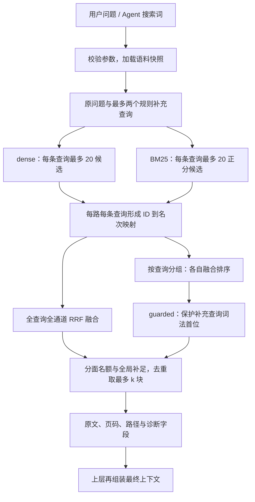

# 模块深度拆解 02：检索入口与证据选择

> 第二阶段，本次只讲 `ragcore/retriever.py`。分析日期：2026-10-07；源码快照：`9df8174`。
>
> `evidence.py` 是本模块调用的规则辅助文件，本文只解释理解检索入口所必需的辅助逻辑，不另展开第二个模块。学习目标是能解释候选召回、融合排序、证据选择的区别，并用实验支持设计取舍。

## 模块作用

### 为什么存在：把用户问题转成可核对的来源块

上一模块的 `search_handbook` 实际调用 `retrieve(query, k=8, strategy='guarded')`。模型决定“查什么”，这个模块决定“从本地知识库取回哪些条款、以什么顺序交给上层”。普通 RAG 也用相同入口，因此检索改动会影响两条问答链路。

它解决三个不同的问题：

1. **候选召回**：口语问题与制度词不完全相同，能否找回相关块？
2. **排序融合**：向量与词法的评分尺度不同，如何合并两路排序？
3. **证据选择**：Top-8 能否保留总则、具体规则与例外，避免同一主题占满位置？

需要记住：**相关度高不等于必要证据齐全。** 问“事假当天有餐补吗”，只找到事假规则仍可能缺少无薪假福利总则或餐补条款。本模块返回原文和来源，最终生成与引用检查由下游负责。

### 入口契约与两个实验维度

```python
def retrieve(
    query: str,
    k: int = FINAL_TOP_K,
    mode: str = "rrf",
    bm25_top_k: int | None = BM25_TOP_K,
    strategy: str = "baseline",
) -> list[dict]:
```

| 参数/返回值 | 意义 | 面试中别混淆 |
| --- | --- | --- |
| `query` | 一次工具搜索或普通用户检索的文本 | 不含题号、gold ID 或标准答案 |
| `k` | 最终最多返回多少块，默认 8 | 不控制 dense/BM25 每路候选数，也不是上下文 token 预算 |
| `mode` | 使用 dense、BM25 或两路 RRF | 决定召回通道 |
| `strategy` | baseline、expanded、coverage、guarded | 决定查询扩展与证据选择 |
| `bm25_top_k` | 每条查询词法候选上限，默认 20；None 不截断 | 和最终 k 独立；None 用于旧行为对照 |
| 结果列表 | ID、原文、页码/路径、融合分、原查询名次和诊断字段 | 不是答案，也不一定全都进入最终模型输入 |

mode 与 strategy 是两个维度。例如 `mode='bm25', strategy='guarded'` 是词法召回加规则补全；`mode='rrf', strategy='baseline'` 是原问题两路融合，没有补充查询。

### 实测：为什么不能简单说“融合更准”

历史原检索题库共 46 题，其中 35 道正样本、11 道负样本。下面的检索均值只计算正样本：

| mode | Recall@3 | Recall@8 | MRR |
| --- | ---: | ---: | ---: |
| dense | 77.14% | 94.29% | 0.7049 |
| RRF | 91.43% | 100% | 0.8131 |
| BM25 | 97.14% | 100% | 0.8762 |

出处：`data/eval/report_ir.json`，保存日期 2026-09-14。BM25 的 Recall@3 比 RRF 高 5.71 个百分点，比 dense 高 20 个百分点。此题库源自语料构造，词面重合偏高；结论是本次题库中 BM25 更强，不是所有真实问法都应只用 BM25。

另一次固定历史 125 块语料的证据优化，结果如下：

| strategy | 9 道开发正题：至少命中一块@8 | 同 9 题：完整参考覆盖@8 | 原 35 正题：至少命中一块@3 / @8 |
| --- | ---: | ---: | ---: |
| baseline | 8/9 | 7/9 | 32/35、35/35 |
| expanded | 8/9 | 8/9 | 30/35、33/35 |
| coverage | 8/9 | 8/9 | 32/35、34/35 |
| guarded | 9/9 | 9/9 | 32/35、35/35 |

出处：`evaluation/evidence_experiment_2026-09-26/retrieval_summary.json` 与 `evaluation/guarded_experiment_2026-09-26/retrieval_summary.json`。

guarded 相比 baseline 的完整参考覆盖增加 2 题，从 77.78% 到 100%，增加 22.22 个百分点，相对增加 28.57%。它说明这些开发题中的互补证据保留改善，同时原 35 题没有上述回归指标退步。9 题很小且参与过规则设计，不能说真实用户准确率达到 100%。

当前修复后的语料是 123 块；本文历史收益没有在当前语料重新测一遍。58.33%→83.33% 则是普通 RAG 检索、提示词和推理设置共同变化后的模型复核结果，不能全部归因于本模块。

## 核心代码流程

### 先建立三层思路



实际 L115–118 先执行原问题，再 L119–130 生成/执行补充查询；图按概念展示三层。mode 决定是否启用某条通道，不是每种模式都会同时调用两路。

### 1. L22–38：语料缓存，为什么必须和更新边界一起讲

关键源码：

```python
    if _corpus is None:
        col = get_collection()
        data = col.get(include=["documents", "metadatas"])
        _corpus = (data["ids"], data["documents"], data["metadatas"])
    return _corpus
```

| 行 | 逻辑与设计意义 |
| --- | --- |
| L22–25 | 参数、嵌入、存储和证据辅助函数分开导入；检索模块组合这些能力 |
| L27–28 | 进程内缓存全文/元数据以及 BM25，不在每题都做重复准备 |
| L34–35 | 只有首次 `_corpus is None` 才取集合；接口默认可创建集合，不是严格的“缺索引直接失败”入口 |
| L36 | 一次取全部原文与元数据供词法检索及结果还原，不需把每个候选重新读库 |
| L37 | 缓存 ID、正文、元数据三个对齐列表 |
| L38 | 后续复用相同对象；没有语料版本检测或自动刷新 |

当前只有 123 块，全量读入适合本地小语料。代码注释仍写 125，是历史描述，应以当前数据为准。缓存设计预期减少读取与分词准备，但没有单独的缓存开关对照，不能编造延迟提升百分比。

重要更新边界：服务中重建索引后 `_corpus` 仍可能是旧语料，而 dense 侧去查当前集合；新 ID 可能无法通过 L150 的旧 `pos` 找到。当前安全解释是“不支持无缝热更新，需要显式失效/版本化或重启”，不是“重建后自动刷新所有缓存”。

### 2. L41–55：BM25 索引构建只做一次，但 ID 检查不等于版本检查

关键源码：

```python
    if _bm25_cache is None or _bm25_cache[0] != tuple(ids):
        import jieba
        from rank_bm25 import BM25Okapi

        corpus = [list(jieba.cut(d)) for d in docs]
        _bm25_cache = (tuple(ids), BM25Okapi(corpus), jieba)
```

| 行 | 逻辑与设计意义 |
| --- | --- |
| L48 | 缓存为空或输入 ID 序列不同才重建；顺序变化也会触发，因为后续分数按文档位置对应 |
| L49–50 | 在需要构建时导入中文分词与 BM25 实现 |
| L52 | 对传入的文档文本逐个分词；当前 text 已由分块模块加了章节路径前缀，因此包含路径词，不是另读 metadata 做加权 |
| L53 | BM25 持有词频、文档长度、词的文档频率等统计；缓存它以避免逐题重建 |
| L54–55 | 返回索引及分词模块供查询使用 |

两层缓存要分别解释：即使 BM25 能检测输入 ID 的变化，`_load_corpus` 不刷新时根本不会传来新 IDs；而相同 ID 的正文变化也不会使此条件成立。代码注释“重建索引时自动失效”不代表当前完整链路已实现这种保证。

### 3. L58–67：dense 候选只保留排名，丢掉绝对距离

关键源码：

```python
    vec = embed_query(query)
    col = get_collection()
    res = col.query(
        query_embeddings=[vec],
        n_results=min(DENSE_TOP_K, n),
        include=["distances"],
    )
    return {iid: rank for rank, iid in enumerate(res["ids"][0], start=1)}
```

| 行 | 逻辑与设计意义 |
| --- | --- |
| L60 | 本地 BGE 将查询编码为向量；依赖接口会加查询前缀并归一化，模型在 CPU 缓存运行 |
| L61 | 从 Chroma 取集合；不是 Agent 去调外部检索模型 |
| L63 | 查询侧提供显式 embedding，不让数据库临时决定另一种嵌入方式 |
| L64 | 每条查询最多 20 候选；文档少时取更少，与最终 k 独立 |
| L65 | 请求距离用于返回数据，但当前后续没有保存或检查这些距离 |
| L67 | 转成从 1 开始的 ID→rank；RRF 只需要名次，不保留原距离 |

dense 的设计动机是语义表达可能跨词面匹配。例如“赔钱”和“经济赔偿”不完全同词。但近似同主题不等于资格与数值正确；具体收益以历史消融为准。

当前没有最低语义相似度阈值。对知识库外的问题，也可能拿到“相对最像”的 Top-20；不能把返回非空当成“手册确实规定了这件事”。512 是向量维度，与最终 k 或模型 token 窗口无关。

### 4. L70–81：BM25 候选是先排序截断，再过滤正分

关键源码：

```python
    bm25, _ = _bm25_index(ids, docs)
    scores = bm25.get_scores(list(jieba.cut(query)))
    order = sorted(range(len(ids)), key=lambda i: -scores[i])
    if top_k is not None:
        order = order[:top_k]
    return {ids[i]: rank for rank, i in enumerate(order, start=1) if scores[i] > 0}
```

| 行 | 逻辑与设计意义 |
| --- | --- |
| L76 | 复用已经分词构建的全文 BM25 统计 |
| L77 | 查询也用 jieba 分词，根据同词的词频、稀有度与文档长度得分 |
| L78 | 对所有语料文档分数降序排序；当前规模小，接受全排序成本 |
| L79–80 | 默认只保留前 20 个位置；None 保留全排序供旧行为对照 |
| L81 | 从这些位置输出正分块及名次；非正分被过滤，所以结果可能少于 20 |

BM25 的正分过滤只是实现层的词法筛选，不是政策相关性阈值。匹配“公司”或“员工”等词仍可能得到无用候选。没有自行实现停用词、词典训练或无 jieba 的 bigram 兜底；配置中的 `BM25_NGRAM` 当前未在此使用。

`mode='bm25'` 不执行 `embed_query`，所以不会为查询加载 BGE 权重做推理；但 L23 导入嵌入模块，仍有 sentence-transformers 等包依赖。注释称“最快”，本次没有模式耗时基准，讲法应是“减少向量计算，速度收益需测量”。

### 5. L101–111：参数校验与 k 的实际含义

| 行 | 逻辑与设计意义 |
| --- | --- |
| L101–104 | mode 和 strategy 不在允许集合中就报错，避免拼错参数静默采用别的行为 |
| L105–107 | 空/纯空白返回空列表；正常问题去除两侧空白 |
| L109–110 | 读取缓存语料，得到文档数 n |
| L111 | 最终 k 限定在 1 至 n 的思路，但实际表达式把 k=0/负数也改成 1，不是返回空 |

这里没有显式空集合检查：n=0 时表达式仍得到 1，dense/BM25 下游可能报错。类型提示也不等于运行时完整输入验证，直接函数调用和网页 Pydantic 校验是不同边界。

“请求 k=100”也不保证返回 100 块：每路候选只有 20，最终只能从候选并集中选择。增加最终 k 不会凭空加入未召回的来源。

### 6. L114–130：为什么同时维护全局通道和查询分组

关键源码：

```python
    queries = ([query] if strategy == "baseline" else
               scoped_queries(query) if strategy == "guarded" else expand_queries(query))
    query_groups = [rank_maps.copy()]
```

| 行 | 逻辑与设计意义 |
| --- | --- |
| L114–118 | 根据 mode 执行原查询通道，得到 `dense`、`bm25` 两张或一张名次表 |
| L119–120 | baseline 不扩展；guarded 使用范围保护；expanded/coverage 使用领域扩展 |
| L121 | 保存原查询这一组的通道结果，为后续按问题分面留位置 |
| L122–127 | 对每个补充查询按相同 mode 检索；当前是顺序调用，未并行或批量查询向量 |
| L128 | 将每个补充查询的两路结果加入自己的 group |
| L129–130 | 同时用 `dense:1`、`bm25:1` 等独立名字加入全局 rank_maps，不覆盖原查询名次 |

两种结构用途不同：`rank_maps` 用于所有查询/通道的总融合，`query_groups` 用于保留每个查询的代表证据。只留总融合会丢掉“这个候选来自哪个事项”的选择信息。

### 7. 查询扩展：原问题保留，领域桥接不是 LLM 改写

辅助定位：`evidence.py` L6–28、L39–44。

规则把“电脑弄坏/赔钱”桥接到“公司资产、故意或过失、毁损、追偿”；把事假与餐补桥接到“无薪假福利”及“实际出勤扣减”；也处理病假、迟到、调动、年假等词。

| 辅助行 | 逻辑与边界 |
| --- | --- |
| L11–27 | 根据出现的词触发手册词汇查询，没有调用生成 API，也没有存参考 ID 或标准答案 |
| L21 | 病假查询会把两个补充分面放在前面，改变有限扩展名额的优先顺序 |
| L28 | 保留原问题、按字符串去重、最终最多 3 条；不是所有触发事项都被保留 |
| L42–43 | 只有明确的“试用期 + 迟到/早退”组合改用试用期补查，避免泛化到正式员工纪律条款 |
| L44 | 其他问题继续使用普通扩展，未保证所有用户条件都被复制到补充查询 |

实际规则示例：

```text
原问题：请了一天事假，那天15块钱餐补还发吗？
查询1：请了一天事假，那天15块钱餐补还发吗？
查询2：事假 无薪假 薪酬 福利
查询3：餐费补贴 实际出勤 休假 扣减
```

另一个重要反例：“电脑弄坏了，离职工资什么时候到账？”最终保留原问题、资产损坏查询、经济赔偿查询，后加的发薪日查询因前三条限制被丢弃。这是当前规则实际输出，说明查询有界也会有分面遗漏。原问题仍包含发薪意图，但不能说扩展已覆盖全部事项。

语料专家规则可解释、零生成调用，代价是领域迁移和覆盖不足。虽然没有 gold ID 泄漏，但规则设计见过开发题，所以仍需独立问法验证泛化。

### 8. L133–134：RRF 汇总，不能把它当可信度

辅助函数的实际核心（`evidence.py` L31–36）：

```python
    scores = {}
    for ranks in rank_maps:
        for iid, rank in ranks.items():
            scores[iid] = scores.get(iid, 0.0) + 1.0 / (constant + rank)
    return scores
```

RRF 计算：

```text
score(d) = Σ 1 / (60 + rank_channel_query(d))
```

| 主模块行 | 逻辑与设计意义 |
| --- | --- |
| L133 | 将所有启用的查询/通道名次表传入 RRF；每张表贡献等权的一票 |
| L134 | 按总分降序取得全局 fused_ids，形成候选并集中的总体排序 |

为什么按名次？cosine 距离与 BM25 原分数不是同一个量纲，直接相加需要校准与权重。RRF 避免原分数尺度问题，但也丢掉了“第1名比第2名高多少”的差距。

单查询、单通道、按融合分选择时，`1/(60+rank)` 对 rank 单调，所以排序不变。**单通道多查询**仍会汇总多张表，不能说任何 BM25 模式都必然等于原问题的一次 BM25 排序。

默认 baseline 的并集最多 40 块；三查询两通道默认最多 120 个不同块，也受实际语料大小和重复命中限制。`candidate_count=len(rrf)` 是这个不同 ID 数，不是各路名次条目之和，也不是超过某个可信度阈值的文档数。

RRF 分值不是概率；多查询同义且高度相关时会重复给相似主题投票。增加查询还改变分值总量，不能用一个跨所有策略相同的 RRF 数字阈值声称“相关概率足够”。

### 9. L135–141：总融合与分面融合分开，保护词法独有证据

关键源码：

```python
    for group in query_groups:
        group_scores = fuse_ranks(list(group.values()), RRF_K)
        order = sorted(group_scores, key=lambda iid: -group_scores[iid])
        if strategy == 'guarded' and len(facet_orders) > 0:
            order = lexical_anchor_order(order, group.get('bm25', {}))
        facet_orders.append(order)
```

| 行 | 逻辑与设计意义 |
| --- | --- |
| L136–138 | 每条查询自己的 dense/BM25 先融合，取得分面内顺序 |
| L139 | 只对 guarded 的补充查询做词法首位保护；原查询不改，也不把它应用于所有 strategy |
| L140 | 如果补充查询有 BM25 结果，就把该路首位移到分面前面；dense-only 没有该词法保护 |
| L141 | 保存调整后的分面顺序，交给名额选择 |

辅助 `lexical_anchor_order` 从词法名次表找最小 rank 对应的 ID，将它前置并去掉原位置。这并不修改 RRF 数值，也不把所有 BM25 来源强制排在 dense 前面。

为什么需要这项保护？单路第 1 名得分 `1/61≈0.0164`，两路第 20 名得分 `2/80=0.025`。只被 BM25 发现的直接条款，可能被两个通道都认为“同主题”的普通段落压过。

这个手算已用当前 `fuse_ranks` 核对，说明融合有偏好；不是实测检索质量。词法首位也可能误匹配，所以保护是需要评测的领域启发式，非必要证据判定器。

### 10. L142：coverage/guarded 返回的是证据选择顺序

关键源码：

```python
    top_ids = select_evidence(fused_ids, facet_orders, k) if strategy in ('coverage', 'guarded') else fused_ids[:k]
```

baseline/expanded 直接取全局前 k；coverage/guarded 先给分面留名额，再全局补足。辅助 `select_evidence` 位于 `evidence.py` L55–77：

| 辅助行 | 逻辑与设计意义 |
| --- | --- |
| L57–60 | k 不正时空；只有一条查询时维持全局顺序，避免无必要改动 |
| L61–62 | 保存选择列表与候选 ID 集合，不能添加不在候选中的条款 |
| L64–71 | 从给定顺序添加有限个尚未选择的来源；重复 ID 不消耗本分面的新增名额 |
| L73 | 原问题分面先拿最多 3 个；不是“任何情况下都必须有3个” |
| L74–75 | 每个补充分面最多加入 2 个尚未选中的候选 |
| L76 | 最后按全局融合顺序补足到最多 k，可能再加入原查询更多来源 |

手算例子：全局顺序是 `a,b,c,d,e,f,g,h,salary`，原问题分面有 `a,b,c,d`，补充分面有 `salary,a`。k=8 时输出 `a,b,c,salary,d,e,f,g`。salary 从全局第 9 位进入最终证据，h 被挤出；这解释互补规则为何能保留。

“分面”在当前代码中等于一条查询的候选组，没有模型给每个块自动标注“定义/例外/资格”。quota 也不证明它们各承担了不同必要事实。最终列表可能不按 RRF 分数递减；上层应保持这份证据顺序，不能又按分数重排而不评价影响。

### 11. L144–170：来源字段有诊断价值，也有信息缺口

| 行 | 逻辑与设计意义 |
| --- | --- |
| L144–145 | 取的仅是原问题 `dense` 和 `bm25` 名次表，不包含补充查询的名次 |
| L146 | 建立 ID→缓存文档位置映射，取原文与 metadata |
| L149–155 | 按最终选择顺序输出 ID 与正文，不输出模型编造的来源 |
| L157 | 保存融合分，保留 6 位小数；选择排序在此前用未四舍五入分数完成 |
| L158–159 | 名次字段可能为 None：候选可能只来自另一条通道或补充查询，不等于没检索到 |
| L160–164 | 从扁平 metadata 还原页码、路径、条款与正文长度；数据不符合格式时可能报错 |
| L165–167 | 每块附本次查询列表、策略、候选不同 ID 总数，方便解释补查和选择 |
| L170 | 返回来源列表，由普通 RAG/Agent 决定下一步 |

当前接口没有保存各补充查询的名次、原始 BM25 得分、dense 距离、分面选择理由和阶段耗时。只看 `dense_rank=None, bm25_rank=None` 无法解释它到底从哪条补查进入；本次只读追踪临时观察了这些内部名次，未修改在线接口。

### 12. 用实际原文定位错误发生在哪一层

历史诊断的 9 道正样本：候选层完整参考覆盖 8/9，Top-8 与重建输入层完整覆盖都是 7/9；当次未发现上下文预算移除块。出处是 `evaluation/evidence_diagnosis_2026-09-26/summary.json`。

两个典型问题：

- **电脑损坏赔偿**：第 11 页直接追偿依据未进原查询两路候选；当前候选内再精细重排，也不能找回这块。第 46 页另有赔偿补充依据进入候选，不能说候选完全没有赔偿信息。
- **事假餐补**：无薪假福利总则在 RRF 第 15，餐补在第 9；原 Top-8 没选进去，这是选择/排序问题，不能笼统说“向量模型没召回”。

固定这份候选集合时，完整参考覆盖的理论上限为 8/9，不是已经实现的重排收益，也不等于答案质量上限。若原始解析已丢失 URL，任何检索策略都不能从没有这段文字的索引中恢复它。

诊断是同代码/文本的重放与上下文重建，不是找回当时完整请求日志。本文不将历史重放指标和下面的当前索引追踪混成优化实验。

### 13. 本次当前索引的只读追踪

当前示例问题为“请了一天事假，那天15块钱餐补还发吗？”。本次只运行本地检索，分别观察 baseline 与 guarded 的内部名次、分面和最终来源，不生成答案，也不计算新的回答正确率。

核对集合有 123 块；当前分块正文快照 SHA-256 为 `6689f74c6d50718e48a76d1857128247f336bca005f8c8b655b06b11d74e9301`。检索 mode 都是 rrf、每路候选 20、最终 k=8。本次生成调用为 0。

| 观察项 | baseline | guarded |
| --- | --- | --- |
| 查询数 | 1，只有原问题 | 3，原问题 + 事假/无薪假福利 + 餐费补贴/实际出勤 |
| 候选不同 ID 数 | 30 | 44 |
| 无薪假福利总则 `p21-88de6db287` | 原查询 dense 第5，BM25未入选；最终Top8没有 | 最终第4位 |
| 餐补条款 `p30-526ea28baa` | 原查询 dense 第15、BM25第12；最终Top8没有 | 最终第6位 |

按控制流拆开看：

1. 原问题的两路融合前三块先保留，和 baseline 的前三块一致。
2. “事假 无薪假 薪酬 福利”的分面原融合第一是年假块 `p23-77b2224c12`，而词法首位是无薪假总则 `p21-88de6db287`；guarded 将总则前置。该分面新增两块，进入最终第4、第5位。
3. “餐费补贴 实际出勤 休假 扣减”的分面原融合第一是已经选中的总则，词法首位是餐补块 `p30-526ea28baa`。它被前置进入最终第6位；总则去重不占新增名额，该分面再加入一个考勤块。
4. 最后全局补足到8块。返回第一块的RRF分为0.076043，第二块为0.090695，再次证明结果顺序不是全局分数递减。

原文核对到两条直接依据：总则中的“无薪假：不支付请假期间的薪酬、福利”，以及第30页餐补按实际出勤日核算、休假/缺勤按规定扣减的条款。这里演示的是这些文本如何进入来源列表，没有运行最终回答或引用审评。

也要看到限制：补充分面仍带入年假、考勤等来源，名额留位不保证每块都必要。这个例子中的两块关键来源本来就在原问题候选中，变化同时包含扩展和选择，不能把它们进Top8全部归因为“新召回”；也不能用一个例子测出两项机制的独立贡献。

本次 baseline 首次运行约5.223秒，guarded 随后约0.209秒。前者包括模型/分词冷加载，后者复用缓存；**这不是guarded提速的证据**。需要相同冷热状态、重复运行与分阶段计时才能比较延迟。上述单题追踪也不作为新的质量基准。

## 设计思想

### 1. 语义召回和词法召回互补，但是否融合要由数据决定

dense 的动机是跨词面语义匹配；BM25 的动机是制度名称、术语、金额和条款词的精确匹配。两路错法不同，所以值得保留消融，而不是把“向量更先进”或“融合一般更好”当结论。

当前历史题库 BM25 更强，一个可能解释是反向出题的问法与原文词面接近；这是基于题库构造的解释，不能证明全部差异都来自这一因素。应补充真实改写、错别字、领域外问题和多条件题，保持同语料/同 k/同上下文预算对照。

### 2. RRF 用排序关系降低分数校准负担

词法分数和向量距离不能天然加在一起。RRF 按名次投票，参数少且容易解释；60 是融合平滑常数，不是检索 60 块，也不是经过本项目优化验证的最优参数。

替代方案包括归一化后加权、带标签训练融合或候选交叉编码器重排。它们可以利用原分数差距或 query-document 交互，但增加数据需求、调参或运行成本。没有对照测量前，不能宣称它们必然优于现有 RRF。

RRF 同分时，当前 Python 稳定排序保留分数字典插入顺序；该顺序受通道、查询和原候选顺序影响。源码没有定义独立的稳定 ID tie-break。既想复现旧行为又想改 tie-break 时，应单独评价。

### 3. 从“主题相似”转向“互补证据有位置”

Top-k 高相似度可能重复来自同类主题，而工资、福利、资格分别需要不同来源。分面 quota 是一个简单、可审计的保留策略：先保证原问题，再给补充查询留位，最后补足。

替代方案 MMR 可以减少相似块重复，但相似度多样性不等于必要政策条件齐全；更细的必要事实槽位或 learned reranker 也需要新的标签与验证。当前选择不是数学最优覆盖，也没有求解完整的语义覆盖目标。

**已测收益**是历史 9 题完整参考覆盖 7/9→9/9；**未测收益**包括真实问法泛化、引用语义支持和独立业务收益。

### 4. 保留原问题，控制扩展范围与代价

补充查询可能找回用户没说出的制度词，也可能丢掉“试用期”等重要条件或把无关分面加入。原问题保留可以减少偏移，但不会自动抵消扩展名额中的遗漏与范围漂移。

当前最多三查询，RRF mode 最多三次 dense 与三次 BM25 执行，顺序运行；没有生成 API 用量，但仍有本地 CPU/延迟成本。若 Agent 最多调用搜索工具三次，底层最多九条查询、九次 dense 与九次 BM25，而不是只有三次数据库查询。

使用 LLM 改写/Hypothetical Document 等替代方案可能增加词汇覆盖，但新增模型延迟、token 与条件改变风险。只有独立保留题集有收益时才值得引入，本项目当前没有这些在线能力。

### 5. 把检索诊断和回答质量分开

Hit@k 看是否命中任一参考块；Recall@k 是参考块命中比例；完整参考覆盖看是否全部命中；MRR 看首个命中的位置。它们都不验证模型最后是否保留资格或正确引用。

例如 gold 为 `{a,b}`、Top-8 只有 a：Hit=1，Recall=0.5，完整覆盖=0。历史 35 正题当前每题一个 gold，因此 Hit 与 Recall 可以数值相同；9 道组合题不应延续这个简化。无 gold 的负样本也不能作为“自动完美覆盖”计入。

最终还要检查被选原文是否进入生成预算。如果 Top-8 有必要来源，但装入时遗漏，那么优化不能停留在本模块的 Top-8 覆盖。反过来，gold 可能含冗余块，另一个条款也可能充分回答，参考覆盖不是完整的回答充分性标准。

### 6. 全量内存 BM25 是小语料选择，不是规模化架构承诺

当前全文 123 块，本地 CPU 和内存缓存很容易部署、复核，避免初版增加独立搜索服务。代价是全量分词统计、全排序与单进程缓存一致性；没有百万文档吞吐、内存和并发数据。

如果扩大规模，再考虑成熟词法索引、分片、权限前置过滤和一致的语料版本。这些是未来系统设计，不是现有源码隐藏实现的功能。

## 如果重构

以下是方案，不实施、不承诺收益。保留原检索作为对照，不把题号/gold IDs/标准答案编码到生产逻辑。

### P0：先建立同一语料版本的缓存契约

现状是 `_corpus` 常驻，BM25 按 ID 序列缓存，而 dense 读取当前集合，更新时可能不一致。

方案是请求绑定一个包含正文、metadata、BM25、向量集合和版本号的只读快照。新索引先完整构建，验证一致性后切换；小项目先支持显式缓存清空并重启也比假装自动热更新可靠。不能仅给 BM25 加一个哈希就宣布两路一致。

测量更新前后来源一致性、更新期间异常率、切换/恢复耗时与内存峰值；当前没有这些指标，也没有历史缓存开关延迟对照。

### P0：补足诊断字段，但不要把日志等同质量

现状只返回原查询的名次和总融合分，补充查询贡献难以解释，绝对得分也丢失。

方案是让内部诊断记录每条查询的各路原分/名次、RRF 贡献、分面选择原因、去重情况和阶段耗时；网页只展示帮助用户核对的内容。不要把内部模型/检索实现细节都塞入用户问答界面。

测量诊断能否复现同一候选去向与选择结果；另测记录开销。该改动预计改善排错，不应宣称直接提高 Recall 或答案正确率。

### P1：补充独立题集再调整规则名额与资格保护

现有三查询上限可能丢掉后出现的分面，特定试用期规则也不是通用资格保留。

方案是在保留原问题的前提下显式记录用户适用条件与问题事项，按当前问题所需分面选择查询。先做轻量规则配置和独立条件错配测试，再决定是否值得引入模型拆解；不要在 retriever 中复制一套已有 Agent 决策循环。

测量分面遗漏率、资格漂移率、必要证据覆盖、无关来源比例、检索 P50/P95和最终模型输入量。对照当前规则保持候选深度、嵌入与生成条件一致。

### P1：在候选可用前提下比较语义重排与分面规则

候选缺关键来源时，先调整查询/候选深度；候选有但 Top-k 丢掉时，才评价重排或分面选择。一个重排器不能找回它从未收到的块。

方案是在相同候选并集上比较当前 RRF、guarded、MMR 或 Cross-Encoder，固定最终字符/Token 预算，保留原策略以支持消融。引入 Cross-Encoder 会增加 query-document 计算，不假定一定划算。

测量候选必要事实可用率、预算内完整覆盖、答案质量和新增延迟；不仅测 MRR。历史固定候选的 8/9 是诊断上限，不是新算法承诺。

### P1：明确空索引、非法 k 与无证据的契约

当前 k=0 会变成 1，空集合可能在下游失败，dense 总能取“最像”来源却无相关性阈值。

方案是定义并验证输入契约、缺索引明确失败、空集合明确返回状态；若考虑拒答阈值，需要保留原距离/词法分和独立负样本验证。不能给 RRF 随意设 0.02 就说是置信度门槛。

测量领域外误召回、错误拒答、真正可答问题的召回以及后续模型拒答行为；阈值存在质量取舍，没有对照前不做收益声明。

### P2：实际测量后再优化批量查询与排序成本

多查询 dense 当前逐条编码。可以测一次批量 encode 查询或分组查询，BM25 可在大语料时用 Top-k 选择替代全文排序，但必须保持候选、同分与最终来源语义一致。并行也可能让 CPU 竞争或增加模型内存，不能只凭“并行”推断更快。

先固定硬件与冷热状态重复测每阶段耗时、P50/P95、内存和并发。现有数据小，优先级低于来源一致性与独立质量评测；无必要先迁移分布式系统。

## 面试考点

| 考点 | 面试官想确认什么 | 回答落点 |
| --- | --- | --- |
| 召回/排序/选择 | 是否能定位缺证据发生在哪层 | 候选缺条款、候选有但 Top-8 丢、Top-8 有但最终输入丢，分别诊断 |
| dense 与 BM25 | 是否理解两类匹配及实验偏差 | 语义/词法互补是动机；历史 BM25 更强，真实问法需另测 |
| RRF | 是否理解公式和局限 | `Σ1/(60+rank)`、尺度问题、丢失分数差距、共识偏好 |
| guarded | 是否把启发式说成语义智能 | 原问题3、补充各2、词法首位保护、全局补足；不理解必要性 |
| 多查询 | 是否知道收益与风险 | 最多三条、资格漂移、名额遗漏、本地计算增加，非 LLM 改写 |
| 参数层次 | 是否混淆各种 k | 候选20/20、最终8、RRF常数60、下游6000字符分别解释 |
| 结果可观测性 | 是否能解释补查来源的空名次 | 返回 ranks 只属于原问题，补充查询来源名次可能为空 |
| 评测 | 是否给准确指标/基线/题库 | 9题完整覆盖7/9→9/9；35题命中回归保持；开发集非真实保留集 |
| 缓存与一致性 | 是否只考虑一次演示 | `_corpus` 不自动刷新，BM25 ID cache 不等于整体语料版本 |
| 重构 | 是否优先解决现有问题 | 更新契约、诊断、独立题集和候选内重排，收益需成对测 |

### 本次现有测试验证什么

| 测试文件 | 数量 | 控制逻辑证据 |
| --- | ---: | --- |
| `tests/test_evidence_queries.py` | 5 | 原问题保留、查询去重/最多3条、损坏/发薪词汇桥接、未知问法不乱扩展、试用期迟到保护 |
| `tests/test_evidence_selection.py` | 4 | 补充分面存活、去重与数量限制、无补查维持顺序、词法独有首位前置 |

这些测试直接检查辅助规则，不是完整检索质量、真实模型语义能力或全链路检索入口边界测试。当前没有单独的 `test_retriever.py` 覆盖完整入口各路缓存/空索引/更新一致性，不能用九项通过声称整个检索系统所有边界都已验证。

## 高频追问

以下是基于代码的预测题，按连续深挖组织。

### 追问链 1：你为什么做混合检索？

**第一问：** “向量和 BM25 谁更好？”

答题方向：说明语义与词法的动机；历史35正题 BM25 Recall@3=97.14%，RRF=91.43%，dense=77.14%，不能只讲一般经验。

**第二问：** “BM25 既然更强，RRF 是不是多余？”

答题方向：原题库有词面偏向，真实改写可能不同，保留单路消融；现有数据不支持融合普遍优越，也不支持直接宣布所有线上问题只用 BM25。

**第三问：** “你怎么证明语义互补？”

答题方向：独立真实改写/关键词缺席题，分层报告两路独有有效命中与最终答案；当前只是动机，不能把设计直觉当已测结论。

### 追问链 2：RRF 的分数为什么不能当置信度？

**第一问：** “为什么不用原分数相加？”

答题方向：量纲与分布不同，需要校准；RRF 用名次消除这项工程负担。

**第二问：** “第1名会不会被20名压过？”

答题方向：单路1/61，小于双路2/80；共识偏好可能压过单路独有直接证据。

**第三问：** “高于0.02就足够相关吗？”

答题方向：分值受通道/查询数量影响，缺少概率校准；不能直接当政策相关度或可答置信度。

### 追问链 3：guarded 是 reranker 吗？

**第一问：** “你是否训练了重排模型？”

答题方向：没有。当前是规则扩展与候选名额保留，RRF 融合后也没有 Cross-Encoder。

**第二问：** “它如何知道哪个条款是例外？”

答题方向：不知道。分面来自查询组，quota 给互补查询留位，词法首位被保护，不是块级语义分类。

**第三问：** “那为什么有效？如何证明不是记题？”

答题方向：开发题观察到7/9→9/9、没有gold ID进入生产；但是规则见过题，仍可能过拟合，需要独立题集验证。

### 追问链 4：缺证据为什么不直接增大 k？

**第一问：** “Top8不够，Top20不就好了？”

答题方向：可能补回候选内被排除条款，但增加原文与干扰，还受最终输入预算限制。

**第二问：** “关键条款没有在候选呢？”

答题方向：最终 k 变大和候选内 rerank 都找不回，需要修解析、补查或调整候选召回。

**第三问：** “你怎么确认是哪层？”

答题方向：原文/解析、两路候选、融合/选中、最终 context 逐层追踪；历史诊断8/9候选→7/9 Top8属于不同阶段，不是一次优化前后。

### 追问链 5：缓存真的会自动失效吗？

**第一问：** “ID序列变化就重建BM25，足够吗？”

答题方向：还要看上游 `_corpus` 是否刷新；同ID正文变化也未检测，不能只看局部注释。

**第二问：** “服务在线重建会怎样？”

答题方向：词法/原文可能旧，dense可能新，返回来源存在不一致风险；这是代码边界，不是宣称已发生事故。

**第三问：** “你会怎么处理？”

答题方向：请求固定版本快照、离线构建后切换并验证；小规模先显式失效/重启，测一致性和恢复时间。

### 追问链 6：你说覆盖100%，究竟是什么100%？

**第一问：** “至少命中一个块和找齐有什么区别？”

答题方向：gold={a,b}而只返回a时Hit=1、Recall=0.5、完整覆盖=0。

**第二问：** “9/9能证明答案都正确吗？”

答题方向：不能，开发参考集合覆盖是检索层指标；模型仍可遗漏条件或引用错事实。

**第三问：** “参考块有冗余或等价条款怎么办？”

答题方向：补必要事实级审评和替代证据标注；来源块覆盖是可复核代理指标，不是完整语义充分性判定。

## 标准回答

以下示例用于练习设计论证，不建议机械背诵。个人独立完成和 AI 辅助部分按真实参与说明。

### 1. 用 60–90 秒介绍这个模块

“这个模块把用户问题或 Agent 的搜索词转成带页码和章节的手册来源。它分三步：先用 BGE 向量和 jieba/BM25 产生候选，再用 RRF 合并名次，最后按策略选择最多八个原文块。

我发现高相关度不等于证据充分。例如事假餐补需要假别性质、福利总则和餐补规则共同支持，普通融合可能只保留一个主题。因此项目保留 baseline，并增加最多两个领域补查、原问题名额、补充分面名额，以及补查 BM25 首位保护。

在历史九道开发正题中，完整参考覆盖从7/9到9/9，增加22.22个百分点；原35正题的Top8命中保持35/35。这个结果来自小型模拟开发集，不是回答准确率。历史单路消融中BM25也比RRF更强，所以我不会宣称融合天然更准。下一步需要独立问法与预算内证据、答案质量一起评测。”

### 2. “dense 与 BM25 各自负责什么？”

“dense 将问题与条款编码为向量，主要动机是跨词面的语义匹配；BM25 使用分词后的词频、词稀有度和长度归一化，更容易解释制度术语等词面匹配。它们的分数不能直接当同一尺度。

本项目保存的35道正题里，BM25 Recall@3=97.14%，RRF=91.43%，dense=77.14%。这可能受语料反向出题和词面重合影响，应该在真实改写上验证两路互补，不能只按模型先进程度选择。”

### 3. “RRF 怎么工作，有什么缺陷？”

“RRF 对每条查询的每个检索通道，给来源加上1/(60+名次)，然后把同一ID的贡献累加。它避免了cosine距离和BM25原分数的校准问题，单查询单通道时排序不变。

但它更重视多路共识，丢掉原分数差距。单路第1名只有1/61，双路第20名是2/80，后者可能更高；所以单路独有的必要条款会被挤掉。当前guarded通过分面名额与补查词法首位保护应对这个观察，并不是RRF自己理解必要条件。”

### 4. “guarded 为什么这样设计？”

“原问题先保留最多三块，每个补充查询再加入最多两块未选来源，最后全局补足到k。补充查询的BM25第一名会前置，减少两路一致主题挤掉词法独有直接依据的问题。

这个规则在历史九题完整覆盖从7/9提高到9/9，原35题Top8命中不退步。但它没有判断每块是否真正必要，词法首位也可能是噪声；返回顺序是证据选择顺序，不一定按RRF分值递减。它是可解释领域启发式，不是训练reranker。”

### 5. “你怎么排查一个没答对的问题？”

“先核对原页是否有依据以及解析是否保留，再看两路候选有没有关键条款。如果候选缺，就调整解析或召回；候选有而Top8没有，就检查融合与分面选择；Top8有而最终context没有，就检查预算装入；原文都进入模型后仍漏条件，才进入生成侧分析。

历史事假餐补的总则和餐补规则在融合第15和第9，属于选择问题；电脑损坏直接追偿依据没进原候选，候选内重排无法补回。这样能避免把所有失败都归到向量模型或提示词。”

### 6. “多查询扩展有什么风险，和 Agent 有何不同？”

“这里的扩展是规则决定的手册词汇桥接，没有生成API调用。它保留原问题、最多三查询，guarded只针对部分资格组合做保护；查询名额不足和适用条件丢失仍可能发生。

Agent是在看到上次工具原文后，由模型决定下一次搜索参数。两者分层复用：一次Agent搜索内部仍可有三条规则查询，因此三次工具搜索不等于三次底层查库。新增补查要同时测必要证据、资格漂移和本地耗时。”

### 7. “你会如何优化延迟并保持正确性？”

“当前已经缓存全文和BM25，避免逐题分词构建，但没有单独的缓存开关收益数据。多查询向量编码是串行的，可以测批量编码；规模大时也可以测Top-k选择或成熟词法索引，但要保持候选和同分处理语义一致。

我会先固定语料、硬件与冷热状态重复测各阶段P50/P95，再看质量是否退步。更先要解决的是语料更新时两路版本不一致，不能为了速度只缓存却不定义失效契约。”

### 8. “你的指标为什么可信，哪些结论还不能说？”

“检索评分使用参考ID集合，标签在检索返回后才计算，运行逻辑不接收gold IDs。九题完整参考覆盖7/9到9/9有逐题记录，同时原35正题做回归；两类数据分别报告，负样本不记成自动完美覆盖。

不过这些模拟题用于过规则设计，不是独立真实用户保留集，参考块也可能冗余。九项辅助测试证明规则控制，不证明语义质量；检索覆盖更不能代替模型答案正确率和引用支持率。后续要补独立问法、必要事实审评与预算内输入覆盖。”

### BM25 的公式追问：理解三个因素就够了

本次查看了项目环境所安装 `rank_bm25.BM25Okapi` 的源码。当前未传自定义参数，默认 `k1=1.5`、`b=0.75`、`epsilon=0.25`；没有调参最优性实验。

```text
score(d,q) = Σ IDF(t) × f(t,d)(k1+1)
                       / [f(t,d) + k1(1-b+b×len(d)/avglen)]
```

- `IDF(t)`：少数文档才出现的词通常更有区分度。
- `f(t,d)`：词在文档中出现越多，贡献会趋于饱和，不是重复十遍就无限线性增加。
- `len(d)/avglen`：调节文档长短，避免长文只是有更多词就占优势。

当前包对负 IDF 做 epsilon×平均 IDF 的替换，查询词重复也会重复累加贡献；所以这是具体实现，不应把所有BM25变体完全等同。原分数不作为概率，词面匹配也不证明制度适用。

面试简洁回答：“BM25综合词的稀有度、词频饱和与文档长度，适合解释词法匹配；中文分词和题库词面会影响结果。我使用库默认参数，没有证明参数最优，也不把正分当作真实可答。”

### 掌握标准与下一步

你应能解释：一次Agent搜索内部为何可以有三条查询；20/20、8、60各代表什么；两种rank_maps结构为何共存；guarded如何改变顺序；命中、完整覆盖与最终可答为什么不同；以及代码缓存注释为何不等于热更新保证。

**推荐下一模块：`ragcore/llm.py`**，接着讲选中的原文如何进入预算、来源编号如何生成、推理预算为什么会导致空正文/截断。替代路线是分块模块，或独立走读检索评测指标。本次不展开下一个模块。

### 本次验证范围

只新增 `notes/module_retriever.md`，不修改业务逻辑、生产语料、索引或题库，不调用真实生成API。9项现有查询/证据选择离线测试全部通过，测试报告耗时0.003秒。额外使用现有集合做单题只读追踪，帮助解释候选与选择，不当作新的质量/延迟基准。源码摘录、行号、指标和来源在交付前核对。
