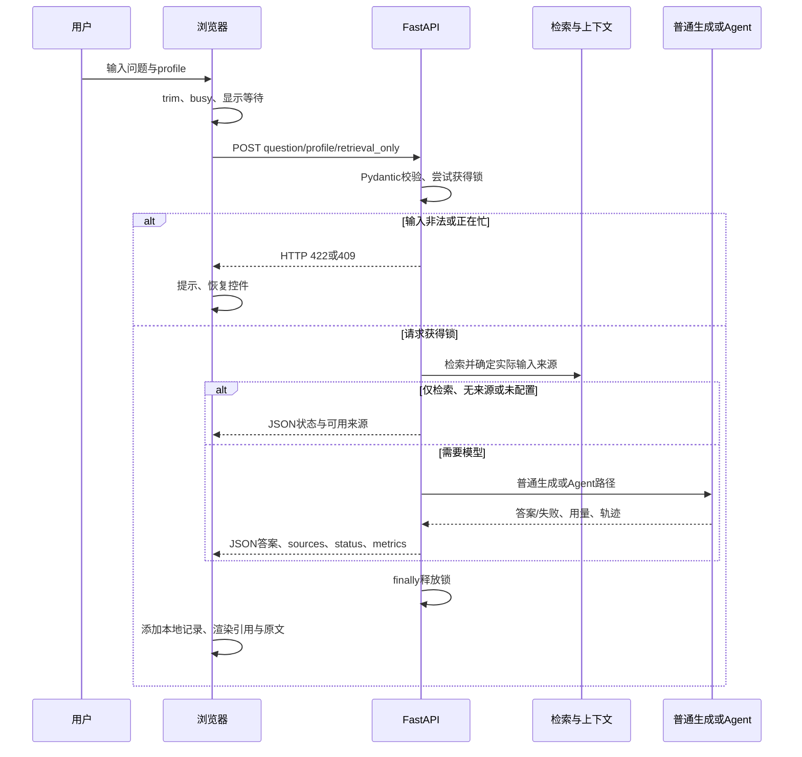

# 模块深度拆解 04：服务请求、状态契约与前端证据展示

> 分析日期：2026-10-09；源码快照：`25bc121`。主入口 `webapp.py`，前端职责由 `web/app.js` 与 `web/index.html` 共同完成。本篇将它们视为一个服务交付模块，按后端和前端阶段分别解释。
>
> 本次只讲解并生成笔记，不修改业务代码，不调用真实模型。离线知识构建仍未单独生成深拆笔记；本篇不冒称整个项目的所有模块均已讲完。

## 模块作用

### 为什么存在：让用户知道发生了什么、根据什么回答

前面的检索、生成和 Agent 模块是能力层。用户需要一个稳定入口提交问题、选择配置、查看状态、点击引用并核对原文。本模块把这些能力组合成可使用的本地演示。

它解决四个问题：输入是否合法；当前是否能够接收新请求；不同失败如何表现；用户如何看到真正提供给模型的来源与每次用量。

不是“套一个网页”就完成服务化。模型可能无配置、余额不足、截断或超时；来源可能检索到但没进入上下文；业务失败也可能通过HTTP 200返回。正确服务设计要把这些区别表达清楚。

### 三种成功必须分开

| 层次 | 当前判断 | 不能推出什么 |
| --- | --- | --- |
| HTTP成功 | 浏览器 `response.ok` | 流程完成、模型生成成功或政策正确 |
| 业务状态 | JSON `status`，如complete、generation_failed | complete不等于答案经过事实审评 |
| 语义正确 | 原文与答案逐事实核对 | 当前网页没有自动完成这层审评 |

普通RAG没有引用合法性检查；前端匹配引用只是让用户跳转到来源。Agent有不同的标记检查，但也不等于语义支持。前端不能替后端补上完整回答校验。

### 文件职责与接口

| 文件/入口 | 职责 |
| --- | --- |
| `webapp.py::AskRequest / ask` | 请求输入契约、单进程入口互斥 |
| `webapp.py::run_question` | profile分发、来源准备、失败状态、指标聚合 |
| `web/app.js::ask / show / inline / evidence` | 请求等待、记录显示、引用点击、原文卡片 |
| `web/index.html` | 三栏页面、输入控件、模式选项、版本与冷启动提示 |
| `/api/health` | 本地进程响应、配置是否存在、锁是否占用 |

`/api/ask`的请求只有question、profile、retrieval_only。没有会话ID、上一轮messages或用户身份；浏览器历史不参与下一题推理。

## 核心代码流程

### 完整请求生命周期



实际Agent成功分支直接返回Agent结果，普通分支自行准备来源；图只展示共同生命周期，不表示Agent也先执行普通检索再启动。

### 1. webapp L12–29：配置路由与延迟导入

```python
PROFILES = {
    'baseline': ('baseline', 'baseline', 'default'),
    'quality': ('guarded', 'evidence', 'low'),
    'fast': ('guarded', 'evidence', 'disabled'),
    'agent': ('guarded', 'evidence', 'low'),
}
```

| 行 | 逻辑与设计意义 |
| --- | --- |
| L12–14 | 根目录、FastAPI实例、一个进程内Lock；禁用自动API文档界面不是认证机制 |
| L15–20 | profile映射三项配置：检索strategy、prompt版本、思考方式 |
| L22–24 | Agent在需要时导入，普通模式不必先运行代理依赖 |
| L26–29 | 检索也延迟导入，启动页面/health不等于已经加载本地嵌入权重 |

代价是首次问题可能更慢。界面提示冷启动，但本次没有启动前后P50/P95对照，不能宣称延迟导入让问答本身快了多少。

profile是受控配置组合，用户不能从网页任意传模型地址、提示词或内部工具参数。agent表项并不意味着配置已经由普通generate执行；真正Agent入口在L59先分流。

### 2. webapp L31–46：服务端输入校验与有限健康检查

```python
class AskRequest(BaseModel):
    question: str = Field(min_length=1, max_length=500)
    profile: Literal['baseline', 'quality', 'fast', 'agent'] = 'quality'
    retrieval_only: bool = False
```

| 行 | 逻辑与设计意义 |
| --- | --- |
| L32–34 | 问题长度限制、profile允许集合、是否仅检索；默认quality |
| L36–42 | 服务端strip并拒绝全空白；不能仅依赖浏览器校验 |
| L44–46 | health返回ready、配置存在、锁状态，不返回密钥/地址 |

本次11项服务测试中，空白、501字符及非法profile均得到422。health仅证明进程能响应且配置字符串是否存在，没有验证Chroma可读、模型认证、余额或供应商网络。

前端每15秒轮询health，能更新显示；页面显示“服务已连接”不代表模型已经就绪，更不能当端到端可用率探针。

### 3. webapp L48–55：非阻塞锁是拒绝并发，不是排队

```python
    if not pipeline_lock.acquire(blocking=False):
        raise HTTPException(409, '正在处理另一个问题，请稍后再试。')
    try:
        return run_question(request)
    finally:
        pipeline_lock.release()
```

| 行 | 逻辑与设计意义 |
| --- | --- |
| L50–51 | 已有请求占锁就立即409，不在此建立等待队列 |
| L52–53 | 获锁后才执行整个普通/Agent链路 |
| L54–55 | 不论返回还是抛异常，释放入口锁 |

锁覆盖检索、资料装入和生成，甚至retrieval-only也互斥。它减少本地演示同时操作带来的资源/全局状态冲突，代价是长生成期间其他用户无法查看证据。

`threading.Lock`只管一个进程。若改为多个worker，各自有锁，不能继续说全局只处理一题。也没有账户级限流、队列公平性或吞吐实验。

这里路由是同步`def`；函数体直接执行同步业务，没有自己创建async并发调度。不要为了“看起来异步”把阻塞调用搬进async函数而不处理阻塞。

Agent超时后后台工具线程可能仍运行；入口锁释放不证明所有后台工作都停止，见Agent笔记的停止等待边界。

### 4. webapp L57–73：Agent分流与公开结果裁剪

```python
    if request.profile == 'agent' and not request.retrieval_only and api_ready():
        try:
            result = dict(agent_answer(request.question))
            # Raw context belongs in evaluation artifacts, not the public API.
            result.pop('context', None)
            result.pop('source_map', None)
            return result
```

| 行 | 逻辑与设计意义 |
| --- | --- |
| L58–59 | 开始服务计时；只有agent、非仅检索、配置存在三条件都满足才调用Agent |
| L61 | 复制结果字典后裁剪顶层字段，不把Agent调用结果整体原地改写 |
| L63–65 | 删除内部context和source_map后返回；source cards仍含原文，不能说API没有返回知识文本 |
| L66–73 | 启动级ImportError映射agent_unavailable，其他启动异常agent_failed，返回通用消息 |

Agent内部正常报告timeout/generation_failed等状态时，不需要在此再抛异常；这些是Agent自己的业务结果。

仅检索的agent配置走普通guarded检索，没有动态工具循环，也不调用决策模型。未配置时也走普通检索后返回not_configured，不偷偷切换其他生成模型。

Agent分支的metrics沿用Agent内部计时；成功返回不会重新把webapp的start计算进指标。因此不同profile的total_seconds没有完全相同的最外层计时边界，比较时要说明。

### 5. webapp L74–87：先获取来源，失败不泄漏原异常

```python
    try:
        chunks = retrieve(request.question, k=8, strategy=strategy)
    except Exception:
        result.update(status='retrieval_failed', message='检索失败，请检查本地索引是否已构建，并查看服务终端。')
        result['metrics'] = {'retrieval_seconds': perf_counter()-start, 'generation_seconds': None,
                             'total_seconds': perf_counter()-start, 'total_tokens': None, 'attempts': 0}
        return result
```

| 行 | 逻辑与设计意义 |
| --- | --- |
| L74–77 | 普通路径读取配置，初始化结果status=complete，后续失败分支覆盖 |
| L79 | 固定最终k=8，mode沿用retrieve默认rrf；网页没有独立mode参数 |
| L80–84 | 检索抛错返回业务失败，生成耗时/用量未知或未调用；不把异常详情直接给用户 |
| L85 | 记录检索结束时间，用于阶段耗时 |
| L86–87 | 准备实际上下文和编号反向映射，用来展示模型可见来源 |

重要边界：L86不在上述try中。metadata不符合契约导致`prepare_context`抛异常时，可能形成HTTP500，而不是结构化retrieval_failed。finally仍释放锁。这在本次合成故障追踪中复现；不修改代码，只明确诊断边界。

当前业务异常分支有通用消息，但没有统一的请求ID和结构化服务日志。提示“查看终端”不代表每个被捕获异常都会在这里完整记录。

### 6. webapp L88–105：展示来源必须对应实际装入集合

| 行 | 逻辑与设计意义 |
| --- | --- |
| L89–96 | baseline没有编号map，服务按相同正文预算/break逻辑重建included IDs |
| L97–98 | evidence直接使用map.values，代表真正装入的块 |
| L99–100 | 普通生成只展示included；retrieval-only展示全部检索来源 |
| L101–104 | 取页码、路径、原文、标签，保留核对依据 |
| L105 | in_context明确标识本配置装入情况，避免命中与模型可见混淆 |

retrieval-only从未调用模型。其in_context表示按该配置预备装入，不表示真的已发送；前端另外明确显示“本次未调用模型”。

baseline重复预算算法是保持旧行为的折中，若只改llm一侧就可能出现展示与实际发送不一致。更稳的重构是一次准备返回context、map、included，生成与展示共享结果。

sources在生成前建立。因此认证/余额/生成错误时仍可把原文给用户核对，而不是把全部结果一起丢掉。这是故障下仍保留有用产物的设计。

### 7. webapp L106–130：业务状态优先级与失败后保留证据

| 判断顺序 | 当前状态 | 实际含义 |
| --- | --- | --- |
| chunks为空 | no_evidence | 无候选来源，未进入生成 |
| retrieval_only | retrieval_only | 展示来源，未调用模型 |
| 配置不存在 | not_configured | 有检索来源但无生成配置 |
| generate正常返回 | 默认complete | 字符串返回；未执行答案事实审评 |
| 最后一条usage是length | truncated | baseline部分回答被标注为不完整 |
| generate抛异常 | generation_failed | 生成失败，保留先前sources |

L116–117将本请求独有的usage列表传给生成。L121–129按402/429/401/403等状态给具体消息，否则用通用连接或无完整回答提示，不回传异常原文。

状态多数以HTTP200承载。HTTP409与422是请求级问题，generation_failed是业务结果，前端要读status/message而非只看response.ok。

两个已知边界：

- chunks非空但context为空时，没有这里的专门no_context分支。generate可能返回本地“未能检索到”字符串，status仍保持complete。
- truncated仅依据最后usage；baseline fallback来自较早响应时，最后usage未必描述被返回文本，见生成笔记。

这些边界不代表答案质量指标；只能说明结果契约还不够细。

### 8. webapp L131–147：计时、用量和部署边界

```python
    known = bool(usage) and all(u.get('prompt_tokens') is not None and u.get('completion_tokens') is not None for u in usage)
    result['metrics'] = {'retrieval_seconds': retrieved_at-start, 'generation_seconds': generation_seconds,
        'total_seconds': perf_counter()-start,
        'total_tokens': sum(u['prompt_tokens']+u['completion_tokens'] for u in usage) if known else None,
        'attempts': len(usage)}
```

只有usage非空且每条输入/输出用量已知才报总token；某次失败用量未知就报告None，不编成0。reasoning不在此重复相加。

| 指标 | 计时范围 |
| --- | --- |
| retrieval_seconds | 普通run_question开始到检索返回，不含后续context准备 |
| generation_seconds | generate调用全过程，包括应用重试与失败等待 |
| total_seconds | 普通run_question内处理，不含浏览器网络、JSON序列化与渲染的全部时间 |
| client_seconds | 浏览器fetch开始到response.json解析完成，不含后面的show/persist完成时间 |

所以不能用浏览器等待减服务处理值精确算“网络耗时”，也不能把历史预计算检索实验的generation P50说成这个接口的端到端P50。

L139–143提供首页与同源静态资源；L145–147直接运行时默认监听127.0.0.1:8000。当前没有认证、用户权限、多人持久会话或限流平台。说明本地演示范围即可，不需要虚构企业上线能力。

### 9. app.js L5–14、L24–27：最近记录不是会话记忆

```javascript
let records = [], activeId = null, busy = false;
```

L6读取localStorage并做粗粒度字段检查，最多保留20条。L9存储失败提示仅留当前页面。L10切换历史只是显示旧结果；L24“新建问答”清当前视图/输入，不清历史；L25清除记录。

L12是字符计数显示；L14处理Enter、Shift+Enter以及输入法组合态，避免中文正在选词时误发送。这是交互控制，不是后端参数安全保证。

关键证据在L22请求体：

```javascript
JSON.stringify({question,profile,retrieval_only:retrievalOnly})
```

没有records/history/messages。浏览器有20条旧答案，下一题仍是独立问题；不能对面试官说项目支持跨轮上下文记忆。记录也保留答案、原文和用量，是浏览器端历史，不是服务端审计库。

### 10. app.js L21–23：等待提示不是流式模型输出

L21的busy禁用输入、发送、模式切换和历史按钮，减少同一页面重复点击；它不能控制另一个标签页或另一个用户，所以还需服务端锁。

L22流程按这个顺序执行：trim→设置busy→等待视图→计时器→fetch→检查HTTP→解析JSON→添加记录→show→persist→finally恢复控件。

计时器每秒显示已等待时长；后端一次返回完整JSON。没有SSE、WebSocket或逐token更新，也没有显示真实工具执行进度。不能把“正在回答”动画说成streaming。

HTTP失败和网络异常不会加入正常记录；HTTP200的业务失败会作为记录保存。finally清计时器并恢复控件。当前没有AbortController、用户取消或浏览器总等待期限；关闭页面不等于取消供应商生成或后台工具。

### 11. app.js L7、L15–20：文本渲染与可点击来源

```javascript
function node(tag, text, cls) { const el=document.createElement(tag); if(text!==undefined) el.textContent=text; if(cls) el.className=cls; return el; }
```

| 行 | 关键逻辑与设计意义 |
| --- | --- |
| L7 | 用textContent插入文本，避免将模型输出直接解释为HTML |
| L15 | 根据source ID选中卡片和引用，滚动并聚焦；考虑减少动态效果偏好 |
| L16 | 只识别来源标记和简单粗体，普通段落使用文本节点；不是完整Markdown解析器 |
| L16 | 标记能匹配sources.label时生成按钮；匹配不到显示unmatched-citation提示 |
| L17 | 按行生成标题/段落，没有通用HTML/表格渲染 |
| L18 | 原文前200字符预览，长块可展开完整文本；标识未进入上下文的来源 |
| L20 | 显示答案、来源、Agent步骤、指标和每次usage，再提示业务message |

引用能点击只是label匹配，不能证明支持该结论。匹配不到的普通RAG标记仍会展示，不是后端拒绝整条答案。

textContent减少将模型HTML作为可执行内容的风险，但本次没有全面浏览器安全审计；不能用此宣布整个系统无XSS或完全安全。localStorage记录校验也不检查所有嵌套source字段，损坏记录仍可能使show报错。

### 12. 本次离线追踪得到的具体结果

用FastAPI TestClient和fake检索/客户端观察控制流，无真实网络模型调用，没有修改文件：

| 场景 | 观察结果 | 解释 |
| --- | --- | --- |
| 两个命中，只有a在预备context，retrieval_only=True | HTTP200、retrieval_only，展示a/true和b/false，模型调用0 | 来源全集与预备输入集合分开 |
| prepare_context合成抛ValueError | HTTP500，入口锁已释放 | 资料准备异常不在普通检索try内，finally仍工作 |
| 唯一块text长6001，quality，配置存在 | HTTP200、complete、sources=0、attempts=0、本地无内容提示，模型调用0 | 预算排空不等于生成完成；当前状态表达有缺口 |

这三项是合成控制追踪，不是生产事故、性能基准或模型质量试验。

历史 `evaluation/local_web_smoke_2026-09-27.json` 保存的是餐补题quality的retrieval-only结果：有来源，retrieval约0.284秒，生成未调用。只是一条旧烟测记录，不能用来证明网页P50、吞吐或回答正确率。

## 设计思想

### 1. 统一服务入口，但保留清楚的能力分层

服务负责输入、分发、状态、展示集合与指标；检索负责来源；模型负责基于资料生成。Agent作为单独策略进入，服务不复制它的工具循环。

替代方案是每个模式独立路由，或者统一所有模式为一种任务对象。前者容易重复契约，后者适合更复杂队列但增加实现成本。当前小演示用一个入口与profile表较直接，未测不同路由架构收益。

### 2. 故障时保留可验证产物

生成失败仍展示原文，用户可以人工核对，而不是只有一个不可诊断报错。retrieval-only也便于独立检查检索。

预计影响用户核对效率和失败排查时间；本项目没有人工任务耗时对照，不能声称“工作效率提高X%”。已有测试证明来源保留与不回传fake敏感异常，是控制证据。

### 3. 双层busy各管不同范围

浏览器busy管当前页面点击；后端Lock管同一服务进程。选择立即拒绝避免本地资源无边界堆积，但牺牲并发体验。

替代方案是任务队列、资源信号量或分离检索与生成额度。需测固定并发下的成功率、拒绝率、P95、内存和等待公平性后再决定；没有多用户吞吐收益数据。

### 4. 指标放在准确边界上

服务处理、浏览器等待、检索、生成和token分开，使模型慢、冷启动慢、重试多等原因有定位线索。

但指标多不等于可比：Agent与普通计时起点不同，客户端不计全部渲染，历史实验不含实时检索。本模块的重点是口径明确，不编造统一“响应时间提升”。

### 5. 用户可核对的来源比漂亮答案更重要

同一次context来源展示、引用点击、完整条款展开，能帮助看到条件与例外。200字符只是预览，不替代传给模型的完整text。

替代方案是全文PDF页定位、事实级引用片段或原文高亮。当前只有文本块卡片，没有实现PDF页内精准高亮。新的视觉方案要测核对准确性/时间，不能将UI改善自动当答案质量改善。

## 如果重构

所有建议均未实施，保留现有模式作为对照。

### P0：统一生成结果、装入集合与状态

让一次上下文准备返回context/map/included/reason；生成返回明确状态与实际采用的attempt。增加no_context，区分无候选、预算排空、完整正文和部分fallback。

把资料准备异常也纳入稳定服务契约，仍保留来源并在服务端按请求ID记录原错误。测状态正确率、错误展示率、展示/发送一致性和故障来源保留；当前没有全面覆盖数据。

### P0：固定计时与未知用量口径

为所有模式定义统一服务总计时；同时保留Agent编排、检索/读邻接、合成阶段。标出冷/热和未调用/未知，避免单个None承担多种意思。

测计时事件是否闭合、失败usage未知比例、每个正确回答总耗时/费用。应用重试和SDK发送区别继续保留，不凭零次应用usage证明供应商完全没收费。

### P1：增加取消与忙碌策略前先定义执行语义

浏览器取消只取消等待不够；需要明确服务任务、底层请求和工具线程能否停止，以及迟到结果如何处理。队列需容量、过期与公平规则，不无限排队。

测同一硬件/题集下并发1/2/4时成功率、409率、P50/P95、内存峰值、取消后资源释放。当前只有本地锁控制测试，没有并发压测收益。

### P1：前端状态与本地记录形成完整契约

加强嵌套sources/metrics校验，损坏记录单条忽略，防止整页渲染失败。区分网络失败、HTTP失败、业务失败和结果显示失败，不统一说“无法连接”。

若引入流式，先定义事件顺序、最终状态、断线恢复与引用只有终稿才合法的边界。测首个可见内容时间、完整回答耗时、断线错误率和误展示率；当前未测流式收益。

### P2：需要多人使用时再引入身份与权限

本地demo未实现用户身份、检索前权限和服务端持久会话。多人部署应先明确文档权限、记录归属与版本新鲜度，不把localhost改成公开监听就叫企业版。

测越权来源暴露、权限过滤后召回、历史隔离、版本命中与运维恢复。本项目没有这些现有结果，不用上线架构愿景冒充已实现能力。

## 面试考点

| 考点 | 回答落点 |
| --- | --- |
| 请求生命周期 | 浏览器校验→服务校验→锁→分流→来源→模型→状态→展示/持久化 |
| HTTP与业务失败 | 422输入、409忙；生成失败可能HTTP200，必须看status |
| 并发 | 页面busy与进程Lock范围不同，非阻塞拒绝不是队列 |
| 降级 | 没有模型仍可检索；失败保留原文，不能说自动切备用模型 |
| 多轮 | localStorage20条只是展示，POST不传历史 |
| 流式 | 等待计时器不等于SSE或真实步骤进度 |
| 可核对来源 | included来源、in_context、编号点击，结构不等于事实支持 |
| 耗时与成本 | 服务、浏览器、生成、重试边界；未知不填0 |

### 现有验证的证据范围

本次 `tests/test_webapp.py` 的11项全部通过，测试报告0.465秒：8项普通服务测试、3项Agent路由测试。覆盖输入校验、busy、retrieval-only、实际context来源、token聚合、失败保留/脱敏、缺配置、截断、health、Agent分流与依赖失败。

它们使用fake检索/生成与TestClient，不证明供应商可用、浏览器实际渲染、冷启动延迟、并发吞吐或回答正确。新增笔记无需编写镜像实现的新测试；本次补充了上面的合成边界追踪。

## 高频追问

### 追问链1：网页返回200，为什么还能失败？

第一问“200表示什么？”——请求得到正常JSON，不代表模型正确。

第二问“前端怎样区分？”——同时看status、message、answer、sources，生成失败仍保留原文。

第三问“complete可靠么？”——当前预算排空也可complete，已有离线复现；需结构化生成状态修正，不把complete计成答案准确。

### 追问链2：为什么用一个锁？

第一问“能处理几个用户？”——同一进程问答入口一次一个，其余409，没有队列。

第二问“多worker呢？”——每worker独立Lock，不是跨进程全局互斥。

第三问“超时释放锁就恢复了吗？”——不保证后台工具已停，需观察资源与执行语义；不能凭锁释放宣称工作都取消。

### 追问链3：你支持多轮和流式吗？

第一问“历史记录不是多轮吗？”——存旧结果但下次只发question，未实现跨请求模型记忆。

第二问“每秒更新不是流式吗？”——更新时间提示，最终完整JSON返回，没有逐token事件。

第三问“怎么加？”——先定义会话条件继承、预算和事件状态，再测质量与延迟，不先靠界面名称冒称能力。

### 追问链4：引用点击保证可信了吗？

第一问“来源怎么确定？”——后端根据实际context map显示来源，retrieval-only单独展示全部命中。

第二问“source label存在但结论错呢？”——UI只连接ID，不评语义；需要事实审评。

第三问“输出含脚本怎么办？”——当前用textContent/文本节点，不直接渲染模型HTML；仍不能等同完整安全审计通过。

### 追问链5：响应时间怎么量？

第一问“14秒是网页等待吗？”——历史14.071是生成P50，预计算检索，不是网页端到端。

第二问“client_seconds包括渲染么？”——到response.json完成，不包括show/persist全部完成。

第三问“你优化了多少？”——当前只有阶段记录和单条旧烟测，没有服务结构优化的可比收益；需同硬件、题集、冷热与并发压测。

## 标准回答

### 1. 60–90秒介绍本模块

“服务层把检索、生成与Agent配置封装成一个本地问答入口。问题先在浏览器和Pydantic校验，服务通过非阻塞Lock控制同一进程一次一题，再按profile分流。

普通路径先检索、确定真正进入context的来源，之后才生成。缺配置、仅检索或模型失败都能保留原文让用户核对。前端用来源编号连接卡片，显示完整条款、状态与分阶段耗时，历史最多20条存在浏览器。

我会明确它不是多轮记忆或流式输出；HTTP200也不代表答案正确。现有11项测试验证控制行为，本次还发现预算排空可返回complete的状态边界。下一步优先统一生成状态与输入来源契约，再考虑并发和流式，而不是先宣布企业上线能力。”

### 2. “HTTP状态怎么设计？”

“输入格式问题是422，入口忙是409；模型失败作为结构化业务结果返回，通常仍是200，包含generation_failed、message与保留来源。这样浏览器可以展示证据而不把失败全归成网络错误。

但当前资料准备异常可能500，预算排空也可能保持complete，契约未全面闭合。改造时应统一状态、请求ID和采用的attempt，测故障下的错误展示与来源保留，不能只看HTTP成功率。”

### 3. “为什么不用简单async就提高并发？”

“当前入口互斥是资源与全局状态控制，函数里还有本地CPU和同步模型请求。换async语法不会自动让CPU计算并行或取消限额，也可能阻塞事件循环。

先分清检索、模型I/O和Agent工具资源，固定硬件做并发成功率、P95、409率和内存测试。之后选择线程/进程、信号量或有界队列，收益不能在没有压测前编百分比。”

### 4. “模型失败，用户还得到什么？”

“普通生成前已准备sources，失败时仍给条款、页码、路径和通用错误提示，不把密钥或底层异常文本返回。retrieval-only则完全不调用模型，便于核对召回。

这是一种保留已完成产物的策略，不是自动换供应商；也没有量化人工效率收益。测试验证来源保留，真实可用率和用户核对时间还要独立测。”

### 5. “浏览器历史是如何参与Agent的？”

“它不参与下一题。localStorage保存最多20条结果供切换查看，POST只传question、profile和retrieval_only。Agent的工具history只在一次请求内作用，不能把浏览器记录说成长短期记忆。

若需要承接上一题，要显式设计会话条件和来源继承、失效与token预算，独立测资格漂移，而不是直接把旧答案拼成事实来源。”

### 6. “你会优先改哪里？”

“先让上下文准备、展示来源和生成共用一份结构化结果，再分清候选为空、预算排空、完整答案与部分截断。接着统一计时、请求级日志和未知usage；现有baseline保持对照。

最后根据真实并发需求测队列或分离资源，前端若加流式也要定义终稿和错误事件。每项都用正确状态、必要事实覆盖、P95和正确回答费用衡量，当前未测收益就明确说未测。”

### 掌握标准

能够画出一次请求的生命周期，并解释409/422/200业务失败、两层busy范围、sources的in_context、历史与模型记忆、等待动画与流式、各项耗时边界以及预算排空状态缺口，就能应对这一模块的主要追问。

### 本次验证范围

只新增本篇笔记。核对后端147行、前端27行与页面控件；11项现有服务测试通过，另做三项合成控制追踪，没有真实模型调用。源码摘录与行号交付前校验；未重做浏览器视觉QA，不将历史截图/烟测当当前在线验证。
